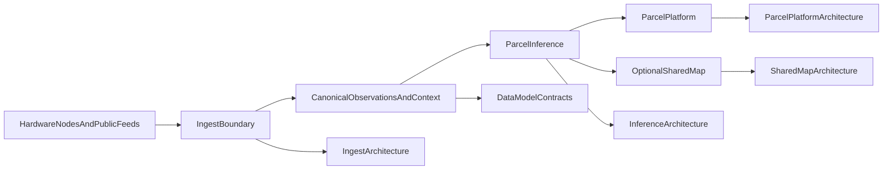

# Reference Stack v0.1

## Purpose

Describe the current runnable technical stack and the documents and code
surfaces that define each stage.

## Status

Current reference stack.

## Stack summary

The current reference stack follows this path:

1. hardware nodes and selected public feeds produce raw evidence
2. ingest validates and normalizes evidence into canonical observations,
   including receipt timing, lineage, and freshness—**temporal integrity** is part
   of the truth model (`05` §2), not optional plumbing
3. inference combines observations with parcel and public context
4. parcel platform renders the dwelling-facing parcel view
5. shared-map outputs remain optional and policy-gated

This path is the **runnable slice** of the layered blueprint in
`../../program/operating-packet/05-revised-architecture-blueprint.md` (sensing → ingest → context → state
estimation / functional fields → presentation, plus optional shared/governance
surfaces). Enumerated objects: `architecture-object-map.md`.

**OptionalSharedMap** sits on the **policy-gated** shared / governance boundary
(`05` §6–7); it is not part of the narrow parcel-private minimum path.

## Canonical implementation posture

- Sibling repo **`../../../oesis-runtime`** (checkout sibling to this program-specs
  repo) is the canonical Python implementation tree for the current reference
  services (`oesis.*` package); see `implementation-posture.md` canonical homes.
- Program-specs **`../../software/`** tree remains the **interface and
  architecture prose** for ingest, inference, parcel platform, and shared map;
  runnable entrypoints are invoked from the runtime repo (see
  `v0.1-runtime-modules.md` and `v0.1-acceptance-criteria.md`).
- **`../../software/v0.1/README.md`** and **`../../software/operator-quickstart.md`**
  remain the main operator-facing execution guides (they proxy or reference
  `make oesis-*` in the runtime checkout).

## Stage map

### Raw evidence producers

- [`bench-air-node/README.md`](https://github.com/lumenaut-llc/oesis-hardware/blob/main/v0.1/bench-air-node/README.md)
- [`mast-lite/README.md`](https://github.com/lumenaut-llc/oesis-hardware/blob/main/v0.1/mast-lite/README.md)
- [`flood-node/README.md`](https://github.com/lumenaut-llc/oesis-hardware/blob/main/v0.1/flood-node/README.md)
- [`thermal-pod/README.md`](https://github.com/lumenaut-llc/oesis-hardware/blob/main/v0.1/thermal-pod/README.md)
- `../../architecture/system/integrated-parcel-system-spec.md`

### Ingest boundary

- `../../software/ingest-service/architecture.md`
- `../../software/ingest-service/README.md`
- [`v0.1/README.md`](https://github.com/lumenaut-llc/oesis-contracts/blob/main/v0.1/README.md)

Normalization and ingest behavior should treat **timing, receipts, dedupe/replay,
and staleness** as core truth surfaces, consistent with `../../program/operating-packet/05-revised-architecture-blueprint.md`
§2 and `implementation-posture.md`.

Admissibility decisions are a first-class output of this layer. For each
normalized observation, ingest emits `admissible_to_calibration_dataset: bool`
plus `admissibility_reasons: [string]` per [`../system/calibration-program.md`](../system/calibration-program.md) §C (or [`../system/adapter-trust-program.md`](../system/adapter-trust-program.md) §C for adapter-derived data). The decision is runtime-computed; the facts it depends on are carried in the canonical observation schema (tracked as gap G17).

Entry surfaces:

- `make oesis-validate`
- `python3 -m oesis.ingest.validate_examples`
- `python3 -m oesis.ingest.ingest_packet`
- `python3 -m oesis.ingest.serve_ingest_api`

See also `v0.1-runtime-modules.md` and `v0.1-acceptance-criteria.md`.

### Canonical observations and context

- [`v0.1/README.md`](https://github.com/lumenaut-llc/oesis-contracts/blob/main/v0.1/README.md)
- [`public-context-schema.md`](https://github.com/lumenaut-llc/oesis-contracts/blob/main/v0.1/public-context-schema.md)
- [`parcel-context-schema.md`](https://github.com/lumenaut-llc/oesis-contracts/blob/main/v0.1/parcel-context-schema.md)
- [`node-registry-schema.md`](https://github.com/lumenaut-llc/oesis-contracts/blob/main/v0.1/node-registry-schema.md)
- [`explanation-payload-schema.md`](https://github.com/lumenaut-llc/oesis-contracts/blob/main/v0.1/explanation-payload-schema.md)
- Observation schema extensions for admissibility facts are tracked in v0.1 gap register G17 (cross-repo change to `oesis-contracts`)
- [`../system/calibration-program.md`](../system/calibration-program.md) — program-level calibration policy for physical sensors
- [`../system/adapter-trust-program.md`](../system/adapter-trust-program.md) — program-level trust policy for Tier 1 / Tier 2 adapter-derived data

### Parcel inference

- `../../software/inference-engine/architecture.md`
- `../../software/inference-engine/README.md`
- `technical-philosophy.md`

Entry surfaces:

- `make oesis-demo`
- `python3 -m oesis.parcel_platform.reference_pipeline`
- `python3 -m oesis.inference.infer_parcel_state`
- `python3 -m oesis.inference.serve_inference_api`

### Parcel platform

- `../../software/parcel-platform/architecture.md`
- `../../software/parcel-platform/README.md`
- `../../software/operator-quickstart.md`

Entry surfaces:

- `make oesis-accept`
- `make oesis-check`
- `make oesis-http-check`
- `python3 -m oesis.parcel_platform.serve_parcel_api`

### Optional shared-map layer

- `../../software/shared-map/architecture.md`
- `../../software/shared-map/README.md`
- `../../architecture/system/shared-map-product-posture.md`

Entry surfaces:

- `python3 -m oesis.shared_map.aggregate_shared_map`
- `python3 -m oesis.shared_map.serve_shared_map_api`
