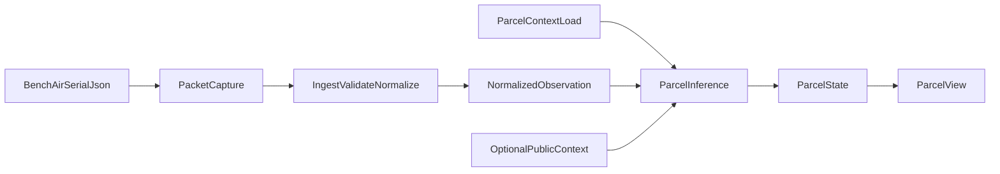

# v0.1 runtime modules (separate workspace)

## Purpose

Record how the **minimal runtime module plan** for `v0.1` maps onto the canonical
executable tree in the sibling **`oesis-runtime`** checkout (`../../../oesis-runtime`
from this file; **`../oesis-runtime`** from the program-specs repository root).

This file is the program-specs counterpart to the implementation; it does not
duplicate code.

## Status

Aligned with the frozen `v0.1` slice in `minimum-functioning-v0.1.md`.

## Module map

| Plan module | Role | Primary locations in `oesis-runtime` |
|-------------|------|--------------------------------------|
| **ingest** | Validate raw `oesis.bench-air.v1` packets, normalize to canonical observation, minimal HTTP ingest | `oesis/ingest/` — `validate_examples`, `normalize_packet`, `ingest_packet`, `extract_latest_packet`, `serve_ingest_api`, public weather/smoke normalization |
| **context** | Load parcel context and optional raw public fixtures for the reference path | `oesis/context/` — `loader.load_parcel_context`, `load_default_bundle`, `load_public_contexts` |
| **inference** | Combine normalized observation + parcel context + optional public context → parcel state | `oesis/inference/` — `infer_parcel_state`, `serve_inference_api` |
| **parcel_platform** | Format parcel state into dwelling-facing parcel view (and related reference helpers) | `oesis/parcel_platform/` — `format_parcel_view`, `format_evidence_summary`, `reference_pipeline`, `serve_parcel_api` |
| **checks** | Prove packet → normalized observation → parcel state → parcel view (CLI and HTTP smoke) | `oesis/checks/v01.py`, `python3 -m oesis.checks`, `scripts/oesis_smoke_check.sh`, `scripts/oesis_http_smoke_check.sh` |

## End-to-end flow

## Contract and interface sources of truth

Keep runtime behavior aligned with:

- [`bench-air-node/serial-json-contract.md`](https://github.com/lumenaut-llc/oesis-hardware/blob/main/bench-air-node/serial-json-contract.md)
- [`node-observation-schema.md`](https://github.com/lumenaut-llc/oesis-contracts/blob/main/v0.1/node-observation-schema.md)
- [`parcel-context-schema.md`](https://github.com/lumenaut-llc/oesis-contracts/blob/main/v0.1/parcel-context-schema.md)
- [`parcel-state-schema.md`](https://github.com/lumenaut-llc/oesis-contracts/blob/main/v0.1/parcel-state-schema.md)
- `../../software/ingest-service/interfaces.md`
- `../../software/inference-engine/interfaces.md`
- `../../software/parcel-platform/interfaces.md`

## Related

- `minimum-functioning-v0.1.md` — object and behavior minimum
- `v0.1-acceptance-criteria.md` — how we know the path is healthy
- `reference-stack.md` — runnable entrypoints and doc map
- `../../meta/repo-split-plan.md` — multi-repo boundary
