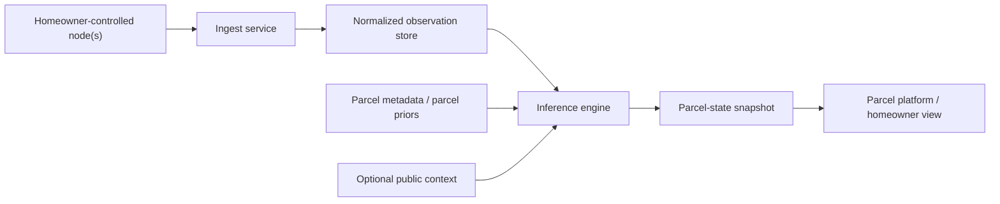
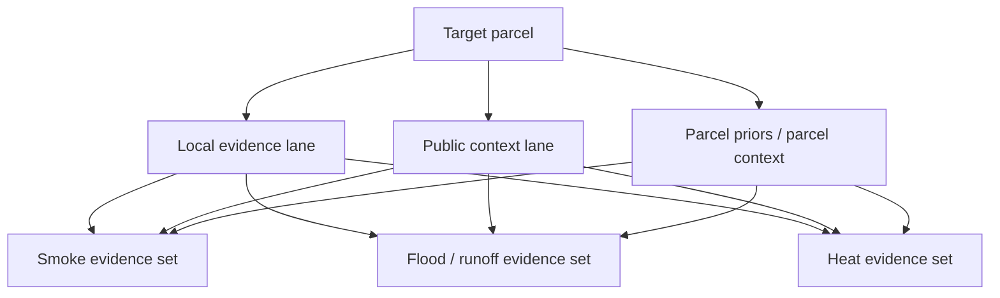
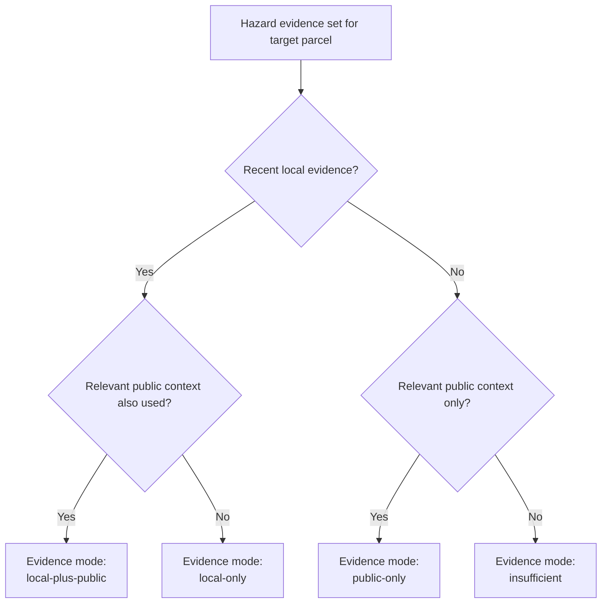
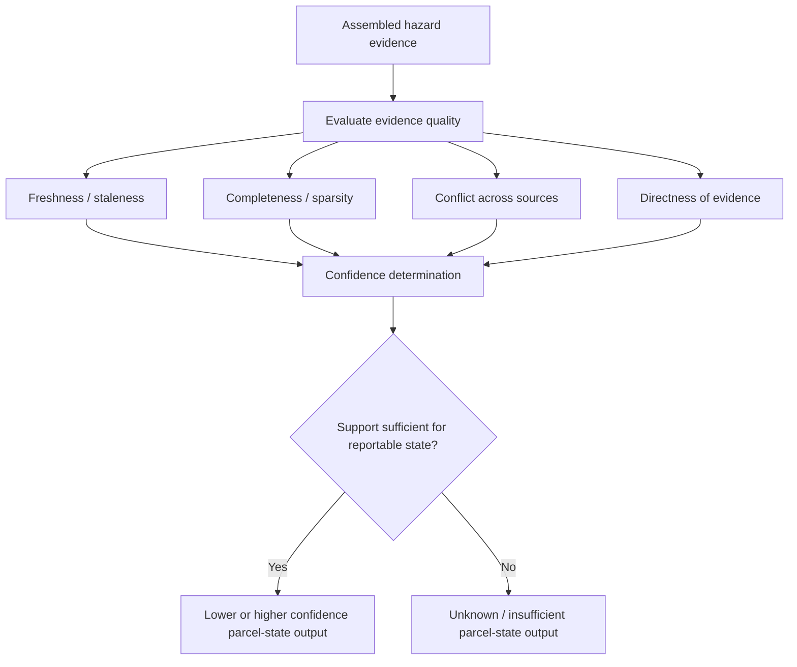
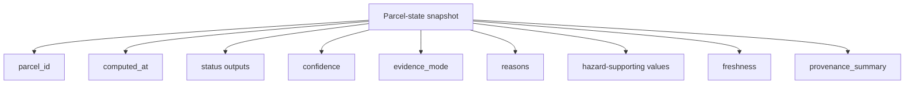
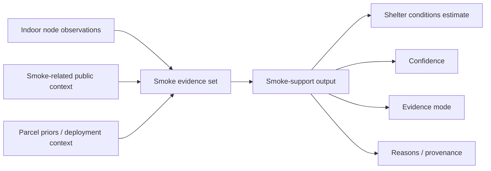

# Provisional Figures: Parcel-State Generation

## Status

Internal drafting document for a possible narrow U.S. provisional filing.

Do not publish before the filing decision.

## Purpose

Provide fast visual drafts for the parcel-state generation candidate so the team can review the filing story, refine scope, and turn the figures into formal drawings if needed.

## Figure 1. System block diagram from node observations to parcel-state snapshot

Notes:

- Keep local and public inputs visually distinct.
- The inference engine is the center of the candidate method.
- The parcel platform consumes the output rather than recomputing it.

## Figure 2. Parcel evidence assembly by source class and hazard domain

Notes:

- Not every hazard set needs every source class in practice.
- Observation references and provenance links should survive assembly.

## Figure 3. Evidence-mode assignment flow

Notes:

- This is source-mode logic, not detailed hazard scoring logic.
- This lean version intentionally excludes shared-neighborhood modes from the filing candidate.

## Figure 4. Confidence degradation and unknown-state transition

Notes:

- Keep numeric thresholds out of the figure unless you want to preserve them explicitly.
- This figure is useful because it shows the system does not force a definitive output when support is weak.

## Figure 5. Example parcel-state snapshot with provenance fields

Notes:

- Keep the figure generic enough that field names can evolve.
- If useful, match labels to the current schema in a later draft.

## Optional Figure 6. Example smoke-domain execution

Notes:

- Use synthetic examples only.
- This is optional if you want the packet to stay hazard-agnostic.

## Review questions

- Are you comfortable keeping shared neighborhood evidence out of this filing candidate entirely?
- Do you want to preserve any exact evidence-mode vocabulary now?
- Do any of these figures reveal more than you want to hold back before filing?
