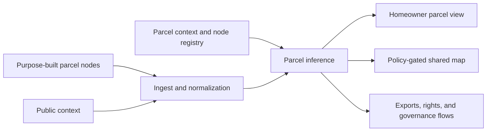
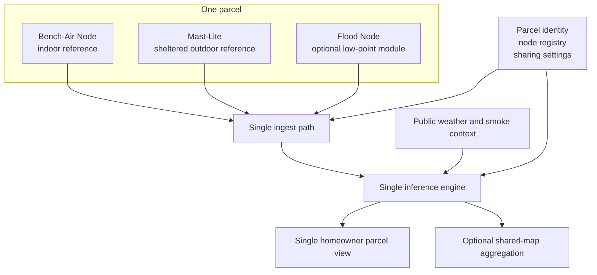
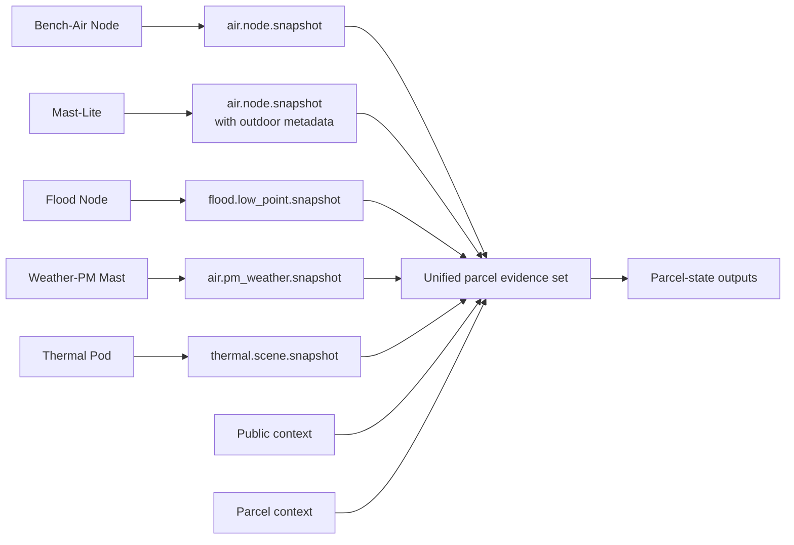
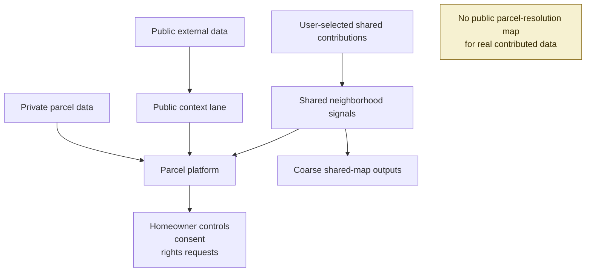
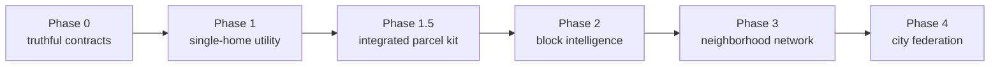
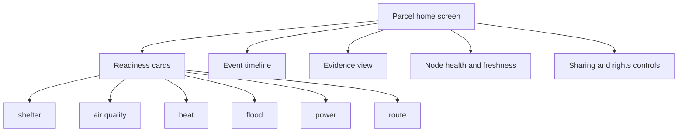

# Prototype Integration Diagram Pack

## Purpose

Provide a shared diagram set that:

- breaks the program into understandable parts
- shows how those parts combine into one prototype
- compares several architecture avenues
- explores several design possibilities without overcommitting too early

This pack stays at a public-safe and cross-team-safe level.
It is intended to complement the system-overview docs without disclosing detailed method internals that may still belong in controlled review.

## Scope and release posture

Use this pack for:

- architecture alignment
- collaborator onboarding
- roadmap discussions
- public-safe high-level explanation

Do not use this pack to document:

- detailed inference decision trees
- evidence weighting rules
- threshold logic
- reproducible narrow method flowcharts
- unreleased hardware implementation details

For internal filing-oriented figure drafts, see the controlled legal materials instead.

## Diagram 1: System context

What this explains:

- many evidence sources can feed one parcel-level system
- the parcel view is the primary product surface
- shared intelligence is downstream and policy-gated, not the starting point

## Diagram 2: Recommended first integrated prototype

Why this is the recommended default:

- it matches the current integrated parcel spec
- it keeps the physical system modular
- it still behaves like one coherent product
- it is strong enough for a real first pilot without waiting for every node family

## Diagram 3: Part-by-part combination map

What this clarifies:

- each hardware family keeps a distinct role
- the combination happens at the parcel evidence layer, not by forcing one hardware box
- new node classes extend the system through normalized observation families

## Diagram 4: Data-rights and visibility boundary

Why this matters:

- the system design is inseparable from the privacy design
- shared intelligence should be derived and bounded
- public context supports the parcel platform without replacing homeowner control

## Diagram 5: Prototype evolution path

Recommended interpretation:

- do not wait for block-scale features to make the first product useful
- move from one-home value to network effects in stages
- keep each step operationally honest and understandable

## Diagram 6: Parcel view surface

What this anchors:

- the parcel view should feel like one parcel experience, not a collection of device dashboards
- device details support interpretation, but the homeowner-facing unit is still the parcel

## Architecture avenues

### Avenue 1: Tier 1 software-first prototype

Summary:
- `bench-air-node` plus public context

Best for:
- fastest demo
- validating parcel-state UX
- proving one-home value with minimal hardware effort

Strengths:
- shortest path to a usable prototype
- matches the currently strongest reference implementation
- easiest onboarding and troubleshooting

Risks:
- weaker outdoor truth
- flood support remains mostly software-and-context level until more hardware is added

### Avenue 2: Tier 2 modular parcel kit

Summary:
- `bench-air-node` plus `mast-lite`
- optional `flood-node` on the right parcels

Best for:
- first credible pilot
- balanced hardware and software integration
- truthful hazard coverage without overexpanding the scope

Strengths:
- best balance of realism, modularity, and timeline
- clearly demonstrates how multiple nodes become one parcel system
- aligned with the current integrated parcel spec

Risks:
- requires stronger install guidance and node-registry discipline
- still needs more real-world validation than the indoor-only slice

### Avenue 3: Gateway-first distributed parcel kit

Summary:
- modular nodes plus a local hub or home gateway layer

Best for:
- degraded connectivity
- local buffering and resilience
- future local-first operations

Strengths:
- better offline posture
- cleaner device provisioning and auth options later
- can centralize troubleshooting and local event history

Risks:
- extra operational and hardware complexity
- not necessary before the first strong integrated pilot

### Avenue 4: Single-enclosure demo appliance

Summary:
- combine multiple sensing functions into one presentation-friendly unit

Best for:
- trade-show storytelling
- rough concept demos
- internal visual mockups

Strengths:
- visually simple story
- easier to explain at first glance

Risks:
- does not match real siting needs
- encourages bad measurement placement
- likely to misteach the architecture

## Recommendation by avenue

Use this default decision rule:

- choose Avenue 1 if speed matters most
- choose Avenue 2 if truthfulness and pilot readiness matter most
- choose Avenue 3 if local-first resilience becomes a first-order requirement
- avoid Avenue 4 as the real architecture, even if it is used for a concept render

Recommended current path:

- primary prototype lane: Avenue 2
- fallback demo lane: Avenue 1
- later resilience lane: Avenue 3

## Design possibilities

### 1. Physical system design possibilities

#### Modular parcel kit

Pattern:
- separate nodes for indoor, outdoor, flood, and experimental sensing

Best qualities:
- truthful placement
- easy phased rollout
- clean mapping from node role to evidence role

#### Hub-and-spoke parcel kit

Pattern:
- separate nodes plus one local hub

Best qualities:
- stronger offline operations
- easier future device lifecycle management

#### Portable starter kit

Pattern:
- a simplified first-install bundle optimized for rapid onboarding

Best qualities:
- lower friction for early pilot households
- useful for documentation, kit assembly, and support

Risk:
- can oversimplify what a full parcel deployment really needs

### 2. Product experience design possibilities

#### Parcel dashboard first

Pattern:
- readiness cards, confidence, freshness, reasons, next steps

Best for:
- immediate homeowner comprehension
- the current phase-1 product direction

#### Parcel twin view

Pattern:
- a visual parcel or home map showing attached nodes and evidence lanes

Best for:
- explaining how many devices still belong to one parcel system
- installer and operator onboarding

#### Timeline-first event view

Pattern:
- emphasize what changed, when, and what to do next

Best for:
- live events
- building trust through explainable state changes

### 3. Diagram-language design possibilities

#### Executive story set

Use:
- simple block diagrams
- phased roadmap graphics
- privacy-boundary visuals

Best for:
- public preview
- partner conversations
- early fundraising or outreach materials

#### Product-and-ops set

Use:
- parcel-kit topology
- node role maps
- homeowner and operator surface maps

Best for:
- internal alignment
- pilot preparation
- contributor onboarding

#### Engineering detail set

Use:
- normalized observation lanes
- auth and provisioning diagrams
- packet handling and lifecycle diagrams

Best for:
- implementation planning
- only after the release and filing posture is clear

## Recommended next diagram set

If the team wants the highest-value follow-up work, build these next:

1. a polished parcel-kit topology diagram for onboarding
2. a parcel twin UI diagram for the parcel view
3. a node-registry lifecycle diagram for implementation planning
4. an internal-only provisioning and auth diagram
5. a pilot deployment diagram showing one parcel, one block, and one shared-map boundary

## Recommended design direction

Current best overall direction:

- system architecture: modular parcel kit
- prototype lane: Tier 2 integrated parcel kit
- primary surface: parcel dashboard first, with a timeline second
- explanatory visual language: public-safe executive set plus a deeper internal ops set

That gives the project one coherent prototype story without pretending every sensor should live in one chassis or every future phase should be built before the first pilot.
