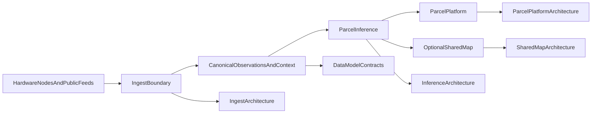
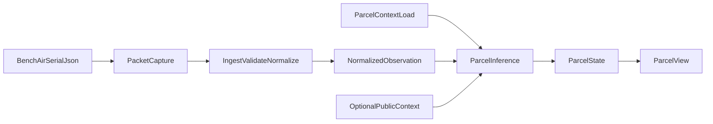

# Current State

This file is the current-truth entrypoint for what is actually real today across the program specs and runtime.

It now includes the full frozen v0.1 architecture spine: philosophy, reference stack, minimum functioning slice, runtime modules, object map, boundaries, acceptance criteria, implementation posture, and the runtime README so architectural claims stay grounded in the executable reference path.

Conventions for path/label interpretation are defined once in
`README.md` for this source-pack.

## Why This File Exists

This summary is followed by verbatim source-file copies so the synthesized guidance and the underlying canonical text stay together in one markdown.

## Included Source Files

- `architecture/current/README.md`
- `architecture/current/technical-philosophy.md`
- `architecture/current/reference-stack.md`
- `architecture/current/minimum-functioning-v0.1.md`
- `architecture/current/v0.1-runtime-modules.md`
- `architecture/current/v0.1-acceptance-criteria.md`
- `architecture/current/architecture-object-map.md`
- `architecture/current/component-boundaries.md`
- `architecture/current/implementation-posture.md`
- `../oesis-runtime/README.md`

## Verbatim Source Content

### File: `architecture/current/README.md`

```md
# Technical Architecture v0.1

## Purpose

Define the current truthful reference architecture for Open Environmental
Sensing and Inference System.

`v0.1` is the architecture of the current reference stack. It should describe
what is real now, what is only partial, and what remains docs-only or planned.

The **narrow program-phase `v0.1` slice** is the frozen anchor in this directory.
`milestone-roadmap.md` also orders **later milestones** that stage growth toward
program-phase **`v1.0`** breadth—without treating those later stages as current
truth here.

## Status

Current reference architecture.

Use this version when you need the architecture that matches the present
implementation boundary rather than future proposals.

This directory is the frozen `v0.1` lane. New future-looking architecture work
should go to `../v1.0/` instead of mutating these current-truth files.

Pre-`1.0` growth should normally be tracked through milestones and status
classification rather than a new version number for every added node or
element.

## Scope

`v0.1` covers:

- the current technical philosophy
- the current collection-to-parcel reference stack
- the minimum functioning first-version slice
- the current architecture object map
- current ownership of implementation, docs, contracts, and policy surfaces
- the implementation boundary reflected in the current reference checks
- the current milestone sequence that fits the implemented reference posture
  (including how milestones relate to program phases—see `milestone-roadmap.md`)
- measurement posture and KPI family emphasis for the frozen slice (see
  `measurement-and-kpis-v0.1.md`)

## Program plan and framing

Files in this directory are **frozen current reference** architecture. Program
mission, phase vocabulary, thesis, layered blueprint, and long-horizon framing are
authored **alongside** them (repo root and `program/`):

- `../../program/v0.1/README.md` — mission, long-term direction, phase label summary
- `../../program/operating-packet/00-version-labels-and-lanes.md` — program phases, runtime lanes, marketing naming
- `../../program/operating-packet/09-phasing-v0.1-v1.0-v1.5.md` — full `v0.1` / `v1.0` / `v1.5` narrative
- `../../program/operating-packet/01-core-thesis-and-framing.md` — thesis and wording guardrails
- `../../program/operating-packet/05-revised-architecture-blueprint.md` — layered model and near-term sensing order
- `../../program/operating-packet/07-information-layer-and-functional-recovery.md` — information-layer target
- `../../program/operating-packet/functional-state-and-response-model.md` — bridge toward response / verification
  objects (`v1.5`-era planning)
- `../../program/operating-packet/04-architecture-review-keep-dangerous-change-now.md` — expanded keep /
  dangerous / change review (judgments also summarized in `technical-philosophy.md`)
- `../../program/operating-packet/08-kpi-framework.md` — detailed KPI catalog (posture in
  `measurement-and-kpis-v0.1.md`)

**Phase ↔ milestone mapping** lives in `milestone-roadmap.md` in this directory.

## Reading order

1. `technical-philosophy.md`
2. `reference-stack.md`
3. `minimum-functioning-v0.1.md`
4. `milestone-roadmap.md` — delivery sequence and relationship to program phases
5. `v0.1-runtime-modules.md` — runtime package map (sibling checkout
   `../../../oesis-runtime`; see `implementation-posture.md` canonical homes)
6. `v0.1-acceptance-criteria.md` — CLI/HTTP acceptance for the frozen slice
7. `measurement-and-kpis-v0.1.md` — KPI family emphasis and traceability to acceptance
8. `architecture-object-map.md`
9. `implementation-posture.md`
10. `component-boundaries.md`
11. `pre-1.0-version-progression.md`

## Primary source alignment

`v0.1` should stay aligned with:

- `../../program/v0.1/README.md`
- `../../program/operating-packet/09-phasing-v0.1-v1.0-v1.5.md`
- `../../architecture/system/technical-philosophy-and-architecture.md`
- `../../architecture/system/integrated-parcel-system-spec.md`
- `../../software/v0.1/README.md`
- `../../release/v.0.1/implementation-status-matrix.md`
- `../../program/operating-packet/08-kpi-framework.md`

## Contributor rule

If a change describes what is implemented, accepted, or currently runnable, it
belongs here.

If a change describes a target architecture, future boundary, or debated
expansion, it belongs in `../v1.0/`.

If a change is incremental but still compatible with the current accepted slice,
prefer updating milestone and implementation-posture docs before proposing a new
`v0.x`.
```

### File: `architecture/current/technical-philosophy.md`

```md
# Technical Philosophy v0.1

## Purpose

State the current technical philosophy that shapes the OESIS reference
architecture.

## Status

Current reference philosophy.

This architecture is fit for the long-term direction only when phase boundaries
are defended: the frozen near-term slice must stay truthful, and future scope must
not be spoken as if it were already executable product reality.

## Core rules

### Parcel first

The system should be useful for one home before neighborhood participation is
added.

### One parcel, one system

Multiple purpose-built nodes may exist, but they should still collapse into one
parcel identity, one ingest path, one inference engine, one dwelling-facing
parcel view, and one privacy/sharing surface.

### Modular hardware, coherent parcel behavior

Hardware should stay modular when placement and sensing needs differ. The
software and product experience should still behave like one parcel system.

Near-term sequencing: treat flood-capable families as **opt-in** and thermal as
**non-core** until air-quality evidence plus parcel context is stable on the
reference path—avoid hardware family sprawl ahead of that stability.

### Preserve evidence boundaries

The architecture keeps clear separation between:

- raw packets and external feeds
- collection and ingest transport
- normalized observations
- inferred parcel-state outputs
- parcel operator presentation
- shared neighborhood outputs

### Collection first for evidence availability

In `v0.1`, network primarily means getting node data into the home/platform
ingest path.

The first functioning version should treat collection and ingest as first-class
realities rather than as hidden plumbing beneath parcel conclusions.

Route-scale and block-scale intelligence stay **downstream** of honest,
repeatable parcel outputs on the reference path—not parallel headline scope.

### Prefer explicit uncertainty

Freshness, provenance, confidence, evidence mode, and reasons should remain
visible throughout the stack.

### Governance is an architecture input

Sharing, privacy, publication, revocation, export, and claims boundaries should
shape technical behavior directly rather than living only in prose.

Prefer a **minimum executable governance loop** in product and runtime over
doctrine that outruns implemented behavior; document claims to match what
operators can actually rely on.

### Use canonical contracts and thin wrappers

One canonical implementation or contract surface should exist per concern, with
thin compatibility layers around it when needed for docs, runbooks, or operator
flows.

## Near-term executable slice (`v0.1`)

Freeze the real near-term architecture in one sentence and repeat it wherever
scope is discussed:

`v0.1` = one parcel, one bench-air lineage, one parcel context, one ingest path,
one inference path, one parcel view

Everything broader is downstream. The next broader program-phase target (`v1.0`,
field-hardened parcel kit and related trust surfaces) stages in the reference
runtime as an optional `v1.0` asset lane merged over this baseline. Phase and lane
vocabulary: `../../program/v0.1/README.md`, `../../program/operating-packet/00-version-labels-and-lanes.md`.

## Phase discipline

Guardrails against common failure modes:

- Mixing **version labels**, program **phases**, reference-runtime **lanes**, and
  **public or marketing** release names without saying which one you mean.
- Letting **future** capabilities read as **current** implementation in
  architecture prose, roadmaps, or demos.
- Prioritizing **shared neighborhood intelligence** before **collection and ingest**
  are mature on the reference path.
- **Governance** described beyond what the product and runtime **actually enforce**.
- Adding **hardware families** faster than the reference path stabilizes for one
  lineage.
- Treating **parcel-first** as **parcel-only**, contradicting the stated
  parcel-first, multi-scale direction (see `../../program/v0.1/README.md`).
- Claiming **deployment or field** maturity beyond what is **repeatable and
  checkable** (reference acceptance paths and implementation posture should stay
  ahead of narrative).

Standardize language around **parcel-first** and **multi-scale** using the program
overview and thesis framing; do not invent competing shorthand.

## Related docs

- `../../program/v0.1/README.md` — program mission, long-term direction, phase labels
- `../../program/operating-packet/00-version-labels-and-lanes.md` — glossary for phases and runtime lanes
- `../../program/operating-packet/04-architecture-review-keep-dangerous-change-now.md` — expanded keep /
  dangerous / change-now review
- `../../architecture/system/technical-philosophy-and-architecture.md`
- `../../architecture/system/integrated-parcel-system-spec.md`
- `reference-stack.md`
- `minimum-functioning-v0.1.md`
- `component-boundaries.md`
```

### File: `architecture/current/reference-stack.md`

```md
# Reference Stack v0.1

## Purpose

Describe the current runnable technical stack and the documents and code
surfaces that define each stage.

## Status

Current reference stack.

## Stack summary

The current reference stack follows this path:

1. hardware nodes and selected public feeds produce raw evidence
2. ingest validates and normalizes evidence into canonical observations,
   including receipt timing, lineage, and freshness—**temporal integrity** is part
   of the truth model (`05` §2), not optional plumbing
3. inference combines observations with parcel and public context
4. parcel platform renders the dwelling-facing parcel view
5. shared-map outputs remain optional and policy-gated

This path is the **runnable slice** of the layered blueprint in
`../../program/operating-packet/05-revised-architecture-blueprint.md` (sensing → ingest → context → state
estimation / functional fields → presentation, plus optional shared/governance
surfaces). Enumerated objects: `architecture-object-map.md`.



**OptionalSharedMap** sits on the **policy-gated** shared / governance boundary
(`05` §6–7); it is not part of the narrow parcel-private minimum path.

## Canonical implementation posture

- Sibling repo **`../../../oesis-runtime`** (checkout sibling to this program-specs
  repo) is the canonical Python implementation tree for the current reference
  services (`oesis.*` package); see `implementation-posture.md` canonical homes.
- Program-specs **`../../software/`** tree remains the **interface and
  architecture prose** for ingest, inference, parcel platform, and shared map;
  runnable entrypoints are invoked from the runtime repo (see
  `v0.1-runtime-modules.md` and `v0.1-acceptance-criteria.md`).
- **`../../software/v0.1/README.md`** and **`../../software/operator-quickstart.md`**
  remain the main operator-facing execution guides (they proxy or reference
  `make oesis-*` in the runtime checkout).

## Stage map

### Raw evidence producers

- `../../hardware/bench-air-node/README.md`
- `../../hardware/mast-lite/README.md`
- `../../hardware/flood-node/README.md`
- `../../hardware/thermal-pod/README.md`
- `../../architecture/system/integrated-parcel-system-spec.md`

### Ingest boundary

- `../../software/ingest-service/architecture.md`
- `../../software/ingest-service/README.md`
- `../../contracts/v0.1/README.md`

Normalization and ingest behavior should treat **timing, receipts, dedupe/replay,
and staleness** as core truth surfaces, consistent with `../../program/operating-packet/05-revised-architecture-blueprint.md`
§2 and `implementation-posture.md`.

Entry surfaces:

- `make oesis-validate`
- `python3 -m oesis.ingest.validate_examples`
- `python3 -m oesis.ingest.ingest_packet`
- `python3 -m oesis.ingest.serve_ingest_api`

See also `v0.1-runtime-modules.md` and `v0.1-acceptance-criteria.md`.

### Canonical observations and context

- `../../contracts/v0.1/README.md`
- `../../contracts/public-context-schema.md`
- `../../contracts/parcel-context-schema.md`
- `../../contracts/node-registry-schema.md`
- `../../contracts/explanation-payload-schema.md`

### Parcel inference

- `../../software/inference-engine/architecture.md`
- `../../software/inference-engine/README.md`
- `technical-philosophy.md`

Entry surfaces:

- `make oesis-demo`
- `python3 -m oesis.parcel_platform.reference_pipeline`
- `python3 -m oesis.inference.infer_parcel_state`
- `python3 -m oesis.inference.serve_inference_api`

### Parcel platform

- `../../software/parcel-platform/architecture.md`
- `../../software/parcel-platform/README.md`
- `../../software/operator-quickstart.md`

Entry surfaces:

- `make oesis-accept`
- `make oesis-check`
- `make oesis-http-check`
- `python3 -m oesis.parcel_platform.serve_parcel_api`

### Optional shared-map layer

- `../../software/shared-map/architecture.md`
- `../../software/shared-map/README.md`
- `../../architecture/system/shared-map-product-posture.md`

Entry surfaces:

- `python3 -m oesis.shared_map.aggregate_shared_map`
- `python3 -m oesis.shared_map.serve_shared_map_api`
```

### File: `architecture/current/minimum-functioning-v0.1.md`

```md
# Minimum Functioning v0.1

## Purpose

Define the minimum object and behavior set required for a genuinely functioning
first `v0.1` version.

This file is narrower than the full `v0.1` architecture object map. It focuses
on what the first working product slice must do, not on every object the
architecture already recognizes.

## Status

Current minimum functioning slice.

## Frozen v0.1 product slice (implementation scope)

For build and test planning, treat **`v0.1`** as this narrow executable slice:

- **One parcel** — one `parcel_id` and one parcel-context bundle in the reference path.
- **One bench-air node** — one `oesis.bench-air.v1` observation path (default fixture: `bench-air-01`).
- **One software path** — ingest → normalized observation, combined with parcel and public context → inference → parcel view (evidence summary included on the offline reference pipeline).
- **One parcel view** — one coherent dwelling-facing status surface.

Executable checks for this slice live in the sibling **`oesis-runtime`** checkout
(`../../../oesis-runtime` from this file; `../oesis-runtime` from the program-specs
repo root): `make oesis-check`, `make oesis-http-check`, `make oesis-accept`.

**Explicitly out of scope** for this frozen executable slice (do not block `v0.1` on these): other observation families (`mast-lite`, `flood-node`, `weather-pm-mast`, `thermal-pod`), a mature shared-map product surface, full consent/rights/revocation UX, or required live Wi-Fi transport from the node (serial capture and local processing are enough). See `v0.1-acceptance-criteria.md` for the software acceptance checklist.

## Why this file exists

The full `v0.1` architecture includes objects that are `implemented`,
`partial`, `docs-only`, or `planned`.

That is useful for architectural truthfulness, but it can blur the answer to a
different question:

What is the minimum set of objects and behaviors needed for a functioning first
version?

This file answers that question directly.

## Required objects

### 1. Sensor node

Role:
- produce direct local observations
- expose device health and freshness

Status in current reference path: `implemented`

### 2. Packet / raw evidence

Role:
- carry versioned local evidence into ingest

Status in current reference path: `implemented`

### 3. Collection path / home-platform ingest boundary

Role:
- move node data from the device into the trusted ingest surface
- preserve enough receipt, freshness, and delivery truth to support parcel
  conclusions honestly

Status in current reference path: `implemented`

### 4. Normalized observation

Role:
- create one canonical ingest output for downstream reasoning

Status in current reference path: `implemented`

### 5. Parcel

Role:
- act as the primary decision anchor
- give the system a concrete dwelling-facing scope

Status in current reference path: `implemented`

### 6. Parcel context

Role:
- provide enough site and install context to interpret evidence honestly

Status in current reference path: `implemented`

### 7. Public context source

Role:
- provide weather or smoke context when local evidence is sparse or incomplete

Status in current reference path: `implemented`

### 8. Derived parcel condition

Role:
- express what the system believes is true for the parcel now
- carry confidence, evidence mode, and freshness

Status in current reference path: `implemented`

### 9. Derived operational status

Role:
- turn condition logic into user-facing operational conclusions

Status in current reference path: `implemented`

In `v0.1`, this is still expressed through the parcel-state and parcel-view
status surfaces rather than through a richer independent object family.

### 10. Explanation record

Role:
- explain why the parcel condition and status were assigned
- preserve source mix and trust cues

Status in current reference path: `implemented`

### 11. Parcel view

Role:
- present the current parcel answer, confidence, evidence mode, reasons, and
  freshness in one coherent surface

Status in current reference path: `implemented`

### 12. Minimum sharing policy

Role:
- keep exact parcel data private by default
- support at least a simple technical distinction between private and broader
  sharing

Status in current reference path: `partial`

The architecture depends on this object, but the full product surface is not
yet complete.

## Required behaviors

To count as a functioning first version, the system should be able to:

1. collect at least one valid local node packet into the home/platform ingest
   path
2. ingest that packet through a trusted collection boundary
3. normalize that packet into a canonical observation
4. combine it with parcel context and public context
5. derive parcel-level condition outputs
6. derive operational status outputs from those conditions
7. attach confidence, evidence mode, freshness, and explanation
8. present those results in one coherent parcel-facing view
9. keep exact parcel data private by default

## Explicitly deferred or non-blocking for the first functioning slice

These objects matter architecturally, but they are not required to call the
first `v0.1` version functioning:

- full node-registry-driven lifecycle
- mature shared neighborhood signal product surface
- mature shared-map product surface
- route or infrastructure segment as a first-class runtime object
- hazard field unit as a first-class runtime object
- full rights, export, deletion, revocation, and consent product lifecycle
- broader multi-scale doctrine beyond what current confidence and explanation can
  already support honestly

## Relationship to the object map

- `architecture-object-map.md`
  answers: what objects the architecture recognizes
- `minimum-functioning-v0.1.md`
  answers: what subset must work for a functioning first version

## Current interpretation

The current reference stack is already strong enough to support a functioning
first version if it is framed around:

- one local observation path
- one collection path into the home/platform ingest boundary
- one parcel anchor
- one public-context lane
- one parcel inference layer
- one operational status layer
- one explanation layer
- one parcel-facing view
- one minimum sharing boundary

## Source of truth

Use this file together with:

- `reference-stack.md`
- `implementation-posture.md`
- `../../release/v.0.1/implementation-status-matrix.md`

If a proposed `v0.1` requirement depends on an object that is still only
`partial`, `docs-only`, or `planned`, it should not be treated as part of the
minimum functioning slice without explicit justification.
```

### File: `architecture/current/v0.1-runtime-modules.md`

```md
# v0.1 runtime modules (separate workspace)

## Purpose

Record how the **minimal runtime module plan** for `v0.1` maps onto the canonical
executable tree in the sibling **`oesis-runtime`** checkout (`../../../oesis-runtime`
from this file; **`../oesis-runtime`** from the program-specs repository root).

This file is the program-specs counterpart to the implementation; it does not
duplicate code.

## Status

Aligned with the frozen `v0.1` slice in `minimum-functioning-v0.1.md`.

## Module map

| Plan module | Role | Primary locations in `oesis-runtime` |
|-------------|------|--------------------------------------|
| **ingest** | Validate raw `oesis.bench-air.v1` packets, normalize to canonical observation, minimal HTTP ingest | `oesis/ingest/` — `validate_examples`, `normalize_packet`, `ingest_packet`, `extract_latest_packet`, `serve_ingest_api`, public weather/smoke normalization |
| **context** | Load parcel context and optional raw public fixtures for the reference path | `oesis/context/` — `loader.load_parcel_context`, `load_default_bundle`, `load_public_contexts` |
| **inference** | Combine normalized observation + parcel context + optional public context → parcel state | `oesis/inference/` — `infer_parcel_state`, `serve_inference_api` |
| **parcel_platform** | Format parcel state into dwelling-facing parcel view (and related reference helpers) | `oesis/parcel_platform/` — `format_parcel_view`, `format_evidence_summary`, `reference_pipeline`, `serve_parcel_api` |
| **checks** | Prove packet → normalized observation → parcel state → parcel view (CLI and HTTP smoke) | `oesis/checks/v01.py`, `python3 -m oesis.checks`, `scripts/oesis_smoke_check.sh`, `scripts/oesis_http_smoke_check.sh` |

## End-to-end flow



## Contract and interface sources of truth

Keep runtime behavior aligned with:

- `../../hardware/bench-air-node/serial-json-contract.md`
- `../../contracts/node-observation-schema.md`
- `../../contracts/parcel-context-schema.md`
- `../../contracts/parcel-state-schema.md`
- `../../software/ingest-service/interfaces.md`
- `../../software/inference-engine/interfaces.md`
- `../../software/parcel-platform/interfaces.md`

## Related

- `minimum-functioning-v0.1.md` — object and behavior minimum
- `v0.1-acceptance-criteria.md` — how we know the path is healthy
- `reference-stack.md` — runnable entrypoints and doc map
- `../../meta/repo-split-plan.md` — multi-repo boundary
```

### File: `architecture/current/v0.1-acceptance-criteria.md`

```md
# v0.1 acceptance criteria (software path)

## Purpose

Define when the **`v0.1` separate-workspace runtime** is accepted for the
**software** path: one parcel, one bench-air node family, one coherent pipeline,
one parcel view.

Hardware criteria (serial emit, repeated valid JSON) are listed for completeness;
they are proven on the bench and in operator runbooks, not by CI in this repo.

## Status

Frozen default lane in the sibling **`oesis-runtime`** checkout (`../../../oesis-runtime`
from this file; from the **program-specs repository root**, `../oesis-runtime`).
Opt-in parallel lanes (e.g. `v1.0`) are out of scope for this checklist unless
explicitly noted.

## Product criteria (from the v0.1 plan)

| # | Criterion | Notes |
|---|-----------|--------|
| 1 | One bench-air node emits **valid serial JSON** repeatedly | Operator: `hardware/bench-air-node/operator-runbook.md`, `serial-json-contract.md` |
| 2 | A **captured packet** validates and **normalizes** successfully | `python3 -m oesis.ingest.ingest_packet <packet.json>`, or ingest API |
| 3 | One **parcel-context** record can be **loaded** and used | Runtime: `oesis.context.loader`; fixtures under `oesis/assets/examples/` |
| 4 | **Inference** produces a parcel-state snapshot with **confidence**, **evidence mode**, **reasons**, **freshness**, and **provenance summary** | `infer_parcel_state` / inference API |
| 5 | **Parcel platform** produces **one coherent** dwelling-facing **parcel view** | `format_parcel_view` / parcel API |
| 6 | The **same path** works via **local CLI** and via **minimal local HTTP** surfaces | Commands below |

## Automated commands (default `v0.1` lane)

Run commands from the **`oesis-runtime`** checkout (`../oesis-runtime` relative to the
**program-specs repo root**, or `../../../oesis-runtime` from this file). Example:
`make -C ../oesis-runtime <target>` when your working directory is the program-specs
root.

| Check | Command | Proves |
|-------|---------|--------|
| Example payload validation | `make oesis-validate` | Packaged examples structurally valid |
| Offline flow + shape | `make oesis-accept` or `python3 -m oesis.checks` | Full reference flow artifacts present |
| CLI smoke | `make oesis-check` | Validate + reference pipeline + structure checks |
| HTTP smoke | `make oesis-http-check` | Ingest → inference (with parcel + public context) → parcel view over HTTP |
| Reference pipeline demo | `make oesis-demo` | End-to-end JSON on stdout for inspection |

**Green bar:** `make oesis-validate`, `make oesis-accept`, `make oesis-check`, and `make oesis-http-check` all succeed on a clean checkout with `pip install -e .`.

## HTTP surfaces (minimal)

| Service | Health | Primary write |
|---------|--------|----------------|
| Ingest | `GET /v1/ingest/health` | `POST /v1/ingest/node-packets` |
| Inference | `GET /v1/inference/health` | `POST /v1/inference/parcel-state` (body includes normalized observation + parcel context + public context for parity with the reference path) |
| Parcel platform | `GET /v1/parcel-platform/health` | `POST /v1/parcels/state/view` |

Port defaults and retry env vars: `../oesis-runtime/README.md` (relative to program-specs root).

## Out of scope for this checklist

Same boundary as `minimum-functioning-v0.1.md` frozen slice: other node families,
mature shared map, full rights/consent product path, **required** Wi-Fi transport
from hardware (optional for `v0.1`).

## Related

- `minimum-functioning-v0.1.md`
- `v0.1-runtime-modules.md`
- `reference-stack.md`
- `measurement-and-kpis-v0.1.md` — KPI family mapping for this checklist
- `../../software/operator-quickstart.md`
```

### File: `architecture/current/architecture-object-map.md`

```md
# Architecture Object Map v0.1

## Purpose

Define the first-class objects and layers of the current `v0.1` architecture so
the system is not described as parcel-only or runtime-only.

## Status

Current reference architecture map.

Use this file to explain what the system reasons about, what each object is for,
and how implemented each object is in the current reference stack.

If you need the narrower answer to "what must work for a functioning first
version," read `minimum-functioning-v0.1.md` alongside this file.

## Relationship to layered blueprint (`05`)

The seven layers in `../../program/operating-packet/05-revised-architecture-blueprint.md` map onto this
object map as follows (this file is the **enumerated** model; `05` names the
**canonical layer titles**):

| `05` layer | Objects in this map |
| ---------- | ------------------- |
| 1. Sensing and capture | **1** Sensor node, **2** Packet / raw evidence (plus device time and health as node/packet concerns) |
| 2. Ingest and temporal integrity | **3** Collection / ingest boundary, **4** Normalized observation (receipt, lineage, timing, replay, dedupe, buffering as part of the truth model) |
| 3. Context and trust | **5** Parcel context, **6** Node registry, **7** Public context; route/access context stays parcel-adjacent, not a full route engine |
| 4. State estimation | **9** Parcel state (fused hazard-oriented estimate, confidence, evidence mode, provenance) |
| 5. Impact and functional state | **9** Parcel state (shelter, reentry, egress, asset risk and related fields as **functional** interpretation—see note under **§9**) |
| 6. Governance and sharing | **8** Shared neighborhood signal, **11** Rights / sharing / export / audit |
| 7. Presentation and operations | **10** Parcel view / evidence summary; optional shared-map presentation is policy-gated via **§8** surfaces |

**Program-phase minimal objects (`05`):** the narrow **`v0.1`** list in `05` (parcel,
packet, normalized observation, parcel context, parcel state, parcel view,
evidence summary) matches the **core** of **§1–5, 9–10** here (sensing through
context, plus parcel state and presentation). **`v1.0`**
adds explicit emphasis on **registry**, installation/trust metadata, **shared**
signal maturity, **functional state** as a clearer split, and history—consistent
with statuses here (**§6** `docs-only`, **§8** `partial`, and matrix rows).
**`v1.5`** response and verification objects are planned in
`../../program/operating-packet/functional-state-and-response-model.md` and `../../program/operating-packet/09-phasing-v0.1-v1.0-v1.5.md`,
not first-class rows in this `v0.1` map.

## Object model

### 1. Sensor node

Status: `implemented`

Role:
- primary direct observation object
- device health, uptime, and calibration state
- install role and physical placement context

Current `v0.1` use:
- bench-air-node is the most concrete current observation source
- mast-lite is partially supported through the current shared packet lineage
- other node families exist in architecture and hardware docs but are not all
  implemented in the current reference software path

Main sources:
- `../../hardware/bench-air-node/README.md`
- `../../hardware/mast-lite/README.md`
- `../../contracts/node-registry-schema.md`

### 2. Packet / raw evidence

Status: `implemented`

Role:
- transport and contract object emitted by hardware or raw external feeds
- preserves raw evidence before normalization

Current `v0.1` use:
- packet contracts exist and are validated
- the current live software path most concretely supports `oesis.bench-air.v1`

Main sources:
- `../../contracts/node-observation-schema.md`
- `../../software/ingest-service/interfaces.md`
- `../../hardware/bench-air-node/serial-json-contract.md`

### 3. Collection path / home-platform ingest boundary

Status: `implemented`

Role:
- move node data from the device into the trusted ingest surface
- preserve receipt truth, delivery visibility, and transport freshness
- separate evidence availability from later inference and parcel conclusion logic
- carry **ingest receipt**, **packet lineage**, and transport-side **buffering /
  replay / dedupe** posture as part of the truth model (`05` §2), not as optional
  plumbing

Current `v0.1` use:
- node-to-home/platform collection is already real in the current reference path
- the first network meaning in `v0.1` is evidence collection, not neighborhood
  intelligence
- this layer is what makes packet delivery and ingest trust part of the
  architecture rather than hidden plumbing

Main sources:
- `../../software/ingest-service/architecture.md`
- `../../software/operator-quickstart.md`
- `reference-stack.md`

### 4. Normalized observation

Status: `implemented`

Role:
- canonical evidence object after ingest
- stable downstream input to inference
- primary bridge between packet contracts and parcel-state derivation
- anchor **temporal integrity**: `measured_at` / `received_at` / `processed_at`,
  freshness windows, and stale-data handling as architecture, not polish (`05` §2)

Current `v0.1` use:
- normalization is implemented for the current bench-air lineage
- this is one of the strongest current boundaries in the stack

Main sources:
- `../../contracts/v0.1/README.md`
- `../../contracts/v0.1/examples/normalized-observation.example.json`
- `../../software/ingest-service/architecture.md`

### 5. Parcel context

Status: `implemented`

Role:
- parcel-specific priors and interpretation context
- site and installation information needed for honest inference

Current `v0.1` use:
- parcel context participates in the current reference pipeline
- it exists more strongly as a contract and reference input than as a mature
  end-user product surface

Main sources:
- `../../contracts/parcel-context-schema.md`
- `reference-stack.md`
- `../../architecture/system/integrated-parcel-system-spec.md`

### 6. Node registry

Status: `docs-only`

Role:
- binds nodes to one parcel
- carries install role, location mode, hardware family, and schema lineage
- prevents node identity from being confused with parcel truth

Current `v0.1` use:
- the registry contract is clearly defined
- the full registry-driven operational path is not yet a complete product/runtime
  surface

Main sources:
- `../../contracts/node-registry-schema.md`
- `../../architecture/system/integrated-parcel-system-spec.md`
- `../../release/v.0.1/implementation-status-matrix.md`

### 7. Public context

Status: `implemented`

Role:
- external regional or coarse context that may influence parcel conclusions
- supports operation under partial local coverage

Current `v0.1` use:
- public weather and smoke adapters are part of the reference pipeline
- public context is already a live inference input, not just a future concept

Main sources:
- `../../contracts/public-context-schema.md`
- `../../software/ingest-service/public-weather-adapter.md`
- `../../software/ingest-service/public-smoke-adapter.md`

### 8. Shared neighborhood signal

Status: `partial`

Role:
- privacy-scoped shared inference object
- supports neighborhood-aware reasoning without exposing exact parcel truth

Current `v0.1` use:
- contract exists
- aggregation path exists
- still not a fully mature first-class product surface

Main sources:
- `../../contracts/shared-neighborhood-signal-schema.md`
- `../../software/shared-map/architecture.md`
- `../../release/v.0.1/implementation-status-matrix.md`

### 9. Parcel state

Status: `implemented`

Role:
- primary decision object
- parcel-level condition estimate output
- carries confidence, evidence mode, freshness, hazards, and explanation payload

**Hazard vs functional vs response (`05`):** the parcel-state contract **compresses**
what the blueprint separates as **hazard-oriented** estimates and **functional**
meaning (shelter, reentry, egress, asset risk, access/utility framing). **Response
state**—actions taken, verification, controllability—is **out of scope** for the
narrow **`v0.1`** slice; see `../../program/operating-packet/functional-state-and-response-model.md` and
program-phase **`v1.5`** in `../../program/operating-packet/09-phasing-v0.1-v1.0-v1.5.md`.

Current `v0.1` use:
- parcel-state generation is central to the current reference path
- this is the core output where the current architecture lands conclusions

Main sources:
- `../../contracts/parcel-state-schema.md`
- `technical-philosophy.md`
- `reference-stack.md`

### 10. Parcel view / evidence summary

Status: `implemented`

Role:
- presentation objects for dwelling-facing and operator-safe interpretation
- separates product-safe summaries from lower-level parcel-state internals

Current `v0.1` use:
- parcel view and evidence summary are part of the reference stack and current
  local checks

Main sources:
- `../../software/parcel-platform/architecture.md`
- `../../contracts/explanation-payload-schema.md`
- `../../contracts/evidence-summary-schema.md`

### 11. Rights / sharing / export / audit objects

Status: `partial`

Role:
- governance-operational objects for sharing settings, consent, rights,
  export, access logging, and retention cleanup

Current `v0.1` use:
- several schemas and reference utilities exist
- important product surfaces are still partial or docs-only

Main sources:
- `../../contracts/v0.1/schemas/`
- `../../release/v.0.1/implementation-status-matrix.md`
- `../../software/parcel-platform/README.md`

## Layered view

The grouping below is the **object-map** shorthand for navigation. **Canonical
layer names and purposes** are in `../../program/operating-packet/05-revised-architecture-blueprint.md`
(see Relationship table above).

### Observation layer

- sensor node
- packet / raw evidence

### Collection and ingest layer

- collection path / home-platform ingest boundary
- normalized observation

### Context layer

- parcel context
- node registry
- public context
- shared neighborhood signal

### Decision layer

- parcel state

### Presentation layer

- parcel view
- evidence summary

### Governance-operational layer

- sharing settings
- consent records
- rights requests
- export bundles
- operator access events
- retention cleanup reports

## `v0.1` rule of interpretation

The parcel is the primary decision object, but not the only architecture object.

`v0.1` should be read as:
- parcel-first for decisions
- sensor-first for direct observation
- collection-first for evidence availability
- context-aware for inference
- provenance-first for explanation and trust

This does not yet imply that every multi-scale doctrine idea is fully
implemented in the current stack.

## Status discipline

This object map uses the same status vocabulary as:

- `../../release/v.0.1/implementation-status-matrix.md`

Do not let architecture prose imply that a `partial`, `docs-only`, or `planned`
object is already a complete product/runtime surface.

## Blueprint and phasing references

- `../../program/operating-packet/05-revised-architecture-blueprint.md` — seven-layer model and hazard /
  functional / response split
- `../../program/operating-packet/functional-state-and-response-model.md` — bridge toward response and
  verification objects
- `../../program/operating-packet/09-phasing-v0.1-v1.0-v1.5.md` — when objects mature by program phase
```

### File: `architecture/current/component-boundaries.md`

```md
# Component Boundaries v0.1

## Purpose

Define the current architectural ownership boundaries across implementation,
contracts, subsystem docs, and governance.

## Status

Current reference boundary map.

## Boundary layers

### Canonical implementation

- sibling **`oesis-runtime`** checkout (`../../../oesis-runtime` from this file;
  **`../oesis-runtime`** from the program-specs repository root)

This is the current executable truth for the reference services.

### Subsystem architecture and operator surface

- `../../software/ingest-service/`
- `../../software/inference-engine/`
- `../../software/parcel-platform/`
- `../../software/shared-map/`

These directories explain local responsibilities, interfaces, risks, and
operator-facing execution paths.

### Formal contracts

- `../../contracts/`

Schemas, examples, and contract definitions live here rather than in the
versioned architecture canon.

### Program-level technical posture

- `technical-philosophy.md`
- `reference-stack.md`
- `implementation-posture.md`

These files define the current cross-subsystem architecture.

### Governance and release constraints

- `../../legal/privacy/`
- `../../legal/`

These materials constrain what the architecture may do and claim.

## Boundary rules

- ingest accepts and normalizes evidence but should not become the hazard engine
- inference reasons about parcel state but should not become the UI layer
- parcel platform presents parcel state but should not recompute inference
- shared-map stays downstream of parcel-private reasoning and policy-gated
- docs-facing wrappers should not become competing implementations of the sibling
  **`oesis-runtime`** checkout (see **Canonical implementation** above)

## Version rule

Subsystems and major features should identify which architecture
version they target and what their status is relative to that version.
```

### File: `architecture/current/implementation-posture.md`

```md
# Implementation Posture v0.1

## Purpose

Tie the current architecture to the current executable and documented reference
state.

## Status

Current reference implementation posture.

## Canonical homes

- sibling repo `../../../oesis-runtime` (program-specs checkout and runtime
  checkout are siblings under the same parent directory)
  Canonical implementation tree for the current reference services.
- `../../../../oesis_build/`
  Canonical build-foundation implementation tree.
- `../../software/*/architecture.md`
  Subsystem-local architecture explanation.
- `../../contracts/`
  Formal contracts, schemas, and examples.
- `../../legal/privacy/` and `../../legal/`
  Policy constraints that shape implementation behavior.

## Current execution evidence

The current local reference posture is anchored by:

- `make oesis-validate`
- `make oesis-check`
- `make oesis-http-check`

These checks are the minimum evidence for calling a surface implemented in the
current reference path.

**Field or pilot “deployed” is not the same thing.** Install and operations
credibility come from pilot playbooks, operator checklists, and rows in the
implementation status matrix—not from Makefile targets alone. Keep deployment
claims aligned with what is repeatable and evidenced outside the dev reference
path.

## Version versus status

Keep these concepts separate:

- `v0.x` version labels describe accepted product slices
- `implemented`, `partial`, `docs-only`, and `planned` describe maturity within
  or around those slices
- **Program phase**, **reference-runtime asset lane**, and **public or marketing**
  release naming are also distinct; see `../../program/v0.1/README.md` and
  `../../program/operating-packet/00-version-labels-and-lanes.md`

A new `partial` node lane or documented boundary does not automatically justify
promoting a new `v0.x`.

## Near-term blueprint posture

Sensing and hardware expansion order (aligned with
`../../program/operating-packet/05-revised-architecture-blueprint.md`):

- bench-air first
- mast-lite second
- flood optional
- thermal deferred
- weather + PM later

Classifications below should stay consistent with that ordering and with
`../../release/v.0.1/implementation-status-matrix.md`.

**Ingest and temporal integrity** (normalization, receipt timing, buffering,
replay, dedupe, staleness) are part of the **truth model** for the reference
path—not optional polish beneath **`implemented`** claims.

For **program-phase `v0.1`**, the narrow-slice object set in `05` (parcel, packet,
normalized observation, parcel context, parcel state, parcel view, evidence
summary) is satisfied when the reference pipeline and contracts honor those
boundaries; see `architecture-object-map.md` for the enumerated model.

## Current coverage

The lists below summarize posture; the **matrix** remains authoritative for
status.

### Implemented

- example payload validation
- reference packet-to-parcel pipeline
- local ingest API
- local inference API
- local parcel-platform API
- bench-air packet normalization

Parcel-facing condition estimates (for example shelter, reentry, egress, and
asset risk) are **functional interpretation** of fused evidence. **`implemented`**
here means the reference inference and parcel-platform path produces them with
confidence, evidence mode, and reasons—not that every governance or presentation
surface is complete.

### Partial

- mast-lite through the current shared packet lineage
- rights request, export, retention, and operator-access utilities
- shared-map aggregate API
- several hardware build/install lanes beyond the smallest indoor slice

### Docs-only or planned

- richer sharing-settings and consent surfaces
- revocation as a product guarantee
- flood-specific observation family
- weather-pm outdoor observation family
- thermal scene observation family
- public parcel-resolution map support

## Posture discipline

- Do not promote **shared neighborhood** surfaces to **`implemented`** until
  **collection, ingest, and parcel-private** reasoning are credible on the
  reference path (`technical-philosophy.md`, `milestone-roadmap.md`).
- Do not claim **governance** execution beyond what the runtime and product
  **enforce**; keep documentation aligned with `partial` and `docs-only` rows in
  the matrix.

## Alignment rule

`v0.1` architecture claims should not outrun the implementation-status
classification used in:

- `../../release/v.0.1/implementation-status-matrix.md`

If a surface is only `partial`, `docs-only`, or `planned`, the architecture
should say so.

If a broader accepted runnable slice is promoted later, update the versioned
architecture documents and the evidence set together rather than treating status
changes alone as a version bump.

## Related docs

- `../../program/v0.1/README.md`
- `../../program/operating-packet/00-version-labels-and-lanes.md`
- `../../program/operating-packet/05-revised-architecture-blueprint.md`
- `../../program/operating-packet/09-phasing-v0.1-v1.0-v1.5.md`
- `technical-philosophy.md`
- `milestone-roadmap.md`
- `architecture-object-map.md`
- `measurement-and-kpis-v0.1.md`
```

### File: `../oesis-runtime/README.md`

```md
# OESIS Runtime

Standalone runtime for the Open Environmental Sensing and Inference System reference path: ingest, inference, parcel platform, and smoke fixtures. The program specifications and contracts live in the sibling repository `../oesis-program-specs` (or your checkout of that tree).

## Program operating packet

**`oesis-program-specs`** remains canonical for contracts, schemas, and formal architecture. This repository also holds a **runtime-adjacent operating brief** (framing, phasing, KPIs, risks):

- **[`00-version-labels-and-lanes.md`](../../program/operating-packet/00-version-labels-and-lanes.md)** — read first: program phases vs runtime `v0.1` / optional `v1.0` lane vs public release language.
- **[`01-core-thesis-and-framing.md`](../../program/operating-packet/01-core-thesis-and-framing.md)** — consolidated framing source (thesis + problem/opportunity + positioning); then continue with **`04`**–**`11`** in order under [`program/operating-packet/`](../../program/operating-packet/README.md):
  - [`02-problem-opportunity-and-market-gap.md`](../../program/operating-packet/02-problem-opportunity-and-market-gap.md) *(redirect to `01`)*
  - [`03-originality-and-positioning.md`](../../program/operating-packet/03-originality-and-positioning.md) *(redirect to `01`)*
  - [`04-architecture-review-keep-dangerous-change-now.md`](../../program/operating-packet/04-architecture-review-keep-dangerous-change-now.md)
  - [`05-revised-architecture-blueprint.md`](../../program/operating-packet/05-revised-architecture-blueprint.md)
  - [`06-network-of-networks-concepts.md`](../../program/operating-packet/06-network-of-networks-concepts.md)
  - [`07-information-layer-and-functional-recovery.md`](../../program/operating-packet/07-information-layer-and-functional-recovery.md)
  - [`08-kpi-framework.md`](../../program/operating-packet/08-kpi-framework.md)
  - [`09-phasing-v0.1-v1.0-v1.5.md`](../../program/operating-packet/09-phasing-v0.1-v1.0-v1.5.md)
  - [`10-outside-concepts-and-technology-pull-forward.md`](../../program/operating-packet/10-outside-concepts-and-technology-pull-forward.md)
  - [`11-next-docs-to-write.md`](../../program/operating-packet/11-next-docs-to-write.md)
- **[`functional-state-and-response-model.md`](../../program/operating-packet/functional-state-and-response-model.md)** — hazard vs functional vs response state and how they land by phase (with [`05`](../../program/operating-packet/05-revised-architecture-blueprint.md) and [`09`](../../program/operating-packet/09-phasing-v0.1-v1.0-v1.5.md)).

## Setup

From this repository root (recommended: use a virtual environment):

```bash
python3 -m venv .venv
source .venv/bin/activate   # Windows: .venv\Scripts\activate
pip install -e .
```

After that, `python3 -m oesis...` and the `Makefile` targets work from any current working directory.

Keep packaged examples under `oesis/assets/examples/` in sync with `contracts/v0.1/examples/` in **oesis-program-specs** when you change contracts.

## v0.1 product slice (frozen scope)

Implementation and acceptance tests target:

- **One parcel** — a single `parcel_id` and parcel-context fixture for demos and checks.
- **One bench-air node** — `oesis.bench-air.v1` packets; default fixture uses `bench-air-01`.
- **One software path** — ingest → normalized observation, plus parcel and public context → inference → parcel view (and evidence summary on the offline path).
- **One parcel view** — dwelling-facing status surface from the parcel platform formatter.

Canonical write-ups in **oesis-program-specs**: `architecture/current/v0.1-runtime-modules.md` (package map) and `architecture/current/v0.1-acceptance-criteria.md` (CLI/HTTP acceptance).

## Quick commands

| Target | What it does |
|--------|----------------|
| `make oesis-validate` | Validate packaged example JSON against schemas. |
| `make oesis-demo` | Run the reference pipeline (packet → parcel view); prints JSON on stdout. |
| `make oesis-accept` | Offline v0.1 acceptance: build flow + verify artifact shapes (`python3 -m oesis.checks`). |
| `make oesis-check` | Validate examples, run demo, verify output shape (CLI path). |
| `make oesis-http-check` | Start local HTTP services and verify ingest → inference → parcel view. |

These default commands remain pinned to the frozen `v0.1` slice.

## Bench-air serial → ingest bridge

With hardware emitting one `oesis.bench-air.v1` JSON line per interval (see **oesis-program-specs** `hardware/bench-air-node/operator-runbook.md`), you can forward packets to the local ingest API without copying files:

```bash
pip install -e ".[serial-bridge]"
python3 -m oesis.ingest.serve_ingest_api --host 127.0.0.1 --port 8787   # separate terminal
python3 -m oesis.ingest.serial_bridge --serial-port /dev/cu.usbmodem101 --parcel-id parcel_demo_001
```

Use `--dry-run` to confirm lines parse on the wire, or `--once` for a single post. Defaults match `make oesis-http-check` (`127.0.0.1:8787`, path `/v1/ingest/node-packets`).

## Ingest live dashboard (operator)

While `serve_ingest_api` is running, open **`http://<host>:<port>/v1/ingest/live`** in a browser to poll the **last accepted** normalized observation (in-memory only; process restart clears it). JSON for scripts: **`GET /v1/ingest/debug/last`**. For hardware on the LAN, bind ingest with **`--host 0.0.0.0`** and use your machine’s LAN IP in the URL.

## Parallel v1.0 lane

This repository also carries an explicit opt-in `v1.0` lane beside the frozen
default:

- `make oesis-v10-accept`
- `make oesis-v10-check`
- `make oesis-v10-http-check`

Those commands materialize a merged future-lane asset set from:

- root `oesis/assets/examples/` and `oesis/assets/config/inference/` as the
  frozen `v0.1` baseline
- additive overrides under `oesis/assets/v1.0/`

This keeps `v0.1` stable by default while giving `v1.0` a real parallel home.
If the `v1.0` lane does not yet override a file, the `v0.1` baseline remains
the explicit fallback for that opt-in lane only.

## Pre-1.0 lane policy

The runtime is intentionally not modeling separate asset overlays for `v0.2`, `v0.3`, and later slices yet.

**Program-specs** still defines those promotions formally (for example **`v0.2`** = accepted indoor + sheltered-outdoor kit with evidence) in sibling [`oesis-program-specs/architecture/current/pre-1.0-version-progression.md`](../oesis-program-specs/architecture/current/pre-1.0-version-progression.md) and the promotion matrix at [`oesis-program-specs/architecture/system/version-and-promotion-matrix.md`](../oesis-program-specs/architecture/system/version-and-promotion-matrix.md). Until this repo adds matching lanes, exercise widened behavior through milestones, optional `v1.0` overrides, and implementation-status tracking—not by inventing informal version names here.

For now:

- keep `v0.1` as the frozen default runtime slice
- use milestones and implementation-status docs for smaller compatible growth
- use the additive future lane as the staging area for the next broader slice
- only generalize runtime lane tooling after a second accepted pre-`1.0` slice
  is real enough to justify new asset overlays, commands, and acceptance paths

## Optional environment overrides

- `OESIS_CONTRACTS_BUNDLE_DIR` — directory containing an `examples/` subtree to use instead of `oesis/assets/examples`.
- `OESIS_INFERENCE_CONFIG_DIR` — directory with `public_context_policy.json`, `hazard_thresholds_v0.json`, `trust_gates_v0.json` instead of `oesis/assets/config/inference/`.
- HTTP smoke (`make oesis-http-check`): `OESIS_HTTP_INGEST_PORT`, `OESIS_HTTP_INFERENCE_PORT`, `OESIS_HTTP_PARCEL_PORT` (defaults `8787`–`8789`); `OESIS_HTTP_HEALTH_RETRIES` (default `30`); `OESIS_HTTP_HEALTH_INTERVAL_S` (default `0.2`).

The `v1.0` helper scripts use those same override hooks explicitly. They do not
change the root defaults for `python3 -m oesis.checks`, `make oesis-accept`, or
the root asset paths.

## License

This reference runtime is licensed under the **GNU Affero General Public License v3.0 or later**. See [`LICENSE`](LICENSE). Contribution expectations: [`CONTRIBUTING.md`](CONTRIBUTING.md).
```
