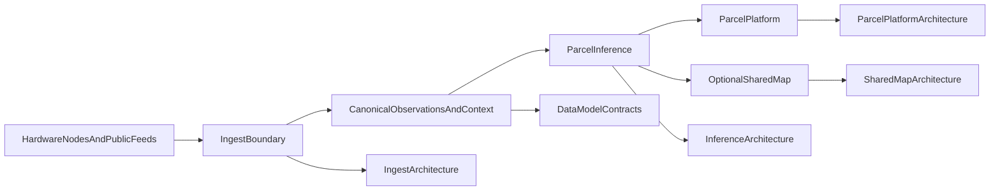
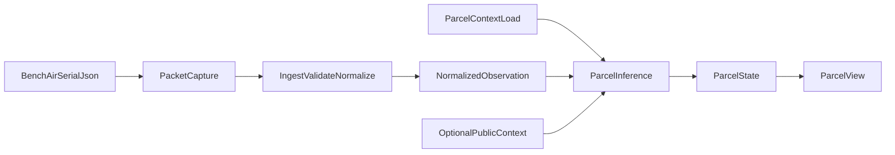

<!--
  OESIS Program Specs — consolidated research / ChatGPT Project bundle
  Assembled: 2026-04-11
  Source repo: oesis-program-specs (paths below are relative to this repo root)
-->

# OESIS program-specs — source bundle (for ChatGPT Project or sharing)

## How to use this file

- **Canonical naming:** Open Environmental Sensing and Inference System (**OESIS**) is the system name; **Resilient Home Intelligence (RHI)** is a legacy compatibility name. Some older starter text still says "RHI" first.
- **Authority order:** `architecture/current/` (frozen v0.1) and `release/v.0.1/implementation-status-matrix.md` (release label `v0.1`, filesystem path `v.0.1/`) override aspirational roadmap text when the question is "what exists today."
- **Terminology:** This bundle uses **dwelling** / **dwelling-associated** / **dwelling-scale** for physical scope; **parcel operator** for agency, rights, and stewardship; **participant-contributed** for parcel-linked data from people; contract enums **`dwelling_node`** and **`dwelling_safe`** for provenance visibility in examples and schemas.
- **Version vocabulary:** **Open-release / packet `v1.0`** (`release/v1.0/`) is not the same as **pre-1.0 reference slices** (`v0.1`, `v0.2`, … in `architecture/current/`), **product roadmap stages** (`current v1` through `v4` in starter/path-forward), or **`deployment maturity v1.0` / `v2.0`** (hardware/ops in `architecture/system/`). See `integrated-parcel-system-spec.md` and `deployment-maturity-ladder.md` in this bundle.
- **Do not over-claim:** Treat a capability as shipped only if the implementation matrix marks it `implemented` (or you have separate runtime evidence).
- **Public site stack erratum:** Several program-specs files still say the sibling public site is **Astro**. The **`oesis-public-site`** repo has migrated to **Next.js 15** (see that repo's `NEXTJS-MIGRATION.md`). Publication allowlists still live under `src/data/publicationPolicy.ts` and generated `src/generated/publicContentBundle.ts`.
- **Cross-reference note:** `architecture/current/README.md` aligns primary implementation status with `release/v.0.1/implementation-status-matrix.md` (release label `v0.1`, filesystem path `v.0.1/`; older snapshots in this bundle may still mention a dated release folder).

## Bundled files (in order)

1. `README.md`
2. `NOTICE.md`
3. `program/v0.1/README.md`
4. `shared/glossary/resilient-home-intelligence.md`
5. `release/v1.0/README.md`
6. `release/v1.0/NOTICE.md`
7. `release/v1.0/v1.0-scope.md`
8. `release/v1.0/v1.0-acceptance-spec.md`
9. `release/v1.0/v1.0-product-surface.md`
10. `release/v1.0/open-source-v1-summary.md`
11. `release/v1.0/asset-class-license-and-publication-matrix.md`
12. `release/v1.0/contributor-and-review-guide.md`
13. `release/v1.0/open-release-v1-audit-checklist.md`
14. `LICENSES.md`
15. `release/v.0.1/implementation-status-matrix.md` (release label `v0.1`, filesystem path `v.0.1/`)
16. `contracts/v0.1/README.md`
17. `contracts/node-registry-schema.md`
18. `contracts/node-observation-schema.md`
19. `contracts/parcel-context-schema.md`
20. `meta/starter-package/project-instructions.md`
21. `meta/starter-package/chat-prompts.md`
22. `meta/starter-package/path-forward-prompt-packet.md`
23. `architecture/current/README.md`
24. `architecture/current/technical-philosophy.md`
25. `architecture/current/reference-stack.md`
26. `architecture/current/implementation-posture.md`
27. `architecture/current/component-boundaries.md`
28. `architecture/current/minimum-functioning-v0.1.md`
29. `architecture/current/v0.1-runtime-modules.md`
30. `architecture/current/v0.1-acceptance-criteria.md`
31. `architecture/current/architecture-object-map.md`
32. `architecture/current/milestone-roadmap.md`
33. `architecture/current/pre-1.0-version-progression.md`
34. `architecture/system/integrated-parcel-system-spec.md`
35. `architecture/system/deployment-maturity-ladder.md`
36. `architecture/system/phase-roadmap.md`
37. `architecture/system/architecture-gaps-by-stage.md`
38. `architecture/decisions/debate-map.md`
39. `architecture/v1.0/README.md`
40. `architecture/v1.0/goals-and-deltas.md`
41. `architecture/v1.0/proposed-architecture.md`
42. `architecture/v1.0/open-questions.md`
43. `architecture/v1.0/decision-log.md`

---


---

## File: README.md

# Open Environmental Sensing and Inference System (program-specs)

This repository is the program-definition and release home for the Open
Environmental Sensing and Inference System (`OESIS`) program.

Open Environmental Sensing and Inference System (`OESIS`) is the canonical
system name. `Resilient Home Intelligence` (`RHI`) remains a legacy
compatibility name during the transition.

The Git repository is **`oesis-program-specs`** on GitHub (`lumenaut-llc/oesis-program-specs`), alongside the sibling **`oesis-runtime`** checkout.

**Finishing the remote rename:** If GitHub still lists the old repository name, open **Settings → General → Repository name** on that repo and set it to **`oesis-program-specs`**. GitHub keeps redirects from the old URL for a while. This checkout should use `origin` → `https://github.com/lumenaut-llc/oesis-program-specs.git`; if not, run `git remote set-url origin https://github.com/lumenaut-llc/oesis-program-specs.git`. After the rename, confirm with `git fetch origin` and push (`git push -u origin main` if needed). Update **GitHub Pages** or any external links that still use the old path or `github.io/.../resilient-home-intelligence/...` URLs.

## Purpose

Open Environmental Sensing and Inference System is a modular, dwelling-scale
environmental sensing and parcel-awareness initiative. It combines:

- physical sensor builds
- parcel-level software
- neighborhood inference
- privacy/governance rules
- documentation and pilot playbooks

The system is designed so each parcel can receive parcel-level condition estimates even with partial sensor adoption. More participating nodes can improve precision and confidence, but they do not unlock basic functionality.

This repository now serves as the canonical home for:

- architecture and system definitions
- schemas, examples, and release packet materials
- governance, privacy, and publication controls
- build and publication support for split-repo workflows

The runnable Python reference services and the public preview site now live as
standalone sibling repositories:

- `../oesis-runtime`
- `../oesis-public-site`

Operational commands in this repository now proxy to those sibling repos by
default. The old in-repo runtime and site trees have been retired and replaced
with migration pointers only.

## Core principles

- Parcel first
- Private by default
- Shared by choice
- Useful as a standalone build
- More powerful as a network
- Explicit uncertainty
- Open and well documented

## Repository map

- `program/` — program overview, notice, and index
- `architecture/` — canonical architecture home, including frozen `current/` (`v0.1`), explicit version lanes such as `v1.0/` and `v1.5/`, redirect-only `future/`, and system narratives
- `contracts/` — frozen `v0.1` contract docs plus additive `v1.0/` and `v1.5/` lanes
- `release/` — release packet materials, publication controls, and launch collateral
- `hardware/` — physical sensor nodes and installation systems
- `software/` — subsystem docs, wrappers, and operator guides
- `legal/` — licensing, defensive publication, governance, contribution policy, and privacy policy
- `operations/` — pilot playbooks and operational rollout materials
- `media/` — diagrams, renders, and images
- `oesis_build/` — build and publication support for contracts, release, and split-repo workflows
- `shared/` — shared standards, templates, and glossary
- `meta/` — planning, milestones, operating notes, repo-split execution docs, and contribution guidance
- `artifacts/` — generated split artifacts such as contracts, public content, and runtime evidence bundles
- `scripts/repo_split.py` — split automation for syncing runtime assets, building bundles, and producing evidence artifacts for sibling repos
- `oesis/` — migration pointer to the standalone `../oesis-runtime` repository
- `sites/public-preview/` — migration pointer to the standalone `../oesis-public-site` repository

## Split workflow

Use these commands while the split is in progress:

- `make oesis-validate`
- `make oesis-check`
- `make oesis-http-check`
- `make public-site-build`
- `make repo-split-sync-runtime-assets`
- `make repo-split-build-contracts-bundle`
- `make repo-split-build-public-content-bundle`
- `make repo-split-build-runtime-evidence-bundle`

The canonical execution plan lives in `meta/repo-split-plan.md`.

## Version lanes

Use these repo surfaces as the default architecture-and-contract entrypoints:

- `architecture/current/` — frozen `v0.1` current truth
- `architecture/v1.0/` — debated `v1.0` target lane
- `contracts/v0.1/examples/` and `contracts/v0.1/schemas/` — frozen `v0.1` default contract surface
- `contracts/v1.0/` — additive `v1.0` contract deltas and future-lane notes

The older `technical-architecture/` tree remains as a transitional pointer, but
contributors should treat `architecture/current/` and `architecture/v1.0/` as
the canonical current-vs-future split.

## Start here

1. Read `NOTICE.md`
2. Read `program/v0.1/README.md`
3. Read `release/v1.0/open-source-v1-summary.md`
4. Read `architecture/README.md`
5. Read `architecture/current/README.md` for the frozen `v0.1` lane or `architecture/v1.0/README.md` for the debated `v1.0` lane
6. Read `meta/repo-split-plan.md` if you are working on runtime/site extraction or bundle boundaries
7. Use `shared/templates/` when starting a new subsystem or document


---

## File: NOTICE.md

# Repository Notice

## Purpose

This repository contains multiple asset classes with different intended license treatments and different publication states.

Do not assume one blanket license applies to every file, dataset, or future release artifact in this repository.

## Repository-wide notice

The Open Environmental Sensing and Inference System (`OESIS`) program is being
prepared for a staged, commons-protective open release.

At the repository level:

- software, hardware, documentation, and datasets may have different governing licenses or notices
- some materials are public preview artifacts only
- some technical materials may remain held back pending release sequencing or legal review
- real participant-contributed parcel-linked data is not made open by default

## Start with these files

- `LICENSES.md`
- `NOTICE.md`
- `legal/ip.md`
- `release/v1.0/open-source-v1-summary.md`
- `release/v1.0/asset-class-license-and-publication-matrix.md`

## Important boundary

Open-source publication of code, hardware designs, or documentation does not convert private participant-contributed parcel-linked data into open data.

## Preview-phase rule

If a file or folder has a more specific notice, release note, or license statement, that more specific statement controls for that material.

If no specific license text is attached yet, treat the repository planning documents as guidance about intended release direction, not as a final legal grant.

## Attorney review

Questions about final licensing, patent grants, trademark permissions, or dataset release terms should be treated as review items rather than assumed from this notice alone.


---

## File: program/v0.1/README.md

# Open Environmental Sensing and Inference System

Open Environmental Sensing and Inference System (`OESIS`) is the canonical flagship
open program described in this repository.

`Resilient Home Intelligence` (`RHI`) remains a legacy compatibility name during
the transition.

Read `NOTICE.md` before treating this program as a complete technical open release.

## Mission

Create dwelling-scale environmental sensing and parcel-level situational intelligence that:
- works for individual homes
- improves with neighborhood participation
- preserves owner control of parcel-linked data, including explicit public-release choices
- uses external public data only inside the platform
- stays modular and open

The program is now in its April 14, 2026 open-release period. Approved software,
hardware, documentation, governance materials, and intentionally public datasets may be
released under asset-specific terms, while some materials remain outside release for
privacy, provenance, security, or licensing reasons.

## Program structure

- `../architecture/` — canonical architecture home for current, future, and system narratives
- `../hardware/` — physical sensor nodes and installation systems
- `../software/` — ingest, parcel platform, inference, and maps
- `../contracts/` — contract docs, schemas, and example payloads
- `../release/` — release packet materials and publication controls
- `../legal/` — licensing, defensive publication, governance, and contribution policy
- `../operations/` — pilot playbooks and operational materials
- `../media/` — diagrams, renders, and images

## Current MVP hazards

- smoke
- pluvial flooding / runoff
- heat

## Current MVP outputs

For each parcel:
- shelter conditions estimate
- reentry conditions estimate
- egress conditions estimate
- asset risk estimate
- confidence
- evidence mode
- reasons

## Principles

- parcel first
- private by default
- shared by choice
- intentionally public datasets must be explicitly designated and licensed
- more nodes improve precision, not basic functionality
- explicit provenance and uncertainty

## Read first

- `NOTICE.md`
- `../architecture/README.md`
- `../architecture/current/README.md`
- `../release/v1.0/open-source-v1-summary.md`
- `../release/v1.0/asset-class-license-and-publication-matrix.md`
- `../legal/ip.md`
- `../legal/dataset-release-policy.md`
- `../legal/GOVERNANCE.md`
- `../legal/privacy/data-ownership.md`
- `../legal/privacy/privacy.md`
- `../release/v1.0/NOTICE.md`


---

## File: shared/glossary/resilient-home-intelligence.md

# Resilient Home Intelligence Glossary

## Parcel
The primary unit of reasoning in the system. Usually a specific house lot or property footprint with associated spatial and contextual features.

## Home
The occupant or structure-specific object associated with a parcel.

## Sensor node
A physical sensing unit deployed at or near a parcel. Examples: bench air node, mast-lite, flood node, thermal pod.

## Parcel prior
The baseline expectation for a parcel before fresh sensor evidence is applied. Built from terrain, drainage, exposure, access, and other slow-changing context.

## Local evidence
Observations from a healthy sensor node directly associated with a parcel.

## Shared evidence
Observations or derived signals that a parcel operator has opted to contribute to the neighborhood or shared intelligence layer.

## External public data
Regional or public context sources integrated inside the platform, such as weather, flood, smoke, and terrain data.

## Derived parcel state
The platform's computed view of conditions or statuses for a parcel, based on parcel priors plus evidence layers.

## Confidence
How certain the system is about a computed parcel condition or status.

## Evidence mode
A label describing where the current parcel state comes from.
Possible values:
- observed_local
- inferred_neighbors
- inferred_regional
- stale

## Observed local
The parcel has a healthy local node with fresh data, and direct evidence strongly informs the parcel state.

## Inferred neighbors
The parcel lacks strong local evidence, but nearby shared nodes provide enough information to estimate current local conditions.

## Inferred regional
The parcel state is driven mostly by parcel priors and external public data because local or shared neighborhood evidence is weak.

## Stale
There is not enough fresh evidence to support a confident current state.

## Standalone value
The usefulness of a subproject or hardware build even if it is not connected to the full network.

## Network value
The additional usefulness created when a build contributes to or benefits from the larger shared intelligence layer.

## Private owner data
Data visible only to the parcel operator unless they explicitly choose to share it.

## Shared neighborhood layer
The common condition field built from opt-in shared data plus external public context.

## Provenance
The record of where a displayed value, condition, or status came from.

## Hazard engine
The system component that computes smoke, flood, heat, or other hazard-specific parcel conditions.

## Explanation layer
The system component that explains why a parcel received a given status and what evidence contributed.

## Mast-lite
A simple outdoor environmental node focused on core weather and air variables.

## Flood node
A dedicated sensing node mounted at an operational low point to track water depth or distance to surface.

## Thermal pod
A simple 2D scene-sensing unit that produces derived thermal metrics instead of only point measurements.


---

## File: release/v1.0/README.md

# Release v1.0 (program packet)

## Purpose

This directory is the **canonical v1.0 public release packet root** for the current cut of program-specs: governance copy, release controls, open-release summaries, and pointers to technical acceptance. It supersedes path-based references to `release/2026-04-14/` in build tooling and publication bundles.

The earlier **April preview** materials remain archived under `release/v.0.1/` for history and diff review.

## What v1.0 means here (three lenses)

1. **Architecture** — [`v1.0-scope.md`](v1.0-scope.md) ties this packet to [`architecture/current/pre-1.0-version-progression.md`](../../architecture/current/pre-1.0-version-progression.md): which pre-1.0 slice bars are claimed **now** vs deferred.
2. **Product / PRD** — Same scope doc maps [`architecture/system/product-requirements-phase-1.md`](../../architecture/system/product-requirements-phase-1.md) (current v1 product requirements) to **honest** implementation status; full consumer UX is planned in [`v1.0-product-surface.md`](v1.0-product-surface.md).
3. **Technical lane** — Contracts and runtime carry an additive **v1.0** lane beside frozen v0.1; acceptance commands are documented in [`v1.0-acceptance-spec.md`](v1.0-acceptance-spec.md) (sibling repo `oesis-runtime`).

## Reading order

1. [`v1.0-scope.md`](v1.0-scope.md) — in scope, out of scope, PRD honesty table  
2. [`v1.0-acceptance-spec.md`](v1.0-acceptance-spec.md) — how to verify the reference stack  
3. [`v1.0-product-surface.md`](v1.0-product-surface.md) — planned product surfaces (app, alerts, timeline)  
4. [`open-source-v1-summary.md`](open-source-v1-summary.md) — canonical v1 open-release explanation  
5. [`asset-class-license-and-publication-matrix.md`](asset-class-license-and-publication-matrix.md) — asset-class licensing and publication map  
6. [`contributor-and-review-guide.md`](contributor-and-review-guide.md) — contribution and review path  
7. [`open-release-v1-audit-checklist.md`](open-release-v1-audit-checklist.md) — readiness checklist  
8. Prior preview context: [`../v.0.1/README.md`](../v.0.1/README.md)  
9. Implementation evidence: [`../v.0.1/implementation-status-matrix.md`](../v.0.1/implementation-status-matrix.md) (refresh or fork when v1.0 rows change)

## Publication

- Machine-readable allowlist roots: `artifacts/public-content-bundle/public-content-bundle.json` (regenerated via `make repo-split-build-public-content-bundle` from program-specs).  
- Public Astro app: sibling workspace `../../oesis-public-site` (`src/data/publicationPolicy.ts`, `src/generated/publicContentBundle.ts`).  
- Human policy: `legal/public-preview-scope.md`.
- Human release-readiness checklist: `open-release-v1-audit-checklist.md`.

## Related

- `NOTICE.md`
- `open-source-v1-summary.md`
- `asset-class-license-and-publication-matrix.md`
- `contributor-and-review-guide.md`
- `open-release-v1-audit-checklist.md`
- `legal/holdback-list.md`


---

## File: release/v1.0/NOTICE.md

# April 14, 2026 Open Release Notice

This release is a public preview of the Open Environmental Sensing and
Inference System legal, governance, and documentation foundation.

## Important release limits

- Not every file in the repository is automatically a public release asset.
- Some materials remain outside release because of privacy, licensing, provenance, security, or operator-use constraints.
- Public release materials should be read together with the project's claims, limitations, privacy, and data-ownership documents.

## Core project rules

- private by default
- shared by choice
- parcel operators should own their raw parcel-linked data
- one intentionally public v1 dataset does not make all future participant parcel-linked data public
- parcel-state outputs are estimates or inferences, not guarantees

## What this release includes

- mission and principles
- high-level architecture
- IP and release position
- governance and privacy posture
- data ownership and sharing policy direction
- the dataset release policy for the intentionally public v1 dataset carve-out
- release limitations and social copy guidance

## What this release does not do

- it does not convert future participant-contributed private parcel-linked data into open data
- it does not grant rights in withheld materials beyond what applicable notices expressly say
- it does not present the project as emergency-grade guidance or an official alerting authority

## Read these first

- `../../../legal/ip.md`
- `../../../legal/dataset-release-policy.md`
- `../../privacy-governance/data-ownership.md`
- `../../privacy-governance/privacy.md`
- `../../privacy-governance/claims-and-safety-language.md`
- `../../../legal/public-preview-scope.md`

## Contact / escalation

Questions about licensing, release scope, privacy, or data governance should be routed
through the project maintainers before anyone republishes or extends release materials.


---

## File: release/v1.0/v1.0-scope.md

# v1.0 scope (single source)

## Purpose

Define what this **release packet and publication cut** claims across:

- pre-1.0 progression slices ([`architecture/current/pre-1.0-version-progression.md`](../../architecture/current/pre-1.0-version-progression.md)),
- PRD “current v1” ([`architecture/system/product-requirements-phase-1.md`](../../architecture/system/product-requirements-phase-1.md)),
- frozen **v0.1** reference runtime vs additive **v1.0** contract/runtime lane (sibling `oesis-runtime`).

This is a **documentation and release-boundary** artifact. Changing rows to “in” must be backed by acceptance commands and matrix evidence per the promotion bar in the progression doc.

## Pre-1.0 progression vs this cut

| Slice | Bar (summary) | Status for this v1.0 packet |
| --- | --- | --- |
| v0.1 | One parcel, one bench-air path, ingest → parcel view | **In** — reference stack remains baseline; see acceptance spec |
| v0.2 | Indoor + sheltered outdoor kit slice | **Partial** — mast-lite path documented; not fully validated as default kit |
| v0.3 | Flood-capable runtime + flood observation family | **Deferred** — hardware/docs partial; Python observation family not reference-implemented |
| v0.4 | Multi-node parcel + registry / evidence composition | **Deferred** — registry examples exist; multi-node not acceptance-gated |
| v0.5 | Sharing/governance with revocation, retention, export enforcement | **Deferred** — schemas and admin utilities partial; product guarantees not closed (see launch checklist) |
| Architectural **v1.0** | “Materially broader than narrow first slice” | **Partial honesty** — this packet **names** v1.0 and wires publication roots; technical and product breadth still staged (see gaps below) |

## PRD mapping (honest snapshot)

Legend: **In** = reference or packet supports it without overclaiming; **Partial** = JSON/API or docs only; **Out** = not shipped in reference product path.

| PRD area | Status | Notes |
| --- | --- | --- |
| FR1 parcel-state generation | Partial | Reference pipeline + HTTP; fixtures for public context |
| FR2 recommendations | Partial | Reason strings in parcel state / view; not full parcel-facing copy layer |
| FR3 trend detection | Partial | Snapshot-first; durable event history not product-grade |
| FR4 alerting | Out | No push/notify path in reference stack |
| FR5 sensor health | Partial | Node health + view fields; limited UX |
| FR6 setup / context | Partial | Parcel context fixtures; guided setup product not reference |
| FR7 honest stage boundary | In | Discipline required in all public copy |
| Readiness cards (six states) | Partial | Logical fields in parcel view; not a card UI |
| Event timeline | Out | No persisted timeline product |
| Evidence view | Partial | Evidence summary JSON; not dedicated UI |
| NFR1 truthfulness | In | Inference + trust gates prefer low confidence |
| NFR2 privacy / sharing | Partial | Private-by-default architecture; revocation as **product** guarantee still open |
| NFR3 explainability | Partial | Provenance in reference outputs |
| In-scope hazards (smoke, heat, flood, freeze, outage) | Partial | Strongest fit: air + shelter-adjacent; flood/freeze/outage without sensors = weak evidence only |

## Explicit non-goals for this packet cut

- Claiming **full** PRD current-v1 consumer experience (app store, notifications, timeline).
- Claiming **v0.5** governance enforcement as shipped product behavior.
- Replacing frozen **v0.1** runtime defaults; additive **v1.0** lane remains opt-in until deltas land.

## Related

- [`v1.0-acceptance-spec.md`](v1.0-acceptance-spec.md)  
- [`v1.0-product-surface.md`](v1.0-product-surface.md)  
- [`../v.0.1/implementation-status-matrix.md`](../v.0.1/implementation-status-matrix.md)


---

## File: release/v1.0/v1.0-acceptance-spec.md

# v1.0 acceptance specification

## Purpose

Document **commands and artifact assertions** for the reference runtime used alongside this release packet. Canonical code lives in the sibling repository **`oesis-runtime`**.

## Environment

- **Python** 3.11+ (see `oesis-runtime/pyproject.toml` `requires-python`).
- Install: from `oesis-runtime` root, `pip install -e .`.
- **OS**: reference checks have been exercised on macOS; Linux should match if Python and `make` are available.

## Commands (frozen v0.1 default lane)

From `oesis-runtime` repository root:

| Command | Proves |
| --- | --- |
| `make oesis-validate` | Packaged example JSON validates against schemas |
| `make oesis-check` | Offline reference pipeline + output shape (v0.1) |
| `make oesis-http-check` | Local ingest, inference, parcel-platform HTTP path + shapes |
| `make oesis-accept` | Offline acceptance (`python3 -m oesis.checks`) |

## Commands (opt-in v1.0 asset lane)

Same repo; materializes merged examples/config from `oesis/assets/v1.0/` over the v0.1 baseline:

| Command | Proves |
| --- | --- |
| `make oesis-v10-accept` | Offline acceptance with v1.0 lane env (`oesis.checks.v10`) |
| `make oesis-v10-check` | Validate + demo + shape check under v1.0 lane |
| `make oesis-v10-http-check` | HTTP smoke under v1.0 lane |

## Offline flow artifact assertions

Source: `oesis/checks/v01.py` — `verify_runtime_flow_artifacts`.

**Required top-level keys** on the built payload:

- `node_packet`, `parcel_context`, `normalized_observation`, `parcel_state`, `parcel_view`, `evidence_summary`

**`normalized_observation` must include:** `node_id`, `parcel_id`, `values`, `provenance`

**`parcel_state` must include:** `shelter_status`, `reentry_status`, `egress_status`, `asset_risk_status`, `confidence`, `evidence_mode`, `reasons`, `freshness`, `provenance_summary`

**`parcel_view` must include:** `statuses`, `summary`, `confidence`, `evidence_mode`, `freshness`, `provenance_summary`

## HTTP flow assertions

Health endpoints must return `ok: true` for ingest, inference, and parcel-platform. Normalized observation, parcel state, and parcel view must satisfy the same key checks as offline (see `verify_http_flow_artifacts` in `v01.py`).

## v1.0 lane vs v0.1 (current code reality)

`oesis/checks/v10.py` currently calls the **same** `build_v01_runtime_flow` and `verify_runtime_flow_artifacts` as v0.1 offline. Until **real** deltas exist under `contracts/v1.0/` and `oesis/assets/v1.0/`, the v1.0 lane is **structurally** separate but **behaviorally** identical offline.

**When you add schema, example, or inference overrides:** extend `v10.py` (or shared verifiers) and update this document with any new required keys or commands.

## Related

- `oesis-runtime/README.md`  
- [`v1.0-scope.md`](v1.0-scope.md)


---

## File: release/v1.0/v1.0-product-surface.md

# v1.0 product surface plan

## Purpose

Describe **planned** end-user and operator surfaces for the PRD “current v1” experience. This file does **not** assert that these are implemented in the reference runtime; it links each area to evidence in [`../v.0.1/implementation-status-matrix.md`](../v.0.1/implementation-status-matrix.md).

## Ship channel

| Option | Role | Dependency |
| --- | --- | --- |
| Web (PWA or hosted) | Primary candidate for readiness cards, evidence, setup | `oesis-public-site` grows beyond preview, or new app repo; parcel APIs hosted with auth |
| Mobile native | Optional later | Same backend contracts; push notifications (FR4) |

**Target milestone:** post reference HTTP stabilization; blocked on ingest auth, parcel binding, and hosting decisions (matrix: local ingest API next gaps).

## Notifications (FR4)

| Need | Current reference | Target |
| --- | --- | --- |
| Material readiness worsening | None | Rule engine + channel (email/push/SMS) + user prefs |
| Stale sensor / confidence drop | Partial signals in JSON | Same + subscription storage |

**Dependency:** persisted parcel-state history or event stream; matrix lists timeline as not a product surface today.

## Event timeline and history (PRD)

| Need | Current | Target |
| --- | --- | --- |
| What changed, when, trend | Snapshot pipeline | Append-only observation + state events, retention policy |

**Dependency:** storage backend, export/retention governance (matrix: revocation and retention utilities partial).

## Setup and context capture (FR6)

| Need | Current | Target |
| --- | --- | --- |
| Installation mode, parcel context | Fixtures + `location_mode` on node packet | Guided onboarding UI + validated parcel-context API |

**Dependency:** product UX and stronger parcel API (matrix: parcel-settings UI not implemented).

## Governance surfaces (NFR2, FR7)

| Need | Current | Target |
| --- | --- | --- |
| Sharing, consent, revocation | Schemas + partial admin routes | End-user settings UI + verified revocation behavior |

**Dependency:** launch-readiness checklist closure; matrix marks several items docs-only or not started.

## Related

- [`v1.0-scope.md`](v1.0-scope.md)  
- [`architecture/system/product-requirements-phase-1.md`](../../architecture/system/product-requirements-phase-1.md)


---

## File: release/v1.0/open-source-v1-summary.md

# Open Source V1 Summary

## Purpose

State what "open source v1" means for the April 14, 2026 open-release period and give outside readers one canonical starting point for the current public release surface.

This summary is a release guide, not legal advice.

## What v1 means in this repository

For the current `v1.0` release:

- the public release surface is intentionally defined
- public materials point to canonical governance, privacy, and release docs
- each asset class has a clear intended or attached license direction
- contributors and reviewers can tell what is public now versus what remains outside release
- private participant-contributed parcel-linked data is not swept into the open-release story

This is the current open-release surface for v1, not a blanket release of every future artifact.

## Public now

The current release surface may include:

- mission, principles, and program overview
- technical architecture and modular system framing
- governance, privacy, and data-ownership posture
- claims, limitations, and safety-language boundaries
- contributor and stewardship posture
- release-direction and intended license posture by asset class
- reference software, firmware, hardware docs, schemas, examples, and approved media
- the project-controlled v1 dataset when it is intentionally designated and carries explicit dataset terms

See:

- `../../README.md`
- `../../NOTICE.md`
- `../../program/v0.1/README.md`
- `../../legal/privacy/data-ownership.md`
- `../../legal/privacy/privacy.md`
- `../../legal/privacy/claims-and-safety-language.md`
- `../../legal/GOVERNANCE.md`
- `../../legal/dataset-release-policy.md`
- `../../legal/ip.md`

## Not public by default

The following are not automatically part of the public v1 surface:

- secrets, credentials, or access tokens
- non-cleared third-party data or licensed materials
- intentionally excluded technical artifacts still governed by `holdback-list.md`
- future participant-contributed parcel-linked datasets
- trademarks, trade dress, or branding rights unless expressly granted

See:

- `../../legal/public-preview-scope.md`
- `../../legal/holdback-list.md`

## Asset classes and release posture

The repository uses an asset-class model rather than one blanket repo license.

Current working direction:

- platform and service software: `AGPLv3-or-later`
- firmware: `AGPLv3-or-later` unless final review selects a narrower copyleft software license
- hardware design files: `CERN-OHL-S v2`
- documentation and governance text: `CC BY-SA 4.0`
- synthetic example datasets and test fixtures: dataset-specific terms approved for release
- project-controlled v1 dataset and approved public snapshots: dataset-specific terms
- future participant-contributed parcel-linked data: not open by default

See:

- `../../LICENSES.md`
- `asset-class-license-and-publication-matrix.md`

## Non-negotiable v1 boundaries

Open release of code, hardware, docs, or an intentionally public dataset does not mean:

- every technical material is public
- every file in the repository is under one identical license
- future participant parcel-linked data becomes open data
- separately withheld materials are granted by implication
- the project is claiming emergency authority, guaranteed safety, or official alerts

## Contributor and reviewer expectations

Contributors and reviewers should be able to answer these questions before publishing, linking, or merging public-facing material:

1. Is the material inside the current public release scope?
2. Does it expose any non-release or held-back technical detail?
3. Does it include or imply rights to real participant-contributed parcel-linked data?
4. Does it match the governing asset-class license or notice?
5. Does it preserve the project's claims, privacy, and governance boundaries?

Use:

- `contributor-and-review-guide.md`
- `../../legal/contribution-policy/README.md`
- `../../legal/GOVERNANCE.md`

## Canonical reading order

For the v1 public surface, start here:

1. `../../README.md`
2. `../../NOTICE.md`
3. `open-source-v1-summary.md`
4. `asset-class-license-and-publication-matrix.md`
5. `contributor-and-review-guide.md`
6. `../../legal/privacy/data-ownership.md`
7. `../../legal/privacy/privacy.md`
8. `../../legal/privacy/claims-and-safety-language.md`
9. `../../legal/GOVERNANCE.md`
10. `../../legal/ip.md`

## Why this document exists

This file ties the repository notice, program notice, release notice, website, and asset-class license plan together in one public explanation.

If a public-facing page or README needs one link that explains the v1 open-release posture, link to this file first.


---

## File: release/v1.0/asset-class-license-and-publication-matrix.md

# Asset-Class License And Publication Matrix

## Purpose

Turn the repository licensing plan into a reviewer-friendly v1 reference that explains what is public now, what terms apply, and what still requires separate release review.

This matrix is a release guide, not legal advice.

## How to read this matrix

- `Public status` describes whether the asset class is currently part of the public v1 release surface.
- `Intended terms` describes the current release direction and should be read together with `../../LICENSES.md`.
- `Not public by default` means the asset class is separately governed or requires explicit release designation before publication.

## Matrix

| Asset class | Example locations | Public status for v1 | Intended terms | Notes |
| --- | --- | --- | --- | --- |
| Program and platform software | `software/`, `contracts/`, released reference tooling | Public when intentionally included in the release surface | `AGPLv3-or-later` | Public software should carry clear notices and remain consistent with the current release scope. |
| Firmware | `hardware/*/firmware/` | Public when intentionally included in the release surface | `AGPLv3-or-later` unless final review selects a narrower copyleft software license | Treat firmware like software for release-scope review and provenance checks. |
| Hardware design files | node READMEs, build guides, wiring, calibration, firmware notes, released CAD/docs | Public when intentionally included in the release surface | `CERN-OHL-S v2` | Hardware design packages are open only to the extent the released files and notices make clear. |
| Documentation and governance text | `README.md`, `program/`, `architecture/`, `release/`, `legal/` | Public when intentionally included in the release surface | `CC BY-SA 4.0` | Public docs should point to canonical policy and scope documents rather than improvised summaries. |
| Synthetic examples and test fixtures | `contracts/v0.1/examples/`, examples in `oesis-runtime`, synthetic fixtures | Public when clearly synthetic and rights-clean | Dataset-specific approved terms such as `CDLA Permissive 2.0`, `CC BY 4.0`, or another approved release term | Keep synthetic examples clearly marked so they are not confused with real parcel-linked data. |
| Project-controlled v1 dataset and approved public snapshots | intentionally designated dataset bundles | Public only when explicitly designated and licensed | Dataset-specific terms such as `CDLA-Sharing-1.0` | A dataset becomes public because it is intentionally released under explicit terms, not because the rest of the project is open. |
| Redistributed public reference datasets | upstream weather, smoke, map, or hazard sources | Public only under upstream source terms and pass-through notices | Upstream source terms | Do not relabel third-party data as project-owned open data. |
| Future participant-contributed parcel-linked datasets | future parcel operator or pilot participant data | Not public by default | Not covered by a blanket repository-wide open-data license | Privacy and ownership controls override any broad reading of \"open source.\" |
| Non-release materials | secrets, non-cleared third-party data, internal historical planning artifacts | Not public by default | No public grant beyond applicable notices | Governed by `../../legal/public-preview-scope.md`, `../../legal/holdback-list.md`, and release-owner checks. |
| Names, logos, and branding | project names, marks, visual identity | Public reference only unless separately granted | No trademark or branding license unless expressly stated | Open copyright licensing does not imply trademark permission. |

## V1 interpretation rules

Use these rules when classifying a file or folder:

1. If the file is intentionally released and carries or inherits the applicable asset-class term, it may be part of the public v1 surface.
2. If the file contains future participant parcel-linked data, it is not part of the general open-release story by default.
3. If the file depends on upstream third-party data, keep the upstream terms attached and visible.
4. If a more specific file notice exists, that notice controls.
5. If no final per-file license is attached yet, treat `LICENSES.md` as the intended asset-class direction rather than a blanket legal grant.

## Reviewer questions

Before calling an asset "open" in v1, confirm:

- Is the asset intentionally included in the current release surface?
- Does the intended term match the asset class?
- Does any more specific notice override the matrix?
- Is any dataset explicitly designated and licensed, rather than implied public?
- Would an outside reader misunderstand this asset as permission to use non-release materials or private data?

## Related documents

- `open-source-v1-summary.md`
- `open-release-v1-audit-checklist.md`
- `../../LICENSES.md`
- `../../legal/ip.md`
- `../../legal/public-preview-scope.md`
- `../../legal/holdback-list.md`


---

## File: release/v1.0/contributor-and-review-guide.md

# Contributor And Review Guide

## Purpose

Give contributors, maintainers, and outside reviewers one short v1 guide for deciding what can be merged, what needs escalation, and what must stay out of the public release surface.

This guide is a release and governance aid, not legal advice.

## Baseline rule

The repository is open by asset class and by approved release surface, not by assumption.

That means:

- public code, docs, and hardware will use clear open terms by asset class
- some materials still remain outside release even during the current open-release period
- real participant-contributed parcel-linked data is not a normal contribution target
- privacy, claims, and release-scope controls still apply to open contributions

## Ordinary contributions

These usually follow normal maintainer review:

- implementation cleanup
- documentation edits that do not change policy or claims
- synthetic examples and fixtures
- non-sensitive architecture clarifications
- housekeeping around public-facing notices, links, and consistency

Contributor expectations:

- use DCO-style signoff or equivalent attestation
- confirm you have the right to submit the work
- identify material third-party code, data, or design inputs
- preserve provenance and avoid overclaiming capabilities

## Governance-sensitive contributions

These require maintainer review plus governance or privacy review:

- new data uses or new data classes
- changes to sharing, export, deletion, or revocation behavior
- claims-sensitive UI copy or public messaging
- changes to how uncertainty, freshness, or provenance is presented
- dataset handling or release-category changes

Required references:

- `../../legal/privacy/data-ownership.md`
- `../../legal/privacy/privacy.md`
- `../../legal/privacy/permissions-matrix.md`
- `../../legal/privacy/retention-export-deletion-revocation.md`
- `../../legal/privacy/claims-and-safety-language.md`

## Release-sensitive contributions

These require release-owner review and legal or IP review before merge or publication:

- anything touching non-release technical materials
- changes to public release scope
- changes to public licensing statements
- new public dataset releases or public map outputs
- changes that could be read as a patent grant, trademark permission, or publication approval for withheld materials

Required references:

- `../../legal/ip.md`
- `../../legal/public-preview-scope.md`
- `../../legal/holdback-list.md`
- `../../legal/GOVERNANCE.md`

## Hard red lines

Do not merge or publish these through normal contribution paths:

- future participant-contributed parcel-linked hazard data
- exact household locations, secrets, or live credentials
- non-release source code, formulas, thresholds, packet contracts, or reproducible internals
- marketing or UI claims that imply guaranteed safety, certainty, or emergency authority
- changes that flip private-by-default behavior into opt-out sharing
- third-party datasets or scrape-derived data with unclear rights

## Fast review decision tree

1. Is the contribution public-facing or release-facing?
2. Does it touch data rights, privacy, claims, or sharing defaults?
3. Does it expose any held-back method detail?
4. Does it introduce third-party rights or dataset obligations?
5. Does it stay consistent with the current asset-class licensing plan?

If the answer to questions 2 through 4 is yes, escalate beyond ordinary maintainer review.

## Outside reviewer checklist

Outside reviewers should be able to verify:

- the project uses a visible asset-class licensing model
- the current release surface is intentionally defined
- non-release materials are explicitly called out rather than silently omitted
- data rights are separated from source-code openness
- contributor expectations are understandable without private context

## Related documents

- `open-source-v1-summary.md`
- `asset-class-license-and-publication-matrix.md`
- `open-release-v1-audit-checklist.md`
- `../../../legal/contribution-policy/README.md`
- `../../../legal/GOVERNANCE.md`


---

## File: release/v1.0/open-release-v1-audit-checklist.md

# Open Release V1 Audit Checklist

## Purpose

Use this checklist before calling the April 14, 2026 `v1.0` surface a credible open-source/open-release public release.

## Go / no-go standard

V1 is ready only if an outside reader can understand:

- what is public now
- what is intentionally outside release
- what terms apply to each public asset class
- how contributors should participate safely
- why private participant-contributed parcel-linked data is not part of the blanket open story

## Repository and notice checks

- [ ] Root `README.md` points to the current v1 public-release summary.
- [ ] Root `NOTICE.md` points to the current asset-class licensing and release-boundary docs.
- [ ] Program-level `program/v0.1/README.md` and `program/NOTICE.md` point to the same canonical v1 summary.
- [ ] No top-level README or notice implies one blanket license governs every file.

## Licensing checks

- [ ] `LICENSES.md` still matches the intended asset-class release direction.
- [ ] Public-facing docs describe software, hardware, docs, and data as separate asset classes where applicable.
- [ ] Public-facing docs do not imply that non-release materials are already licensed for public use.
- [ ] Public-facing docs do not imply that future participant-contributed parcel-linked data is open data.
- [ ] Any more specific notices remain consistent with the asset-class matrix.

## Scope and non-release checks

- [ ] Public release pages stay inside `../../legal/public-preview-scope.md`.
- [ ] Non-release materials listed in `../../legal/holdback-list.md` are not linked from public entrypoints.
- [ ] Public materials do not disclose implementation-enabling methods, thresholds, or excluded internals.
- [ ] Public materials do not expose real participant-contributed parcel-linked records unless intentionally designated and licensed as a public dataset.

## Governance and contribution checks

- [ ] Contributors can find a short guide explaining ordinary, governance-sensitive, and release-sensitive changes.
- [ ] Governance-sensitive public claims still point back to the privacy and claims policy docs.
- [ ] Release-sensitive changes still route through release-owner and legal or IP review.
- [ ] The public release posture does not weaken private-by-default or shared-by-choice rules.

## Site and publication checks

- [ ] The public site points to the canonical open-release docs rather than improvising licensing claims.
- [ ] Public navigation excludes reviewer/counsel/internal historical planning material.
- [ ] Public routes and source roots match the generated public content bundle.
- [ ] The site does not behave like a raw repository browser or imply access to excluded materials.

## Reviewer clarity checks

- [ ] An outside reviewer can identify the current public release surface in under five minutes.
- [ ] An outside reviewer can identify the intended terms for each public asset class.
- [ ] An outside reviewer can tell that the current release is bounded even though it is openly released.
- [ ] An outside reviewer can find the contribution and review path without private context.

## Related documents

- `open-source-v1-summary.md`
- `asset-class-license-and-publication-matrix.md`
- `contributor-and-review-guide.md`
- `../../LICENSES.md`
- `../../legal/ip.md`
- `../../legal/public-preview-scope.md`
- `../../legal/holdback-list.md`


---

## File: LICENSES.md

# Licensing plan

This file is the working licensing matrix for the repository structure and v0.1 open-release posture.

For a shorter v1-facing explanation, see `release/v1.0/asset-class-license-and-publication-matrix.md`.

It is a project planning document, not legal advice.

## Recommended split

- platform and service software: AGPLv3-or-later
- firmware: AGPLv3-or-later unless a narrower final review selects a different copyleft software license
- hardware design files: CERN-OHL-S v2
- documentation, specifications, and governance text: CC BY-SA 4.0
- synthetic example datasets and test fixtures: CDLA Permissive 2.0, CC BY 4.0, or other dataset-specific terms approved for the release
- project-controlled v1 parcel dataset and approved public shared-dataset snapshots, if any: CDLA-Sharing-1.0 unless a later documented dataset decision selects different terms
- redistributed public reference datasets: keep under upstream source terms with attribution and pass-through notices
- future participant-contributed parcel-linked datasets: not open by default and not covered by a blanket repository-wide open-data license

## Current release note

During the current v0.1 release:

- this matrix describes the intended public license split for approved release artifacts
- archival provisional-planning materials remain internal and are not public release assets by default
- no blanket open-data license applies to future participant-contributed parcel-linked data
- the project-controlled v1 dataset may be intentionally released under explicit dataset terms

## Rationale

- `AGPLv3-or-later` best matches the current commons-protective direction for platform and networked service code where preventing quiet enclosure matters more than frictionless proprietary adoption.
- applying the same copyleft software direction to firmware keeps the message simpler during release, while still leaving room for final legal review if a narrower firmware-specific license choice is preferred.
- `CERN-OHL-S v2` fits open hardware designs where improvements should remain in the commons.
- `CC BY-SA 4.0` fits the current direction for documentation and governance text where the goal is to keep adapted public documentation in the commons rather than maximize permissive reuse.
- `CDLA-Sharing-1.0` fits the current goal for the project-controlled v1 dataset because it supports open reuse while pushing modifications and published downstream versions to stay open.
- future participant-contributed parcel-linked environmental data should not be forced into a blanket open-data license because that would overrule owner control for later contributors who did not opt into a public release.

## Data licensing guardrails

- Do not imply that participation in neighborhood sharing grants the public a right to reuse future participant parcel-linked data.
- Treat the project-controlled v1 dataset as an explicitly chosen public artifact, not as proof that all future parcel-linked data is open by default.
- Include provenance, scope notes, and licensing text with any public dataset release.
- If a future participant, pilot, or research dataset is ever released, it should be governed by a separate review and dataset-specific terms rather than the repository-wide license file.

## Open questions still reserved for final legal review

- whether firmware should remain aligned with `AGPLv3-or-later` or move to a different copyleft software license
- whether later public shared-dataset releases should remain on `CDLA-Sharing-1.0` or move to another dataset-specific license such as `ODbL`
- whether any future patent non-assert or additional patent grant language should accompany the final release
- how trademark and certification rules should be stated alongside the copyright licenses

These choices are a working product-governance recommendation, not legal advice.


---

## File: release/v.0.1/implementation-status-matrix.md

# Implementation Status Matrix

## Status

Internal controlled-review document for the v0.1 release period.

Use this to separate what is working now from what is only documented, planned, or policy direction.

Do not treat this file as a public-site asset by default.

## Purpose

The release packet contains a large amount of high-quality documentation.
This matrix exists so reviewers do not confuse:

- verified reference behavior
- reference-only admin or governance utilities
- hardware build readiness
- policy direction that is not yet product behavior

This matrix also separates:

- architectural inclusion
- runnable reference behavior
- deployment maturity and field-hardening readiness

## Status key

- `implemented`
  Working in the current reference path and backed by a concrete check, command, or runnable service.
- `partial`
  Real code or hardware path exists, but coverage is narrow, staged, or still bounded by important gaps.
- `docs-only`
  The rule, contract, or process is documented, but there is not yet a matching operational or product surface.
- `planned`
  Intentionally on the roadmap, but not yet implemented in the current reference path.

## Version note

This matrix tracks maturity, not release numbering by itself.

Use it together with the versioned architecture docs this way:

- version numbers such as `v0.1` or a future `v0.x` identify accepted product
  slices
- status labels identify how complete each surface is within or around those
  slices

Do not treat every `partial`, `docs-only`, or newly added element as requiring a
new version number.

## Current snapshot

This matrix reflects the current local reference state after these checks passed from the **`oesis-runtime`** checkout (sibling repo; Python **3.11+** per `pyproject.toml`):

- `make oesis-validate`
- `make oesis-check`
- `make oesis-http-check`
- `make oesis-accept`

**2026-04-08 — v0.1 completeness review:** the commands above were re-run successfully on Python 3.11.1, along with `make oesis-v10-accept`, `make oesis-v10-check`, and `make oesis-v10-http-check`. Hardware-side, `python3 -m oesis.ingest.extract_latest_packet` plus `python3 -m oesis.ingest.ingest_packet` were exercised on a synthetic serial log; the bench-air **operator runbook** was aligned to these module entrypoints. See `v0.1-scope-matrix.md`, `v0.1-gap-register.md`, `v0.1-pilot-minimum-subset.md`, `v0.1-osi-diagrams.md` (Mermaid), and `v0.1-osi-diagrams-text.md` (plain text) in this directory for scope, gaps, pilot-tier gates, and OSI layer views of each path.

## Deployment maturity note

The repo now uses a separate deployment maturity overlay in addition to the capability roadmap.
In this matrix:

- `implemented` means the reference path or hardware bring-up path exists
- `implemented` does not automatically mean `deployment maturity v1.0`
- a documented hardware lane may still be below a field-hardened deployed posture

## Software and APIs

| Surface | Status | Evidence | Current boundary | Next gap |
| --- | --- | --- | --- | --- |
| Example payload validation | implemented | `make oesis-validate` | Example schemas and checked-in payloads validate cleanly. | Keep examples aligned with new observation families. |
| Reference packet-to-parcel pipeline | implemented | `make oesis-check`, `make oesis-demo` | One reference path runs from node packet through parcel state and parcel view. | Expand beyond the current air-node lineage. |
| Local ingest API | implemented | `python3 -m oesis.ingest.serve_ingest_api`, `make oesis-http-check` | Accepts `oesis.bench-air.v1` packets and normalizes them. | Bind ingest authorization and parcel binding to stronger live-node workflows. |
| Local inference API | implemented | `python3 -m oesis.inference.serve_inference_api`, `make oesis-http-check` | Produces parcel-state outputs from normalized observation plus context. | Extend coverage to more observation families. |
| Local parcel-platform API | implemented | `python3 -m oesis.parcel_platform.serve_parcel_api`, `make oesis-http-check` | Builds parcel views and evidence summaries in the current reference flow. | Distinguish reference governance flows from fuller product UX. |
| Bench-air packet normalization | implemented | `python3 -m oesis.ingest.ingest_packet`, example packet validation | Current ingest path explicitly supports `oesis.bench-air.v1`. | Keep schema stable while new node classes come online. |
| Mast-lite through shared packet lineage | partial | `software/operator-quickstart.md`, integrated parcel spec | Supported as long as `mast-lite` keeps the current `oesis.bench-air.v1` lineage with outdoor or sheltered metadata. | Add family-specific normalization only if and when the packet lineage diverges. |
| Flood low-point observation family | planned | integrated parcel spec, node registry schema | `flood-node` is in the architecture and hardware docs. | Implement `flood.low_point.snapshot` in the canonical Python path. |
| Weather PM outdoor observation family | planned | integrated parcel spec | `weather-pm-mast` is second-wave architecture, not current reference coverage. | Implement `air.pm_weather.snapshot`. |
| Thermal scene observation family | planned | integrated parcel spec | `thermal-pod` remains in a separate R&D lane. | Implement `thermal.scene.snapshot` only after privacy and usefulness boundaries are stronger. |

## Governance, rights, and shared-map surfaces

| Surface | Status | Evidence | Current boundary | Next gap |
| --- | --- | --- | --- | --- |
| Rights request processing utility | partial | `oesis.parcel_platform.process_rights_requests`, parcel API admin routes | Reference delete-processing flow exists for controlled/admin use. | Add a user-facing or operationally complete request lifecycle surface. |
| Export bundle utility | partial | `oesis.parcel_platform.export_parcel_bundle`, parcel API admin routes | Reference export flow exists and can write a machine-readable bundle. | Connect export to a fuller product or support workflow. |
| Retention cleanup utility | partial | parcel API admin route `/v1/admin/retention/cleanup` | Reference cleanup flow exists in the parcel-platform tree. | Turn retention policy into a clearer operational surface with owners. |
| Operator access logging in reference flows | partial | access-log handling inside `serve_parcel_api.py` and related utilities | Reference logging exists for admin actions. | Prove complete parcel-linked access logging in broader operations. |
| Shared-map aggregate API | partial | `python3 -m oesis.shared_map.serve_shared_map_api` | Aggregated neighborhood testing path exists. | Integrate it into broader checks and real review flows. |
| Public shared map | docs-only | `public_map_supported: False` in shared-map API | The reference stack explicitly does not support a public parcel-resolution map. | Keep public-map red lines enforced if the shared-map surface grows. |
| Sharing settings, consent, and rights schemas | docs-only | example payloads and schemas validated by `make oesis-validate` | Contracts and examples exist. | Implement matching product and operator surfaces. |
| Revocation behavior as product guarantee | docs-only | launch-readiness checklist still marks this `not started` | Policy direction is documented. | Implement and verify prompt future-sharing cutoff behavior. |

## Hardware and field path

| Surface | Status | Evidence | Current boundary | Next gap |
| --- | --- | --- | --- | --- |
| Bench-air-node build path | implemented | build guide, operator runbook (ingest via `oesis-runtime` modules), firmware examples, `serial-json-contract.md` aligned with packaged examples | Indoor or sheltered bench node is the current fastest working hardware slice, but the default posture is still `deployment maturity v0.1`. | Document fixed harness, stable enclosure or stand, identity label, and local logging posture before using stronger deployed language; gather more repeatable field evidence. |
| Mast-lite build and install path | partial | build guide, operator runbook, procurement and installation checklists | First sheltered outdoor node is integrated into the parcel-kit path, but not yet field-hardened by default. | Close the field-hardening bundle around protected power, buffering, connectorized wiring, enclosure support, and serviceability. |
| Tier 1 and Tier 2 procurement path | docs-only | `parcel-kit-procurement-checklist.md` | A non-author now has a documented first purchase path, but the repo has not yet proven it through named BOM decisions or completed parcel builds. | Convert purchase guidance into named BOM sources and part decisions. |
| Tier 1 and Tier 2 installation path | docs-only | `parcel-installation-checklist.md` | Indoor and sheltered outdoor siting rules are documented, including the field-hardening gate for deployed language. | Add real install records and field photos under controlled review. |
| Flood-node hardware path | partial | flood-node build/runbook/calibration docs | Hardware path exists, but it is not part of the default first kit and remains a parcel-specific experimental field lane. | Add low-point install records, rigid geometry and marker discipline, and software observation support. |
| Weather-pm-mast hardware path | partial | weather-pm-mast docs and firmware lane | Second-wave hardware lane exists; treat as a `deployment maturity v1.5` target rather than a default pilot requirement. | Complete PM power, airflow, interface, buffering, and maintenance posture before making it critical-path hardware. |
| Thermal-pod hardware path | partial | thermal-pod docs | Separate R&D lane exists and should stay below general field-ready language. | Resolve privacy, retention, power, storage, and usefulness questions before folding it into the parcel kit. |

## Release, legal, and public surfaces

| Surface | Status | Evidence | Current boundary | Next gap |
| --- | --- | --- | --- | --- |
| Public preview site scaffold | implemented | sibling workspace `../../oesis-public-site` (Astro); publication anchors and exclusions in `src/data/publicationPolicy.ts` and `src/generated/publicContentBundle.ts`, generated from program-specs `artifacts/public-content-bundle/public-content-bundle.json` | The site is its own repo; there is no `release/.../site/` tree in program-specs. | Regenerate the bundle when release roots change; keep `legal/public-preview-scope.md` aligned. |
| Public preview packet | implemented | `NOTICE.md`, release README, governance/privacy docs | Packet is assembled for public-safe preview readers. | Keep the packet aligned with the actual implementation boundary. |
| Reviewer packet assembly | implemented | `reviewer-packet-index.md` | Controlled packet lanes are now explicit. | Use named release owners to decide who receives which packet. |
| Counsel packet assembly | implemented | `legal/send-to-counsel-checklist.md` and related filing docs | Archival counsel handoff path exists if later needed. | Only use if the project reopens a separate patent/counsel lane. |
| Pilot packet assembly | implemented | pilot playbooks and pilot/research agreement template | Pilot docs exist for operator and participant review. | Assign named pilot owners and turn packet rules into operating practice. |
| Launch readiness ownership and completion | docs-only | `launch-readiness-checklist.md` remains mostly `not started` | Gates are documented. | Assign owners, statuses, and evidence. |

## How to use this matrix

Before publishing, sending, or presenting anything:

1. Confirm the surface is marked `implemented` or that the audience understands it is only `partial`, `docs-only`, or `planned`.
2. Pair this matrix with `reviewer-packet-index.md` before sending controlled-review materials.
3. Do not let a documented policy or schema stand in for product behavior.
4. Do not let architectural inclusion stand in for field-hardened readiness.
5. Re-run the reference checks before changing any row from `partial` or `docs-only` to `implemented`.
6. Promote a new `v0.x` only when the accepted runnable slice changes materially and the architecture scope, contract/runtime boundaries, and acceptance evidence have all been updated together.


---

## File: contracts/v0.1/README.md

# Contracts

## Purpose

Canonical contract definitions for parcels, nodes, observations, states, permissions, provenance, and later-stage support objects.

## Minimum contents

- packet schemas from hardware and external feeds
- normalized observation objects
- parcel-state outputs
- provenance and freshness fields
- identity and permission linkages

## Current status

The current center of gravity remains the `current v1` observation, parcel-context, and parcel-state contracts.
Those machine-readable contracts describe the current implemented reference path.

The repo also now carries draft deployment-maturity companion docs for node health, deployment metadata, and device lifecycle events.
Those draft docs are intentionally separate from the current schemas so the docs do not imply the reference code already persists them.

For version lanes in this repository:

- `schemas/` and `examples/` are the frozen `v0.1` default contract surface
- `v1.0/` is the additive target lane for future schema/example deltas

Do not silently replace the root `schemas/` or `examples/` files when proposing
future-lane changes. Add new or overridden assets under `v1.0/` instead.

`v1.5` adds separate support objects for:
- house state
- house capability
- control compatibility
- intervention events
- verification outcomes

Those support objects should not be mistaken for a breaking change to the current parcel-state contract.

Machine-readable starter artifacts now live in:
- `schemas/node-observation.schema.json`
- `schemas/node-registry.schema.json`
- `schemas/parcel-state.schema.json`
- `schemas/house-state.schema.json`
- `schemas/house-capability.schema.json`
- `schemas/control-compatibility.schema.json`
- `schemas/intervention-event.schema.json`
- `schemas/verification-outcome.schema.json`
- `schemas/sharing-settings.schema.json`
- `schemas/consent-record.schema.json`
- `schemas/rights-request.schema.json`
- `schemas/shared-neighborhood-signal.schema.json`
- `schemas/sharing-store.schema.json`
- `schemas/operator-access-event.schema.json`
- `schemas/rights-request-store.schema.json`
- `schemas/export-bundle.schema.json`
- `schemas/retention-cleanup-report.schema.json`
- `examples/node-observation.example.json`
- `examples/node-registry.example.json`
- `examples/normalized-observation.example.json`
- `examples/parcel-state.example.json`
- `examples/house-state.example.json`
- `examples/house-capability.example.json`
- `examples/control-compatibility.example.json`
- `examples/intervention-event.example.json`
- `examples/verification-outcome.example.json`
- `examples/sharing-settings.example.json`
- `examples/consent-record.example.json`
- `examples/rights-request.example.json`
- `examples/shared-neighborhood-signal.example.json`
- `examples/sharing-store.example.json`
- `examples/operator-access-event.example.json`
- `examples/rights-request-store.example.json`
- `examples/export-bundle.example.json`
- `examples/retention-cleanup-report.example.json`

## Parallel lane rule

Use the root paths when you mean the accepted `v0.1` baseline.

Use `v1.0/` when you need future-lane notes, schema deltas, or example deltas
that must remain separate from the frozen default contract set.

## Deployment-maturity companion schemas

Draft deployment-maturity companion docs live under `artifacts/contracts-bundle/`:

- `../artifacts/contracts-bundle/node-health-schema.md`
- `../artifacts/contracts-bundle/deployment-metadata-schema.md`
- `../artifacts/contracts-bundle/device-event-schema.md`

## Related workstreams

- hardware node design
- ingest service contracts
- inference engine inputs
- privacy and governance

## Next docs to add

- provenance summary model
- sharing settings model
- consent record model
- rights request model
- shared neighborhood signal model
- sharing store model
- operator access event model
- rights request store model
- export bundle model
- retention cleanup report model


---

## File: contracts/node-registry-schema.md

# Node Registry Schema

## Purpose

Define the parcel-scoped registry object that binds one or more physical nodes to one parcel, one software stack, and one dwelling-facing parcel view.

## Current implementation boundary

This doc describes the current parcel-scoped registry baseline plus planned deployment-maturity extensions.
The current machine-readable starter artifact remains the implemented baseline.

## Core fields

- `updated_at`
- `parcel_id`
- `nodes`

Each node entry includes:

- `node_id`
- `node_class`
- `hardware_family`
- `schema_version`
- `observation_family`
- `location_mode`
- `install_role`
- `transport_mode`
- `power_mode`
- `calibration_state`
- `installed_at`
- `last_seen_at`
- `enabled`

Optional fields:

- `firmware_version`
- `privacy_mode`

## Minimum object

```json
{
  "updated_at": "2026-04-01T18:00:00Z",
  "parcel_id": "parcel_123",
  "nodes": [
    {
      "node_id": "bench-air-01",
      "node_class": "indoor_air",
      "hardware_family": "bench-air-node",
      "schema_version": "oesis.bench-air.v1",
      "observation_family": "air.node.snapshot",
      "location_mode": "indoor",
      "install_role": "indoor_reference",
      "transport_mode": "https_push",
      "power_mode": "usb_c_mains",
      "calibration_state": "verified",
      "installed_at": "2026-03-29T18:00:00Z",
      "last_seen_at": "2026-04-01T17:58:00Z",
      "enabled": true
    }
  ]
}
```

## Design rules

- There is one node registry per parcel, not one registry per node.
- `parcel_id` lives at the registry layer so hardware packets do not need to carry exact parcel identity.
- `node_id` must be unique within the registry and should remain stable across firmware updates.
- `hardware_family` describes the physical build lineage, while `schema_version` describes the emitted packet contract.
- `observation_family` describes the normalized ingest output expected from that packet lineage.
- `install_role` captures why the node exists in the parcel system, not just where it is mounted.
- `enabled: false` means the node remains historically known but should not be treated as active evidence.
- `privacy_mode` is optional and primarily relevant to node classes such as `thermal-pod`.

## Planned maturity extensions

The following fields are good candidates for a later registry version, but they should not be treated as implemented merely because they are documented here.

### Physical identity and provisioning

- `device_label`
- `label_code`
- `provisioning_state`
- `claimed_at`

### Service and protection posture

- `storage_class`
- `power_protection_class`
- `service_access_mode`
- `enclosure_revision`

### Version and trust lineage

- `config_version`
- `calibration_version`
- `correction_model_version`
- `maintenance_state`

### Replacement lifecycle

- `retired_at`
- `replacement_for_node_id`
- `replacement_node_id`

## Why this object matters

The integrated parcel design depends on multiple specialized nodes behaving like one system.
The node registry is the bridge between:

- hardware installation
- ingest authorization and parcel binding
- calibration tracking
- inference observability assumptions
- operator troubleshooting

## Related docs

- `../../architecture/current/README.md`
- `node-observation-schema.md`
- `deployment-metadata-schema.md`
- `device-event-schema.md`
- `parcel-context-schema.md`
- `sharing-settings-schema.md`
- `../system-overview/integrated-parcel-system-spec.md`
- `../build-guides/integrated-parcel-kit-bom.md`


---

## File: contracts/node-observation-schema.md

# Node Observation Schema

## Purpose

Define the canonical evidence packet and normalized observation model used between hardware nodes and the ingest service.

## First supported schema version

- `oesis.bench-air.v1`

This version covers the bench-air-node MVP and establishes the minimum structure future node schemas should preserve:
- explicit schema versioning
- stable node identity
- observation timestamp
- sensor presence reporting
- health telemetry
- provenance-friendly raw payload retention

## Current implementation boundary

This markdown doc includes:

- the currently implemented `rhi.bench-air.v1` contract
- planned deployment-maturity extensions that are not yet part of the machine-readable schema

The current reference ingest path should be treated as implemented only for the fields already shown in the machine-readable examples and validation path.

## Raw packet contract

Required top-level fields:
- `schema_version`
- `node_id`
- `observed_at`
- `firmware_version`
- `location_mode`
- `sensors`
- `health`

Optional top-level fields:
- `derived`
- `sequence`
- `transport`
- `notes`

Example packet:

```json
{
  "schema_version": "oesis.bench-air.v1",
  "node_id": "bench-air-01",
  "observed_at": "2026-03-30T19:45:00Z",
  "firmware_version": "0.1.0",
  "location_mode": "indoor",
  "sensors": {
    "sht45": {
      "present": true,
      "temperature_c": 23.4,
      "relative_humidity_pct": 41.8
    },
    "bme680": {
      "present": true,
      "temperature_c": 24.1,
      "relative_humidity_pct": 40.9,
      "pressure_hpa": 1012.6,
      "gas_resistance_ohm": 145230
    }
  },
  "derived": {
    "temperature_c_primary": 23.4,
    "relative_humidity_pct_primary": 41.8,
    "pressure_hpa": 1012.6,
    "voc_trend_source": "gas_resistance_ohm"
  },
  "health": {
    "uptime_s": 1820,
    "wifi_connected": true,
    "free_heap_bytes": 214332,
    "read_failures_total": 0,
    "last_error": null
  }
}
```

## Field notes

- `schema_version`
  Required string used for validation and compatibility handling.
- `node_id`
  Required stable identifier scoped to a parcel operator or deployment.
- `observed_at`
  Required RFC 3339 timestamp generated by the node if possible.
- `location_mode`
  Initial enum: `indoor`, `sheltered`, `outdoor`.
- `sensors`
  Object keyed by sensor family with explicit `present` values.
- `derived`
  Optional lightweight summaries that do not replace raw readings.
- `health`
  Required operational metadata used for debugging and freshness scoring.

## Normalized observation model

Suggested canonical shape after ingest:

```json
{
  "observation_id": "obs_01HT...",
  "node_id": "bench-air-01",
  "parcel_id": "parcel_123",
  "observed_at": "2026-03-30T19:45:00Z",
  "ingested_at": "2026-03-30T19:45:02Z",
  "observation_type": "air.node.snapshot",
  "values": {
    "temperature_c_primary": 23.4,
    "relative_humidity_pct_primary": 41.8,
    "pressure_hpa": 1012.6,
    "gas_resistance_ohm": 145230
  },
  "health": {
    "uptime_s": 1820,
    "wifi_connected": true,
    "read_failures_total": 0
  },
  "provenance": {
    "source_kind": "dwelling_node",
    "schema_version": "oesis.bench-air.v1",
    "firmware_version": "0.1.0",
    "raw_packet_ref": "rawpkt_01HT..."
  }
}
```

## Design rules

- Raw evidence should remain recoverable after normalization.
- Ingest should not convert observations directly into parcel-state outputs.
- Missing sensor values must be explicit, not silently omitted because of read errors.
- Future schemas should extend by version, not by changing the meaning of existing fields in place.

## Planned maturity extensions

The following extensions are intentionally documented here as planned fields, not as part of the current machine-readable contract.

### Packet identity and replay control

Future node families should have a clearer answer for:

- `packet_id`
- stronger `sequence`
- explicit replay or buffered-upload markers
- `recorded_at`, `received_at`, and `processed_at` when timing quality matters

### Buffer and storage state

Future health blocks may add:

- `storage_state`
- `buffer_fill_pct`
- `buffer_oldest_at`
- `buffer_drop_count`

### Power and connectivity health

Future health blocks may add:

- `supply_voltage_v`
- `power_source_state`
- `signal_quality`
- `rssi_dbm`

### Boot, config, and calibration lineage

Future packet or provenance blocks may add:

- `boot_reason`
- `config_version`
- `calibration_version`
- `correction_model_version`

These extensions matter for deployment maturity and measurement trust, but they should land as versioned schema additions rather than silent edits to `rhi.bench-air.v1`.

## Related docs

- `parcel-state-schema.md`
- `node-health-schema.md`
- `../../software/ingest-service/interfaces.md`
- `../../hardware/bench-air-node/firmware-notes.md`


---

## File: contracts/parcel-context-schema.md

# Parcel Context Schema

## Purpose

Define the minimum parcel and installation context needed for the inference engine to interpret observations without pretending a node reading is equivalent to parcel truth.

## Status

Draft

## Owner

Open Environmental Sensing and Inference System

## Related files

- `node-observation-schema.md`
- `parcel-state-schema.md`
- `house-state-schema.md`
- `house-capability-schema.md`
- `../../hardware/bench-air-node/README.md`
- `../../software/inference-engine/interfaces.md`

## Why this schema exists

The current repo has node-observation and parcel-state contracts, but it does not yet have a canonical parcel-context contract between them.

That gap matters because hazard reasoning depends on context such as:

- whether a node is indoor, sheltered, or outdoor
- whether a node is actually attached to a parcel
- whether a node is installed at a runoff-relevant low point
- whether parcel priors are known or absent

Without parcel context, the system can only see measurements. It cannot responsibly interpret their parcel relevance.

The current `v1` contract stays intentionally small.

`v1.5` should extend this context with optional fields that support building response, intervention planning, and later compatibility mapping without breaking the baseline contract.

## Current implementation boundary

This doc describes the current parcel-context baseline plus planned deployment-maturity extensions.
The current machine-readable examples should still be treated as the implemented contract.

## Minimum parcel-context object

```json
{
  "parcel_id": "parcel_123",
  "site_profile": {
    "structure_type": "single_family",
    "parcel_area_m2": 740,
    "climate_zone": "unknown",
    "notes": null
  },
  "node_installations": [
    {
      "node_id": "bench-air-01",
      "node_type": "bench_air_node",
      "location_mode": "indoor",
      "install_role": "reference_indoor",
      "placement_notes": "office near hallway",
      "height_m": 1.2,
      "exposure_bias_flags": [
        "hvac_possible"
      ],
      "installed_at": "2026-03-30T18:00:00Z"
    }
  ],
  "parcel_priors": {
    "heat_retention_class": "unknown",
    "runoff_tendency_class": "unknown",
    "smoke_exposure_class": "unknown"
  },
  "structure_response_profile": {
    "orientation_class": "southwest_exposed",
    "hvac_type": "forced_air",
    "filter_path_class": "1_inch_return",
    "higher_merv_support": "unknown"
  },
  "site_dependency_profile": {
    "drainage_path_notes": [
      "driveway lip drains toward curb cut"
    ],
    "primary_route_posture": "limited_exits",
    "backup_power_available": "no"
  },
  "known_protective_capabilities": {
    "recirculation_available": true,
    "portable_purifier_present": true,
    "motorized_shades_present": false
  },
  "known_vulnerable_zones": [
    "west upstairs bedroom",
    "driveway low point"
  ]
}
```

## Required top-level fields

- `parcel_id`
- `site_profile`
- `node_installations`
- `parcel_priors`

The following are optional in `current v1`, but intended to become important in `v1.5`:
- `structure_response_profile`
- `site_dependency_profile`
- `known_protective_capabilities`
- `known_vulnerable_zones`

## Site profile fields

- `structure_type`
  Suggested initial enum: `single_family`, `duplex`, `multi_unit`, `unknown`
- `parcel_area_m2`
  Optional numeric field for later use in parcel modeling
- `climate_zone`
  Optional string for future external-context interpretation
- `notes`
  Optional free-text for admin use, not inference by default

## Node installation fields

Each node linked to a parcel should carry explicit installation context.

Minimum fields:

- `node_id`
- `node_type`
- `location_mode`
- `install_role`
- `placement_notes`
- `height_m`
- `exposure_bias_flags`
- `installed_at`

Suggested initial `location_mode` enum:

- `indoor`
- `sheltered`
- `outdoor`
- `low_point`

Suggested initial `install_role` enum:

- `reference_indoor`
- `reference_sheltered`
- `primary_outdoor_air`
- `runoff_low_point`
- `thermal_scan`
- `unknown`

Suggested initial `exposure_bias_flags` values:

- `hvac_possible`
- `kitchen_adjacent`
- `garage_adjacent`
- `direct_sun_possible`
- `under_eave`
- `not_runoff_representative`

## Parcel priors fields

The initial parcel-prior model should stay categorical.

Suggested initial fields:

- `heat_retention_class`
- `runoff_tendency_class`
- `smoke_exposure_class`

Suggested initial enum for each:

- `low`
- `moderate`
- `high`
- `unknown`

## v1.5 extension fields

### `structure_response_profile`

Optional slow-changing building characteristics that affect how the house responds to outside conditions.

Useful fields:
- orientation or dominant exposure
- HVAC type
- filter-path class or filter size
- higher-MERV support posture
- cooling and filtration availability where it changes recommendation quality

### `site_dependency_profile`

Optional parcel and access context that matters for route, runoff, and resilience planning.

Useful fields:
- drainage path notes
- low-point or curb-cut relationship
- primary route posture
- backup power availability
- known infrastructure dependencies

### `known_protective_capabilities`

Optional parcel-level protective capacities that are not yet a control interface inventory.

Useful fields:
- recirculation available
- purifier present
- backup power present
- motorized shades present
- pump or sump present

### `known_vulnerable_zones`

Optional list of rooms, facades, low points, or route segments that repeatedly matter for interpretation.

## Planned deployment-maturity extensions

To keep the current parcel-context baseline small, the repo may later split richer installation and service facts into a dedicated deployment-metadata companion object.

Future installation extensions likely include:

- `mount_type`
- `orientation_class`
- `sun_exposure_class`
- `airflow_exposure_class`
- `enclosure_revision`
- `power_source_type`
- `storage_type`
- `maintenance_status`
- `last_maintenance_at`
- `install_photo_refs`

Future deployment-quality handling may also add:

- `deployment_quality_class`
- `deployment_quality_reasons`

These fields are valuable for trust and field operations, but they should not silently inflate the current implemented parcel-context contract.

## Interpretation rules

- A node reading is a point observation, not a parcel-wide condition.
- `location_mode` and `install_role` constrain what hazards the node may influence.
- `indoor` and `sheltered` nodes may contribute evidence, but should not be treated as direct parcel-wide outdoor truth.
- `runoff_low_point` context is required before flood-node observations can support stronger runoff or accumulation claims.
- Missing parcel priors should not be silently replaced with assumed values.
- `v1.5` extension fields should improve building-response and recommendation quality, not silently inflate hazard confidence on their own.

## MVP usage rules

- The first MVP may attach one bench-air-node to one parcel with minimal site profile information.
- If parcel context is missing, the inference engine should lower confidence and favor `unknown` outputs.
- Parcel context should be editable without rewriting raw observations.

## Follow-up additions

- parcel geometry linkage
- building-entry-point metadata
- canopy and shade context
- drainage-path annotations
- install-photo references
- explicit deployment-quality metadata

## Related docs

- `deployment-metadata-schema.md`
- `node-registry-schema.md`
- `../build-guides/parcel-installation-checklist.md`


---

## File: meta/starter-package/project-instructions.md

Project name: Open Environmental Sensing and Inference System (OESIS)

Use these instructions as the shared context for all chats in this project.

This project is for a dwelling-scale environmental sensing and parcel-safety platform under the OESIS program. Resilient Home Intelligence (RHI) is a legacy compatibility name during the transition.
It is meant to become a decentralized, democratic, parcel-first climate adaptation system over time, but the current implementation scope remains staged and technically conservative.

Core principles:
- The parcel is the main object, not the sensor.
- The platform computes parcel-level conditions and statuses using parcel priors, local sensor data if present, nearby shared sensor data if present, and external public data integrated only inside the platform.
- Parcel operators own their raw data.
- Sharing is opt-in and can be scoped by what is shared, at what precision, when, and with whom.
- Shared intelligence should be derived, bounded, revocable, and community-safe rather than a path to household surveillance.
- The system must work under partial adoption: every parcel gets a status, but confidence and precision improve as more nodes participate.
- The first hazards to focus on are smoke, pluvial flooding/runoff, and heat.
- The project includes both software and physical sensor prototypes.
- Outputs should remain modular, open-source-friendly, well-documented, and suitable for smaller standalone builds that also combine into a larger system.
- Always distinguish between private owner data, shared community data, external public data, and derived parcel states.
- Always surface confidence and evidence mode honestly: observed_local, inferred_neighbors, inferred_regional, or stale.
- Always distinguish four tradeoffs: absolute accuracy, local recency, parcel relevance, and parcel operator agency.

Canonical version map:
- `current v1` = parcel sensing and inference baseline
- `v1.5` = measurement-to-intervention foundation
- `v2` = bounded adaptation guidance
- `v2.5` = bounded controls and compatibility mapping
- `v3` = parcel adaptation engine
- `v4` = parcel + route + block resilience

Scope boundary:
- `current v1` should prove parcel-first sensing and inference under partial adoption.
- `v1.5` is the first minimum bridge into house-state, intervention, controllability, and verification data.
- Later stages may add guidance, compatibility mapping, bounded controls, and route/block resilience, but those should not be backfilled into `current v1` as if already implemented.

Preferred operating style:
- Keep recommendations practical and buildable.
- Prefer modular phased roadmaps over all-at-once solutions.
- Preserve consistency with the canonical project files.
- When working in a narrower chat, optimize for that workstream without losing alignment with the whole system.
- When a fresh chat needs the long-horizon staged roadmap, use `path-forward-prompt-packet.md` as the source of truth.


---

## File: meta/starter-package/chat-prompts.md

# Chat Prompts

Use the shared project context below at the top of each new workstream chat.

## Shared project context
I am building Open Environmental Sensing and Inference System (OESIS), a parcel-first, dwelling-scale environmental sensing and parcel-awareness program. Resilient Home Intelligence (RHI) is a legacy compatibility name during the transition. The work is intended to grow into a decentralized, democratic climate adaptation system over time. The parcel is the main object, not the sensor. The platform should determine parcel-level conditions and statuses using parcel priors, local sensors if present, nearby shared sensors if present, and external public data integrated only inside the platform. Parcel operators own their raw data. Sharing is opt-in and should improve collective intelligence without forcing exposure of exact parcel-linked raw data. The system must work under partial adoption: every parcel gets a status, but confidence and precision improve as more nodes participate. The first hazards to focus on are smoke, pluvial flooding/runoff, and heat.

Use this version taxonomy:
- `current v1` = parcel sensing and inference baseline
- `v1.5` = measurement-to-intervention foundation
- `v2` = bounded adaptation guidance
- `v2.5` = bounded controls and compatibility mapping
- `v3` = parcel adaptation engine
- `v4` = parcel + route + block resilience

Important framing:
- `current v1` should prove sensing and inference, not pretend to be a full adaptation or automation system.
- `v1.5` is the minimum bridge stage where the system begins collecting house-state, controllability, intervention, and verification data.
- Always distinguish absolute accuracy, local recency, parcel relevance, and parcel operator agency.
- Always evaluate whether a design choice strengthens or weakens decentralization, replicability, and parcel operator control.

For the full long-horizon staged roadmap, use `path-forward-prompt-packet.md`.

## Master coordination
Please act as the master coordinator for this project: keep the overall architecture coherent, track workstreams, identify dependencies, sequence milestones, and help me connect software, hardware, legal, documentation, governance, and cost planning into one roadmap without confusing current `v1` scope with later stages.

## Major project architecture
Please help me design the full product architecture, user model, core objects, hazard logic, and staged scope for a parcel-first dwelling-scale, parcel-first platform that begins with sensing/inference and later grows into parcel adaptation.

## Software engineering
Please help me design the code architecture, database schema, staged data models, API routes, processing pipeline, permissions model, and frontend information architecture for this platform while preserving the current `v1` parcel-state baseline.

## Inference and modeling
Please help me design hazard-specific scoring formulas, confidence logic, neighbor inference, uncertainty penalties, observed-vs-inferred rules, and a staged path from parcel sensing to building-response and intervention models later.

## Physical prototype and hardware systems
Please help me design modular hardware systems in stages: bench air node, outdoor mast-lite, weather/PM mast, flood node, and 2D thermal pod. Keep the hardware practical, dwelling-scale and DIY-friendly, and compatible with a future `v1.5` bridge into house-state and intervention verification.

## Bench node
Please focus only on an ESP32-S3 with an SHT45 and BME688 so I can learn the wiring, firmware, and data upload path.

## Flood node
Please focus on an outdoor ultrasonic distance-based setup, likely using the MB7389 and an ESP32, for a standalone runoff/flood node.

## 2D thermal pod
Please focus on a Raspberry Pi 5 and MLX90640 thermal array as the first version of a simple 2D sensing pod.

## Procurement
Please help me create a staged procurement plan with small useful bundles, accessory details, and approximate costs.

## Documentation
Please help me define the documentation structure for hardware builds, software architecture, calibration procedures, data schemas, API specs, permissions/provenance, testing protocols, maintenance, installation guides, and staged capability boundaries from `current v1` through `v4`.

## Legal / IP / open source
Please help me design the legal and IP strategy, including licensing, defensive publication, contribution terms, patent-risk considerations, and the relationship between parcel-linked data stewardship, platform governance, and later bounded control surfaces.

## Governance / privacy
Please help me design permissions, custody types, provenance, data export/deletion rights, private vs shared views, control-permission boundaries, and the product rules that make ownership, trust, and decentralization real.

## Pilot / deployment
Please help me scope a one-block or small neighborhood pilot with partial adoption, including host-home selection, installation planning, minimum viable node count, pilot success metrics, maintenance expectations, and a path from `current v1` pilot evidence into `v1.5` response and intervention data.

## Path forward evaluation
Please use `path-forward-prompt-packet.md` and critically evaluate the path from the current `v1` parcel-sensing baseline to a serious parcel adaptation system. Tell me what stays in baseline, what gets added at `v1.5`, what moves to later stages, what is too speculative, and what the best first closed-loop implementation should be.


---

## File: meta/starter-package/path-forward-prompt-packet.md

# Open Environmental Sensing and Inference System (OESIS) — Path Forward Prompt Packet

Use this file as a prompt packet for another chat.

It is designed to help a fresh chat evaluate the path from the current v1 baseline to a serious long-term climate adaptation system, without losing the original constraints or inflating the claims.

---

## 1. Project identity

Canonical program name: Open Environmental Sensing and Inference System (OESIS)  
Legacy compatibility name: Resilient Home Intelligence (RHI)

Mission:
Build a dwelling-scale environmental sensing and parcel-safety platform that helps determine conditions at a specific house while becoming more precise when nearby homes also participate.

Core framing:
- This is not just a sensor dashboard.
- It is a parcel-first situational platform.
- The parcel is the main object, not the sensor.
- Sensors, nearby shared observations, and public feeds are evidence layers used to compute parcel-level conditions and statuses.
- Parcel operators own their raw data.
- Sharing is opt-in.
- The system must work under partial adoption: every parcel gets a status, but confidence and precision improve as more nodes participate.
- The first hazards in scope are smoke, pluvial flooding/runoff, and heat.

Why parcel-first matters:
- It answers the real question: what is true for this property right now?
- It works even when a house has no local node.
- It combines direct evidence, neighbor evidence, parcel priors, and public context.
- It supports partial adoption.
- It produces operational outputs instead of just raw readings.

---

## 2. What the current v1 baseline actually is

This section intentionally describes the baseline before the recent expansion toward stronger adaptation logic.

### v1 baseline concept

The current v1 baseline is primarily a dwelling-scale environmental sensing and parcel-awareness platform that:
- combines parcel priors, local sensors if present, nearby shared sensors if present, and external public data integrated only inside the platform
- computes parcel-level conditions/statuses for smoke, pluvial flooding/runoff, and heat
- distinguishes observed vs inferred states
- shows confidence and provenance
- keeps parcel operator raw data private by default
- allows opt-in sharing into a neighborhood intelligence layer

### v1 baseline outputs per parcel

Each parcel may eventually receive:
- stay_safe
- enter_safe
- escape_safe
- asset_safe

Each output should include:
- confidence: high / medium / low
- evidence_mode: observed_local / inferred_neighbors / inferred_regional / stale
- reasons: smoke / flood / heat / route / utility / other

### v1 baseline physical system family

The hardware side is modular and staged:
1. bench air node
2. outdoor mast-lite node
3. weather + PM mast
4. flood node
5. 2D thermal pod

### v1 baseline hardware direction

Bench / mast nodes:
- ESP32-S3
- SHT45
- BME688
- SPS30
- SparkFun Weather Meter Kit
- optional UV sensor

Flood node:
- ESP32
- MB7389 ultrasonic sensor

Thermal pod:
- Raspberry Pi 5
- MLX90640 thermal array

### v1 baseline software direction

Likely stack:
- Next.js
- Postgres + PostGIS
- Supabase
- H3

Main layers:
- physical sensing layer
- platform/data layer
- parcel inference layer
- governance/presentation layer

### v1 baseline data model assumptions

Core categories:
- private owner data
- shared data
- external public data
- derived parcel states

Representative core objects:
- parcels
- homes
- users
- sensor nodes
- raw observations
- normalized observations
- external observations
- parcel states
- share policies
- coverage cells

### v1 baseline core claim

The strongest defensible v1 claim is not "more accurate than current systems in general."

The better claim is:
This system aims to provide more current and more parcel-relevant local information than coarse regional systems can usually provide on their own, especially where official coverage is sparse or slow to reflect rapid local change.

Important distinction:
- better local recency does not automatically mean better absolute measurement accuracy
- better parcel relevance does not automatically mean better regional truth

---

## 3. What makes the project distinctive

The project is not original because it invents environmental sensing from scratch.

It is original in synthesis.

The distinctive combination is:
- parcel-first reasoning
- partial-adoption operation
- parcel operator-held raw data
- opt-in neighborhood sharing
- multi-hazard scope across smoke, flood, and heat
- house-specific derived statuses rather than just maps or raw sensor dashboards
- modular standalone hardware that can also participate in a network

Important originality claim:
This appears most original as a system framing and integration project, not as a novel sensor or novel single hazard-monitoring method.

---

## 4. Current limitations of the baseline v1

The current baseline is stronger than a generic smart-home idea, but it still risks remaining mostly a sensing-and-interpretation platform rather than a true adaptation system.

Without further changes, v1 is at risk of becoming:
- a hyperlocal sensor dashboard
- a parcel-status layer without intervention loops
- a system that knows external conditions but not how the house responds
- a system that recommends things loosely without being able to verify whether they worked

In other words:
if the long-term goal is a house that eventually becomes more self-protective and adaptive, then the baseline v1 does not yet collect enough data to support that trajectory on its own.

---

## 5. Most important shift discussed after the baseline

The key shift is:

Do not collect only hazard data.  
Collect hazard data + house state data + intervention data + response data + controllability data.

Or more precisely:

Every important data stream should help answer one or more of these four questions:
1. What is happening outside?
2. What state is the house currently in?
3. What action could the house take?
4. Did that action help?

That is the bridge from parcel sensing to parcel adaptation.

---

## 6. Improved conceptual framing beyond baseline

A stronger future framing is:

This is not only an environmental sensing platform.  
It is an open, parcel-first climate adaptation operating system that helps households and neighborhoods sense, interpret, and act under changing local conditions while preserving parcel-linked data stewardship and supporting shared resilience without forced centralization.

But this stronger framing should not replace the baseline overnight.  
It should emerge through staged capability growth.

---

## 7. The path forward from baseline v1 to long-term end state

This is the key roadmap.

### Stage A — Baseline v1: parcel sensing and inference

Purpose:
Prove that the system can collect local data, integrate parcel priors and public context, and compute parcel-level states under sparse adoption.

Core capabilities:
- bench air node, mast-lite, weather + PM mast, flood node, thermal pod
- ingest and normalize data
- compute parcel priors
- derive parcel conditions for smoke, flood/runoff, and heat
- show confidence and evidence mode
- distinguish private vs shared vs public context

Core success test:
Can the system provide more current and more parcel-relevant local information than coarse regional systems in some scenarios, while staying honest about uncertainty?

Keep in scope:
- outdoor sensing
- parcel inference
- observed vs inferred logic
- neighbor contribution under partial adoption
- governance and privacy model

Do not overclaim yet:
- full adaptation system
- strong building automation
- material retrofit optimization
- autonomous protective house behavior

### Stage B — v1.5: measurement-to-intervention foundation

Purpose:
Prevent v1 from dead-ending into a sensor dashboard by adding the minimum data needed to model building response and later adaptation.

Highest-value additions:
- indoor PM2.5
- indoor temperature and RH
- HVAC mode / fan / recirculation state
- filter type and replacement history
- purifier state
- house orientation/exposure metadata
- drainage and low-point site metadata
- action log and outcome log

New system question:
Not only "what is happening?"  
Also "what did the house do, and did it work?"

Core success test:
Can the platform begin measuring response curves such as:
- outdoor PM vs indoor PM
- outdoor heat vs indoor heat response
- rainfall and low-point depth vs driveway/route usability
- action timestamp vs improved condition

### Stage C — v2: bounded adaptation guidance

Purpose:
Turn sensing and inference into serious engineering outputs that guide operational and material decisions.

Add three linked models:
1. condition model
2. building response model
3. intervention model

New outputs:
- current condition estimate
- operational recommendation
- material implementation recommendation

Examples:
- switch HVAC to recirculate
- run purifier
- add MERV-13-capable filtration
- improve exterior shading on west-facing glazing
- regrade driveway lip or drainage inlet

Add intervention ranking dimensions:
- effect size
- cost
- reversibility
- time to implement
- confidence
- multi-hazard benefit

Core success test:
Can the platform say not only what is happening, but which intervention is most likely to help this parcel and why?

### Stage D — v2.5: bounded controls and compatibility mapping

Purpose:
Prepare the system to interact with real homes rather than just observe them.

Add controls inventory per parcel:
- thermostat model and interface
- local API / Matter / cloud-only / BACnet / Home Assistant compatibility
- purifier controllability
- motorized shade state
- window/damper/valve controllability
- sump / pump / relay integration possibilities
- local controller availability

Use a three-tier integration model:
- Tier 1: advisory only
- Tier 2: soft integration through Home Assistant / Matter / smart plugs / existing consumer devices
- Tier 3: harder integration through BACnet or contractor-grade systems later

First automation targets should be:
- reversible
- bounded
- low-risk
- easy to verify

Good first examples:
- HVAC recirculation during smoke
- continuous fan mode during smoke
- purifier activation
- smart shade lowering during high solar load
- alerting on runoff threshold crossing

Core success test:
Can the platform issue or trigger bounded actions and verify whether they improved conditions?

### Stage E — v3: parcel adaptation engine

Purpose:
Move from "current state + recommendations" to a real adaptation engine.

New capabilities:
- time-to-threshold outputs
- time to unsafe / route compromise / recovery
- compound hazard logic
- adaptation history and pathways
- action effectiveness memory
- household capacity modeling

Examples:
- moderate smoke + indoor heat + power instability = compound household stress
- this parcel now heats faster than it did last summer
- this shading intervention reduced indoor peak by X over Y events
- this drainage intervention added Z minutes of access time during runoff events

Add household adaptation capacity data:
- backup power availability
- clean-air room availability
- cooling assets
- drainage maintenance status
- alternate exit options
- neighbor support capacity

Core success test:
Can the platform learn what actually improves outcomes at a parcel over repeated events?

### Stage F — v4: parcel + route + block resilience system

Purpose:
Expand from house-only intelligence to physically and socially useful neighborhood adaptation.

New layers:
- parcel layer
- route / egress layer
- block / neighborhood support infrastructure layer

Examples:
- parcel OK, but route unsafe
- home protected, but neighborhood cooling refuge weak
- one extra node here reduces uncertainty for 14 parcels
- this street drainage fix helps the most homes

Potential community-level outputs:
- shared clean-air refuge prioritization
- block drainage failure points
- shaded pedestrian route gaps
- outage-sensitive cooling vulnerability map
- intervention ranking for neighborhood investments

Core success test:
Can the system identify where shared investments or shared sensor placement most improve resilience?

### Stage G — Long-term end state

Purpose:
The long-term vision is a self-enabling, self-protective house and neighborhood fabric.

But the realistic interpretation is:
- houses become increasingly measurable, interpretable, and controllable
- bounded responses are automated only where safe and verifiable
- material adaptations are informed by real observed outcomes
- neighborhoods become better at shared adaptation without surrendering raw household control

This should not mean jumping directly to exotic kinetic architecture.

The disciplined path is:
- sensing
- inference
- intervention ranking
- bounded control
- outcome verification
- gradual addition of more adaptive building elements later

A good long-term sentence:
The house eventually becomes more self-protective not because it is magically robotic, but because the platform has learned the relationship between hazards, house state, controllable mechanisms, and verified outcomes.

---

## 8. What data collection must change now to support that path

This is the most important bridge section.

### Keep from baseline
- outdoor temperature
- humidity
- pressure
- PM
- wind
- rain
- water depth / rise rate
- thermal scene context if useful

### Add now or as early as possible

#### A. House-state data
- indoor PM2.5
- indoor temperature
- indoor RH
- HVAC mode
- fan state
- recirculation vs fresh-air state
- purifier state
- backup power state
- window/shade state if available
- sump or drain equipment state if available

#### B. Building and site metadata
- house orientation
- roof type/color
- window orientation
- shading condition
- tree canopy
- impervious area
- driveway low points
- drainage paths
- vent locations
- overhangs
- HVAC type
- filter path / filter size
- whether house can support higher-MERV filters

#### C. Intervention and action logs
- switched HVAC mode
- ran purifier
- closed windows
- lowered shades
- cleared drain
- moved vehicle
- activated backup power
- installed temporary barrier
- other operational actions

#### D. Response / verification data
- outdoor PM vs indoor PM over time
- outdoor heat vs indoor heat over time
- rainfall and water depth vs access degradation
- action timestamp vs resulting improvement
- retrofit installation date vs observed later performance

#### E. Actuation compatibility inventory
- thermostat model
- API type
- Matter support or not
- Home Assistant support or not
- BACnet relevance or not
- smart plug availability
- motorized shades/coverings
- controllable valves/dampers/fans/pumps
- local controller availability
- override rules

#### F. Reliability / trust data
- sensor calibration dates
- filter replacement dates
- HVAC service status
- node uptime
- stale data windows
- peer disagreement
- drift flags
- control failure logs
- manual override events

#### G. Route / dependency / community data
- primary and secondary exit route
- nearby drainage chokepoints
- street-level pooling zones
- local outage exposure
- clean-air refuge access
- cooling refuge access
- communication dependency
- shared neighborhood weak points

### Best compact rule
The revised v1 premise should become:

Collect the minimum data needed to model the relationship between outdoor hazards, house operating state, available interventions, and resulting outcomes.

That is stronger than:
Collect better local environmental data.

---

## 9. Why this is a serious technology path rather than concept art

The project becomes serious when every subsystem can answer:
- what can this measure?
- what can this change?
- how will we know the change helped?

If a subsystem cannot answer all three, it is not yet a serious adaptation technology.

The real technical loop is:
1. observe
2. infer
3. decide
4. recommend or actuate
5. verify outcome

If the platform stops at step 2, it is mostly an interesting map.  
If it reaches step 5, it becomes a real adaptation system.

---

## 10. What should stay out of scope for now

Do not jump directly to:
- kinetic facades as the main near-term goal
- autonomous structural decisions
- evacuation commands driven by one cheap sensor
- complex robotics
- highly coupled building automation without verification
- claiming universal superiority over official systems

Near-term safe interpretation of "self-protective" should mean:
- the house can sense
- the platform can infer parcel state
- the platform can recommend or trigger bounded low-risk actions
- the platform can verify whether those actions improved conditions

That is enough for a major first-generation system.

---

## 11. Most realistic first closed loop to prove the concept

The best first closed-loop adaptation case is smoke protection.

### Why smoke first
- there are clear measurable indoor and outdoor signals
- there are known interventions
- current home electronics can already support some controls
- results can be verified within minutes to hours

### First loop
- outdoor PM sensing
- indoor PM sensing
- parcel state enters smoke-protect mode
- advisory or action: recirculate + fan on + purifier on
- verification: indoor PM response over 30–90 minutes
- recommendation output: did the house actually reduce indoor exposure?

This is the best first proof that the system can guide material implementation and bounded control rather than just describe the environment.

After that:
- runoff protection loop
- heat protection loop

---

## 12. Governance and decentralization implications that should remain intact

Do not lose these principles as the system becomes more ambitious:
- private by default
- shared by choice
- parcel operators own raw data
- platform should distinguish private, shared, public, and derived layers
- uncertainty must remain visible
- the system should retain local-first value where possible
- some functionality should remain useful without full cloud dependence
- the system should support user agency, not black-box dependence

The long-term adaptation engine should still be evaluated against the democratic and operator-controlled goals, not only against technical performance.

---

## 13. Most important evaluation questions for another chat

Please evaluate this path critically.

### A. On the current baseline v1
- Is the baseline v1 coherent and technically honest?
- Is it too broad for a real MVP?
- Which parts are strong now, and which are weak?

### B. On the path from baseline to adaptation system
- Which added data streams are truly essential?
- Which are premature?
- What is the minimum addition to keep v1 from dead-ending into a sensor dashboard?

### C. On serious engineering value
- Which loops are actually measurable and verifiable?
- Which interventions could be ranked credibly?
- Which outputs are operationally meaningful versus aspirational?

### D. On controls and actuation
- What is the safest and most realistic path from advisory to bounded automation?
- Which current home electronics are worth targeting first?
- What should stay manual for a long time?

### E. On the long-term vision
- Is the "self-protective house" end state technically coherent if interpreted as increasing controllability + verified adaptation rather than magical architectural movement?
- What would make the long-term vision realistic versus delusional?

### F. On overall roadmap design
- Is this the right sequence of stages?
- What should be merged, cut, or reordered?
- What is the smallest path that still preserves the long-term ambition?

---

## 14. What I want from the next chat

Please analyze this path as a serious engineering and systems roadmap.

I want you to tell me:
- what should stay in the baseline v1
- what should be added immediately after baseline v1
- what is the true minimum bridge from parcel sensing to parcel adaptation
- which parts of the roadmap are realistic
- which parts are too speculative or too early
- which outputs are measurable and defensible
- what the first closed-loop implementation should be
- what the strongest technical failure points are
- whether the sequence from current baseline to long-term end state is sound

Please separate your answer into:
- keep as baseline
- add next
- move later
- cut for now
- strong path elements
- weak path elements
- best first closed loop
- biggest technical risks
- revised staged roadmap

Important instruction:
Be harsh and specific. Do not just help me dream bigger. Pressure-test whether this path actually makes technical sense.

---

## 15. Shorter version if needed

I have a current baseline v1 for a dwelling-scale, parcel-first environmental sensing and parcel-awareness platform focused on smoke, flood/runoff, and heat. It combines parcel priors, local sensors if present, nearby shared sensors if present, and external public data integrated only inside the platform. It is private by default, supports opt-in sharing, and works under partial adoption.

I want to map a realistic path from that baseline v1 to a much more serious long-term adaptation system that can eventually guide material implementation, bounded control actions, and verified parcel-level protection. The key shift discussed is that the system should not only collect hazard data, but also house-state data, intervention logs, response/verification data, and actuation-compatibility data.

Please evaluate whether the staged path from baseline parcel sensing to parcel adaptation is technically sound, what the true minimum bridge is, what should be added next, what should stay out of scope, and what the best first closed-loop implementation should be.

---

## 16. Internal anchor summary

If you need a single-sentence anchor for the whole file, use this:

The path forward is to evolve from a parcel-first sensing and inference platform into a parcel-first adaptation system by adding the minimum data and control structure needed to model hazards, house state, available interventions, and verified outcomes without losing parcel stewardship, decentralization, or technical honesty.


---

## File: architecture/current/README.md

# Technical Architecture v0.1

## Purpose

Define the current truthful reference architecture for Open Environmental
Sensing and Inference System.

`v0.1` is the architecture of the current reference stack. It should describe
what is real now, what is only partial, and what remains docs-only or planned.

## Status

Current reference architecture.

Use this version when you need the architecture that matches the present
implementation boundary rather than future proposals.

This directory is the frozen `v0.1` lane. New future-looking architecture work
should go to `../v1.0/` instead of mutating these current-truth files.

Pre-`1.0` growth should normally be tracked through milestones and status
classification rather than a new version number for every added node or
element.

## Scope

`v0.1` covers:

- the current technical philosophy
- the current collection-to-parcel reference stack
- the minimum functioning first-version slice
- the current architecture object map
- current ownership of implementation, docs, contracts, and policy surfaces
- the implementation boundary reflected in the current reference checks
- the current milestone sequence that fits the implemented reference posture

## Reading order

1. `technical-philosophy.md`
2. `reference-stack.md`
3. `minimum-functioning-v0.1.md`
4. `v0.1-runtime-modules.md` — runtime package map (`../oesis-runtime`)
5. `v0.1-acceptance-criteria.md` — CLI/HTTP acceptance for the frozen slice
6. `architecture-object-map.md`
7. `implementation-posture.md`
8. `component-boundaries.md`
9. `milestone-roadmap.md`
10. `pre-1.0-version-progression.md`

## Primary source alignment

`v0.1` should stay aligned with:

- `../../architecture/system/technical-philosophy-and-architecture.md`
- `../../architecture/system/integrated-parcel-system-spec.md`
- `../../software/v0.1/README.md`
- `../../release/v.0.1/implementation-status-matrix.md`

## Contributor rule

If a change describes what is implemented, accepted, or currently runnable, it
belongs here.

If a change describes a target architecture, future boundary, or debated
expansion, it belongs in `../v1.0/`.

If a change is incremental but still compatible with the current accepted slice,
prefer updating milestone and implementation-posture docs before proposing a new
`v0.x`.


---

## File: architecture/current/technical-philosophy.md

# Technical Philosophy v0.1

## Purpose

State the current technical philosophy that shapes the OESIS reference
architecture.

## Status

Current reference philosophy.

## Core rules

### Parcel first

The system should be useful for one home before neighborhood participation is
added.

### One parcel, one system

Multiple purpose-built nodes may exist, but they should still collapse into one
parcel identity, one ingest path, one inference engine, one dwelling-facing
parcel view, and one privacy/sharing surface.

### Modular hardware, coherent parcel behavior

Hardware should stay modular when placement and sensing needs differ. The
software and product experience should still behave like one parcel system.

### Preserve evidence boundaries

The architecture keeps clear separation between:

- raw packets and external feeds
- collection and ingest transport
- normalized observations
- inferred parcel-state outputs
- parcel operator presentation
- shared neighborhood outputs

### Collection first for evidence availability

In `v0.1`, network primarily means getting node data into the home/platform
ingest path.

The first functioning version should treat collection and ingest as first-class
realities rather than as hidden plumbing beneath parcel conclusions.

### Prefer explicit uncertainty

Freshness, provenance, confidence, evidence mode, and reasons should remain
visible throughout the stack.

### Governance is an architecture input

Sharing, privacy, publication, revocation, export, and claims boundaries should
shape technical behavior directly rather than living only in prose.

### Use canonical contracts and thin wrappers

One canonical implementation or contract surface should exist per concern, with
thin compatibility layers around it when needed for docs, runbooks, or operator
flows.

## Related docs

- `../../architecture/system/technical-philosophy-and-architecture.md`
- `../../architecture/system/integrated-parcel-system-spec.md`
- `reference-stack.md`
- `minimum-functioning-v0.1.md`
- `component-boundaries.md`


---

## File: architecture/current/reference-stack.md

# Reference Stack v0.1

## Purpose

Describe the current runnable technical stack and the documents and code
surfaces that define each stage.

## Status

Current reference stack.

## Stack summary

The current reference stack follows this path:

1. hardware nodes and selected public feeds produce raw evidence
2. ingest validates and normalizes evidence into canonical observations
3. inference combines observations with parcel and public context
4. parcel platform renders the dwelling-facing parcel view
5. shared-map outputs remain optional and policy-gated



## Canonical implementation posture

- Sibling repo **`../oesis-runtime`** is the canonical Python implementation tree
  for the current reference services (`oesis.*` package).
- Program-specs **`../../software/`** tree remains the **interface and
  architecture prose** for ingest, inference, parcel platform, and shared map;
  runnable entrypoints are invoked from the runtime repo (see
  `v0.1-runtime-modules.md` and `v0.1-acceptance-criteria.md`).
- **`../../software/v0.1/README.md`** and **`../../software/operator-quickstart.md`**
  remain the main operator-facing execution guides (they proxy or reference
  `make oesis-*` in the runtime checkout).

## Stage map

### Raw evidence producers

- `../../hardware/bench-air-node/README.md`
- `../../hardware/mast-lite/README.md`
- `../../hardware/flood-node/README.md`
- `../../hardware/thermal-pod/README.md`
- `../../architecture/system/integrated-parcel-system-spec.md`

### Ingest boundary

- `../../software/ingest-service/architecture.md`
- `../../software/ingest-service/README.md`
- `../../contracts/v0.1/README.md`

Entry surfaces:

- `make oesis-validate`
- `python3 -m oesis.ingest.validate_examples`
- `python3 -m oesis.ingest.ingest_packet`
- `python3 -m oesis.ingest.serve_ingest_api`

See also `v0.1-runtime-modules.md` and `v0.1-acceptance-criteria.md`.

### Canonical observations and context

- `../../contracts/v0.1/README.md`
- `../../contracts/public-context-schema.md`
- `../../contracts/parcel-context-schema.md`
- `../../contracts/node-registry-schema.md`
- `../../contracts/explanation-payload-schema.md`

### Parcel inference

- `../../software/inference-engine/architecture.md`
- `../../software/inference-engine/README.md`
- `technical-philosophy.md`

Entry surfaces:

- `make oesis-demo`
- `python3 -m oesis.parcel_platform.reference_pipeline`
- `python3 -m oesis.inference.infer_parcel_state`
- `python3 -m oesis.inference.serve_inference_api`

### Parcel platform

- `../../software/parcel-platform/architecture.md`
- `../../software/parcel-platform/README.md`
- `../../software/operator-quickstart.md`

Entry surfaces:

- `make oesis-accept`
- `make oesis-check`
- `make oesis-http-check`
- `python3 -m oesis.parcel_platform.serve_parcel_api`

### Optional shared-map layer

- `../../software/shared-map/architecture.md`
- `../../software/shared-map/README.md`
- `../../architecture/system/shared-map-product-posture.md`

Entry surfaces:

- `python3 -m oesis.shared_map.aggregate_shared_map`
- `python3 -m oesis.shared_map.serve_shared_map_api`


---

## File: architecture/current/implementation-posture.md

# Implementation Posture v0.1

## Purpose

Tie the current architecture to the current executable and documented reference
state.

## Status

Current reference implementation posture.

## Canonical homes

- sibling repo `../oesis-runtime`
  Canonical implementation tree for the current reference services.
- `../../../../oesis_build/`
  Canonical build-foundation implementation tree.
- `../../software/*/architecture.md`
  Subsystem-local architecture explanation.
- `../../contracts/`
  Formal contracts, schemas, and examples.
- `../../legal/privacy/` and `../../legal/`
  Policy constraints that shape implementation behavior.

## Current execution evidence

The current local reference posture is anchored by:

- `make oesis-validate`
- `make oesis-check`
- `make oesis-http-check`

These checks are the minimum evidence for calling a surface implemented in the
current reference path.

## Version versus status

Keep these concepts separate:

- `v0.x` version labels describe accepted product slices
- `implemented`, `partial`, `docs-only`, and `planned` describe maturity within
  or around those slices

A new `partial` node lane or documented boundary does not automatically justify
promoting a new `v0.x`.

## Current coverage

### Implemented

- example payload validation
- reference packet-to-parcel pipeline
- local ingest API
- local inference API
- local parcel-platform API
- bench-air packet normalization

### Partial

- mast-lite through the current shared packet lineage
- rights request, export, retention, and operator-access utilities
- shared-map aggregate API
- several hardware build/install lanes beyond the smallest indoor slice

### Docs-only or planned

- richer sharing-settings and consent surfaces
- revocation as a product guarantee
- flood-specific observation family
- weather-pm outdoor observation family
- thermal scene observation family
- public parcel-resolution map support

## Alignment rule

`v0.1` architecture claims should not outrun the implementation-status
classification used in:

- `../../release/v.0.1/implementation-status-matrix.md`

If a surface is only `partial`, `docs-only`, or `planned`, the architecture
should say so.

If a broader accepted runnable slice is promoted later, update the versioned
architecture documents and the evidence set together rather than treating status
changes alone as a version bump.


---

## File: architecture/current/component-boundaries.md

# Component Boundaries v0.1

## Purpose

Define the current architectural ownership boundaries across implementation,
contracts, subsystem docs, and governance.

## Status

Current reference boundary map.

## Boundary layers

### Canonical implementation

- sibling repo `../oesis-runtime`

This is the current executable truth for the reference services.

### Subsystem architecture and operator surface

- `../../software/ingest-service/`
- `../../software/inference-engine/`
- `../../software/parcel-platform/`
- `../../software/shared-map/`

These directories explain local responsibilities, interfaces, risks, and
operator-facing execution paths.

### Formal contracts

- `../../contracts/`

Schemas, examples, and contract definitions live here rather than in the
versioned architecture canon.

### Program-level technical posture

- `technical-philosophy.md`
- `reference-stack.md`
- `implementation-posture.md`

These files define the current cross-subsystem architecture.

### Governance and release constraints

- `../../legal/privacy/`
- `../../legal/`

These materials constrain what the architecture may do and claim.

## Boundary rules

- ingest accepts and normalizes evidence but should not become the hazard engine
- inference reasons about parcel state but should not become the UI layer
- parcel platform presents parcel state but should not recompute inference
- shared-map stays downstream of parcel-private reasoning and policy-gated
- docs-facing wrappers should not become competing implementations of the sibling runtime repo `../oesis-runtime`

## Version rule

Subsystems and major features should identify which architecture
version they target and what their status is relative to that version.


---

## File: architecture/current/minimum-functioning-v0.1.md

# Minimum Functioning v0.1

## Purpose

Define the minimum object and behavior set required for a genuinely functioning
first `v0.1` version.

This file is narrower than the full `v0.1` architecture object map. It focuses
on what the first working product slice must do, not on every object the
architecture already recognizes.

## Status

Current minimum functioning slice.

## Frozen v0.1 product slice (implementation scope)

For build and test planning, treat **`v0.1`** as this narrow executable slice:

- **One parcel** — one `parcel_id` and one parcel-context bundle in the reference path.
- **One bench-air node** — one `oesis.bench-air.v1` observation path (default fixture: `bench-air-01`).
- **One software path** — ingest → normalized observation, combined with parcel and public context → inference → parcel view (evidence summary included on the offline reference pipeline).
- **One parcel view** — one coherent dwelling-facing status surface.

Executable checks for this slice live in the sibling runtime repository `../oesis-runtime` (`make oesis-check`, `make oesis-http-check`, `make oesis-accept`).

**Explicitly out of scope** for this frozen executable slice (do not block `v0.1` on these): other observation families (`mast-lite`, `flood-node`, `weather-pm-mast`, `thermal-pod`), a mature shared-map product surface, full consent/rights/revocation UX, or required live Wi-Fi transport from the node (serial capture and local processing are enough). See `v0.1-acceptance-criteria.md` for the software acceptance checklist.

## Why this file exists

The full `v0.1` architecture includes objects that are `implemented`,
`partial`, `docs-only`, or `planned`.

That is useful for architectural truthfulness, but it can blur the answer to a
different question:

What is the minimum set of objects and behaviors needed for a functioning first
version?

This file answers that question directly.

## Required objects

### 1. Sensor node

Role:
- produce direct local observations
- expose device health and freshness

Status in current reference path: `implemented`

### 2. Packet / raw evidence

Role:
- carry versioned local evidence into ingest

Status in current reference path: `implemented`

### 3. Collection path / home-platform ingest boundary

Role:
- move node data from the device into the trusted ingest surface
- preserve enough receipt, freshness, and delivery truth to support parcel
  conclusions honestly

Status in current reference path: `implemented`

### 4. Normalized observation

Role:
- create one canonical ingest output for downstream reasoning

Status in current reference path: `implemented`

### 5. Parcel

Role:
- act as the primary decision anchor
- give the system a concrete dwelling-facing scope

Status in current reference path: `implemented`

### 6. Parcel context

Role:
- provide enough site and install context to interpret evidence honestly

Status in current reference path: `implemented`

### 7. Public context source

Role:
- provide weather or smoke context when local evidence is sparse or incomplete

Status in current reference path: `implemented`

### 8. Derived parcel condition

Role:
- express what the system believes is true for the parcel now
- carry confidence, evidence mode, and freshness

Status in current reference path: `implemented`

### 9. Derived operational status

Role:
- turn condition logic into user-facing operational conclusions

Status in current reference path: `implemented`

In `v0.1`, this is still expressed through the parcel-state and parcel-view
status surfaces rather than through a richer independent object family.

### 10. Explanation record

Role:
- explain why the parcel condition and status were assigned
- preserve source mix and trust cues

Status in current reference path: `implemented`

### 11. Parcel view

Role:
- present the current parcel answer, confidence, evidence mode, reasons, and
  freshness in one coherent surface

Status in current reference path: `implemented`

### 12. Minimum sharing policy

Role:
- keep exact parcel data private by default
- support at least a simple technical distinction between private and broader
  sharing

Status in current reference path: `partial`

The architecture depends on this object, but the full product surface is not
yet complete.

## Required behaviors

To count as a functioning first version, the system should be able to:

1. collect at least one valid local node packet into the home/platform ingest
   path
2. ingest that packet through a trusted collection boundary
3. normalize that packet into a canonical observation
4. combine it with parcel context and public context
5. derive parcel-level condition outputs
6. derive operational status outputs from those conditions
7. attach confidence, evidence mode, freshness, and explanation
8. present those results in one coherent parcel-facing view
9. keep exact parcel data private by default

## Explicitly deferred or non-blocking for the first functioning slice

These objects matter architecturally, but they are not required to call the
first `v0.1` version functioning:

- full node-registry-driven lifecycle
- mature shared neighborhood signal product surface
- mature shared-map product surface
- route or infrastructure segment as a first-class runtime object
- hazard field unit as a first-class runtime object
- full rights, export, deletion, revocation, and consent product lifecycle
- broader multi-scale doctrine beyond what current confidence and explanation can
  already support honestly

## Relationship to the object map

- `architecture-object-map.md`
  answers: what objects the architecture recognizes
- `minimum-functioning-v0.1.md`
  answers: what subset must work for a functioning first version

## Current interpretation

The current reference stack is already strong enough to support a functioning
first version if it is framed around:

- one local observation path
- one collection path into the home/platform ingest boundary
- one parcel anchor
- one public-context lane
- one parcel inference layer
- one operational status layer
- one explanation layer
- one parcel-facing view
- one minimum sharing boundary

## Source of truth

Use this file together with:

- `reference-stack.md`
- `implementation-posture.md`
- `../../release/v.0.1/implementation-status-matrix.md`

If a proposed `v0.1` requirement depends on an object that is still only
`partial`, `docs-only`, or `planned`, it should not be treated as part of the
minimum functioning slice without explicit justification.


---

## File: architecture/current/v0.1-runtime-modules.md

# v0.1 runtime modules (separate workspace)

## Purpose

Record how the **minimal runtime module plan** for `v0.1` maps onto the canonical
executable tree in the sibling repository **`../oesis-runtime`**.

This file is the program-specs counterpart to the implementation; it does not
duplicate code.

## Status

Aligned with the frozen `v0.1` slice in `minimum-functioning-v0.1.md`.

## Module map

| Plan module | Role | Primary locations in `oesis-runtime` |
|-------------|------|--------------------------------------|
| **ingest** | Validate raw `oesis.bench-air.v1` packets, normalize to canonical observation, minimal HTTP ingest | `oesis/ingest/` — `validate_examples`, `normalize_packet`, `ingest_packet`, `extract_latest_packet`, `serve_ingest_api`, public weather/smoke normalization |
| **context** | Load parcel context and optional raw public fixtures for the reference path | `oesis/context/` — `loader.load_parcel_context`, `load_default_bundle`, `load_public_contexts` |
| **inference** | Combine normalized observation + parcel context + optional public context → parcel state | `oesis/inference/` — `infer_parcel_state`, `serve_inference_api` |
| **parcel_platform** | Format parcel state into dwelling-facing parcel view (and related reference helpers) | `oesis/parcel_platform/` — `format_parcel_view`, `format_evidence_summary`, `reference_pipeline`, `serve_parcel_api` |
| **checks** | Prove packet → normalized observation → parcel state → parcel view (CLI and HTTP smoke) | `oesis/checks/v01.py`, `python3 -m oesis.checks`, `scripts/oesis_smoke_check.sh`, `scripts/oesis_http_smoke_check.sh` |

## End-to-end flow



## Contract and interface sources of truth

Keep runtime behavior aligned with:

- `../../hardware/bench-air-node/serial-json-contract.md`
- `../../contracts/node-observation-schema.md`
- `../../contracts/parcel-context-schema.md`
- `../../contracts/parcel-state-schema.md`
- `../../software/ingest-service/interfaces.md`
- `../../software/inference-engine/interfaces.md`
- `../../software/parcel-platform/interfaces.md`

## Related

- `minimum-functioning-v0.1.md` — object and behavior minimum
- `v0.1-acceptance-criteria.md` — how we know the path is healthy
- `reference-stack.md` — runnable entrypoints and doc map
- `../../meta/repo-split-plan.md` — multi-repo boundary


---

## File: architecture/current/v0.1-acceptance-criteria.md

# v0.1 acceptance criteria (software path)

## Purpose

Define when the **`v0.1` separate-workspace runtime** is accepted for the
**software** path: one parcel, one bench-air node family, one coherent pipeline,
one parcel view.

Hardware criteria (serial emit, repeated valid JSON) are listed for completeness;
they are proven on the bench and in operator runbooks, not by CI in this repo.

## Status

Frozen default lane in `../oesis-runtime`. Opt-in parallel lanes (e.g. `v1.0`) are
out of scope for this checklist unless explicitly noted.

## Product criteria (from the v0.1 plan)

| # | Criterion | Notes |
|---|-----------|--------|
| 1 | One bench-air node emits **valid serial JSON** repeatedly | Operator: `hardware/bench-air-node/operator-runbook.md`, `serial-json-contract.md` |
| 2 | A **captured packet** validates and **normalizes** successfully | `python3 -m oesis.ingest.ingest_packet <packet.json>`, or ingest API |
| 3 | One **parcel-context** record can be **loaded** and used | Runtime: `oesis.context.loader`; fixtures under `oesis/assets/examples/` |
| 4 | **Inference** produces a parcel-state snapshot with **confidence**, **evidence mode**, **reasons**, **freshness**, and **provenance summary** | `infer_parcel_state` / inference API |
| 5 | **Parcel platform** produces **one coherent** dwelling-facing **parcel view** | `format_parcel_view` / parcel API |
| 6 | The **same path** works via **local CLI** and via **minimal local HTTP** surfaces | Commands below |

## Automated commands (default `v0.1` lane)

Run from **`../oesis-runtime`** (or `make -C ../oesis-runtime <target>` from program-specs).

| Check | Command | Proves |
|-------|---------|--------|
| Example payload validation | `make oesis-validate` | Packaged examples structurally valid |
| Offline flow + shape | `make oesis-accept` or `python3 -m oesis.checks` | Full reference flow artifacts present |
| CLI smoke | `make oesis-check` | Validate + reference pipeline + structure checks |
| HTTP smoke | `make oesis-http-check` | Ingest → inference (with parcel + public context) → parcel view over HTTP |
| Reference pipeline demo | `make oesis-demo` | End-to-end JSON on stdout for inspection |

**Green bar:** `make oesis-validate`, `make oesis-accept`, `make oesis-check`, and `make oesis-http-check` all succeed on a clean checkout with `pip install -e .`.

## HTTP surfaces (minimal)

| Service | Health | Primary write |
|---------|--------|----------------|
| Ingest | `GET /v1/ingest/health` | `POST /v1/ingest/node-packets` |
| Inference | `GET /v1/inference/health` | `POST /v1/inference/parcel-state` (body includes normalized observation + parcel context + public context for parity with the reference path) |
| Parcel platform | `GET /v1/parcel-platform/health` | `POST /v1/parcels/state/view` |

Port defaults and retry env vars: `../oesis-runtime/README.md`.

## Out of scope for this checklist

Same boundary as `minimum-functioning-v0.1.md` frozen slice: other node families,
mature shared map, full rights/consent product path, **required** Wi-Fi transport
from hardware (optional for `v0.1`).

## Related

- `minimum-functioning-v0.1.md`
- `v0.1-runtime-modules.md`
- `reference-stack.md`
- `../../software/operator-quickstart.md`


---

## File: architecture/current/architecture-object-map.md

# Architecture Object Map v0.1

## Purpose

Define the first-class objects and layers of the current `v0.1` architecture so
the system is not described as parcel-only or runtime-only.

## Status

Current reference architecture map.

Use this file to explain what the system reasons about, what each object is for,
and how implemented each object is in the current reference stack.

If you need the narrower answer to "what must work for a functioning first
version," read `minimum-functioning-v0.1.md` alongside this file.

## Object model

### 1. Sensor node

Status: `implemented`

Role:
- primary direct observation object
- device health, uptime, and calibration state
- install role and physical placement context

Current `v0.1` use:
- bench-air-node is the most concrete current observation source
- mast-lite is partially supported through the current shared packet lineage
- other node families exist in architecture and hardware docs but are not all
  implemented in the current reference software path

Main sources:
- `../../hardware/bench-air-node/README.md`
- `../../hardware/mast-lite/README.md`
- `../../contracts/node-registry-schema.md`

### 2. Packet / raw evidence

Status: `implemented`

Role:
- transport and contract object emitted by hardware or raw external feeds
- preserves raw evidence before normalization

Current `v0.1` use:
- packet contracts exist and are validated
- the current live software path most concretely supports `oesis.bench-air.v1`

Main sources:
- `../../contracts/node-observation-schema.md`
- `../../software/ingest-service/interfaces.md`
- `../../hardware/bench-air-node/serial-json-contract.md`

### 3. Collection path / home-platform ingest boundary

Status: `implemented`

Role:
- move node data from the device into the trusted ingest surface
- preserve receipt truth, delivery visibility, and transport freshness
- separate evidence availability from later inference and parcel conclusion logic

Current `v0.1` use:
- node-to-home/platform collection is already real in the current reference path
- the first network meaning in `v0.1` is evidence collection, not neighborhood
  intelligence
- this layer is what makes packet delivery and ingest trust part of the
  architecture rather than hidden plumbing

Main sources:
- `../../software/ingest-service/architecture.md`
- `../../software/operator-quickstart.md`
- `reference-stack.md`

### 4. Normalized observation

Status: `implemented`

Role:
- canonical evidence object after ingest
- stable downstream input to inference
- primary bridge between packet contracts and parcel-state derivation

Current `v0.1` use:
- normalization is implemented for the current bench-air lineage
- this is one of the strongest current boundaries in the stack

Main sources:
- `../../contracts/v0.1/README.md`
- `../../contracts/v0.1/examples/normalized-observation.example.json`
- `../../software/ingest-service/architecture.md`

### 5. Parcel context

Status: `implemented`

Role:
- parcel-specific priors and interpretation context
- site and installation information needed for honest inference

Current `v0.1` use:
- parcel context participates in the current reference pipeline
- it exists more strongly as a contract and reference input than as a mature
  end-user product surface

Main sources:
- `../../contracts/parcel-context-schema.md`
- `reference-stack.md`
- `../../architecture/system/integrated-parcel-system-spec.md`

### 6. Node registry

Status: `docs-only`

Role:
- binds nodes to one parcel
- carries install role, location mode, hardware family, and schema lineage
- prevents node identity from being confused with parcel truth

Current `v0.1` use:
- the registry contract is clearly defined
- the full registry-driven operational path is not yet a complete product/runtime
  surface

Main sources:
- `../../contracts/node-registry-schema.md`
- `../../architecture/system/integrated-parcel-system-spec.md`
- `../../release/v.0.1/implementation-status-matrix.md`

### 7. Public context

Status: `implemented`

Role:
- external regional or coarse context that may influence parcel conclusions
- supports operation under partial local coverage

Current `v0.1` use:
- public weather and smoke adapters are part of the reference pipeline
- public context is already a live inference input, not just a future concept

Main sources:
- `../../contracts/public-context-schema.md`
- `../../software/ingest-service/public-weather-adapter.md`
- `../../software/ingest-service/public-smoke-adapter.md`

### 8. Shared neighborhood signal

Status: `partial`

Role:
- privacy-scoped shared inference object
- supports neighborhood-aware reasoning without exposing exact parcel truth

Current `v0.1` use:
- contract exists
- aggregation path exists
- still not a fully mature first-class product surface

Main sources:
- `../../contracts/shared-neighborhood-signal-schema.md`
- `../../software/shared-map/architecture.md`
- `../../release/v.0.1/implementation-status-matrix.md`

### 9. Parcel state

Status: `implemented`

Role:
- primary decision object
- parcel-level condition estimate output
- carries confidence, evidence mode, freshness, hazards, and explanation payload

Current `v0.1` use:
- parcel-state generation is central to the current reference path
- this is the core output where the current architecture lands conclusions

Main sources:
- `../../contracts/parcel-state-schema.md`
- `technical-philosophy.md`
- `reference-stack.md`

### 10. Parcel view / evidence summary

Status: `implemented`

Role:
- presentation objects for dwelling-facing and operator-safe interpretation
- separates product-safe summaries from lower-level parcel-state internals

Current `v0.1` use:
- parcel view and evidence summary are part of the reference stack and current
  local checks

Main sources:
- `../../software/parcel-platform/architecture.md`
- `../../contracts/explanation-payload-schema.md`
- `../../contracts/evidence-summary-schema.md`

### 11. Rights / sharing / export / audit objects

Status: `partial`

Role:
- governance-operational objects for sharing settings, consent, rights,
  export, access logging, and retention cleanup

Current `v0.1` use:
- several schemas and reference utilities exist
- important product surfaces are still partial or docs-only

Main sources:
- `../../contracts/v0.1/schemas/`
- `../../release/v.0.1/implementation-status-matrix.md`
- `../../software/parcel-platform/README.md`

## Layered view

### Observation layer

- sensor node
- packet / raw evidence

### Collection and ingest layer

- collection path / home-platform ingest boundary
- normalized observation

### Context layer

- parcel context
- node registry
- public context
- shared neighborhood signal

### Decision layer

- parcel state

### Presentation layer

- parcel view
- evidence summary

### Governance-operational layer

- sharing settings
- consent records
- rights requests
- export bundles
- operator access events
- retention cleanup reports

## `v0.1` rule of interpretation

The parcel is the primary decision object, but not the only architecture object.

`v0.1` should be read as:
- parcel-first for decisions
- sensor-first for direct observation
- collection-first for evidence availability
- context-aware for inference
- provenance-first for explanation and trust

This does not yet imply that every multi-scale doctrine idea is fully
implemented in the current stack.

## Status discipline

This object map uses the same status vocabulary as:

- `../../release/v.0.1/implementation-status-matrix.md`

Do not let architecture prose imply that a `partial`, `docs-only`, or `planned`
object is already a complete product/runtime surface.


---

## File: architecture/current/milestone-roadmap.md

# Milestone Roadmap v0.1

## Purpose

Define the practical delivery sequence implied by the current truthful
reference architecture.

This file translates the current `v0.1` architecture into milestones that can
be used for planning, acceptance, and scope control without pretending later
surfaces are already implemented.

## Status

Current implementation-aligned milestone roadmap.

## Planning rules

- start with one useful parcel before requiring neighborhood participation
- keep one parcel identity, one ingest path, one inference layer, and one
  parcel-facing view
- add new hardware families only when they preserve the same system contract
- do not create a new `v0.x` for every added node or element; reserve new
  pre-`1.0` versions for accepted capability bundles
- do not let milestone language outrun the current
  `implemented` / `partial` / `docs-only` / `planned` posture
- keep privacy, provenance, confidence, and claims boundaries inside every
  milestone definition

## Relationship to pre-1.0 versions

These milestones describe staged growth inside and beyond the current accepted
slice.

They should not be read as one-version-per-milestone automatically. A milestone
becomes a new `v0.x` only when it changes the accepted runnable reference slice
in a way that materially expands the system boundary.

Use `pre-1.0-version-progression.md` to decide when that promotion bar has been
met.

## Milestone 1: one parcel, one node

### Goal

Prove the minimum functioning `v0.1` slice on a single parcel using one local
evidence node.

### Scope

- `bench-air-node`
- one versioned packet lineage
- one ingest acceptance and normalization path
- one parcel inference path
- one dwelling-facing parcel view
- public weather and smoke context through the current software lane

### Build requirements

- repeatable `bench-air-node` bring-up
- packet validation and normalization for the current bench-air lineage
- parcel context sufficient for honest interpretation
- parcel-state and parcel-view outputs with confidence, freshness, evidence
  mode, and reasons

### Acceptance criteria

- `bench-air-node` emits valid packets repeatedly
- the packet validates and normalizes through the ingest boundary
- inference combines local evidence with parcel context and current public
  context
- parcel platform renders a parcel operator-readable parcel answer with explanation
- one parcel receives useful output without neighborhood participation

### Current posture

- hardware path: `implemented`
- reference packet-to-parcel software path: `implemented`
- privacy and sharing product surface: minimum boundary only

## Milestone 2: first integrated parcel kit

### Goal

Treat the parcel as one coherent indoor-plus-outdoor system rather than as two
disconnected devices.

### Scope

- keep `bench-air-node`
- add `mast-lite`
- bind both nodes through one parcel-scoped node registry
- extend parcel evidence summaries so source mix is understandable

### Build requirements

- stable indoor reference node installation
- stable sheltered outdoor reference node installation
- one registry model that binds both nodes to one `parcel_id`
- install metadata and calibration state that operators and inference can trust

### Acceptance criteria

- `bench-air-node` and `mast-lite` both emit valid packets
- both nodes are bound to one parcel through the registry path
- ingest and inference remain singular rather than splitting by node family
- parcel outputs clearly explain indoor versus sheltered outdoor evidence
- `mast-lite` survives sheltered outdoor validation without frequent resets or
  disappearing devices

### Current posture

- `bench-air-node`: `implemented`
- `mast-lite` hardware and shared packet lineage: `partial`
- stronger registry-driven lifecycle: not yet complete

## Milestone 3: hazard-module expansion

### Goal

Add parcel-specific hazard modules only where they create real value and still
fit the singular parcel-system contract.

### Scope

- `flood-node` only for parcels where runoff or pooling is operationally
  meaningful
- flood observation family support
- flood-aware parcel explanation and conservative interpretation

### Build requirements

- explicit `flood.low_point.snapshot` normalization path
- install and geometry metadata that anchor low-point meaning
- inference that keeps flood evidence low-point scoped instead of silently
  generalizing it to the whole parcel

### Acceptance criteria

- flood packets normalize into a dedicated observation family
- parcel outputs preserve the difference between low-point evidence and broader
  parcel conclusions
- adding flood support does not fork the product into a separate architecture

### Current posture

- `flood-node` hardware lane: `partial`
- flood observation family in the canonical software path: `planned`

## Milestone 4: richer outdoor sensing

### Goal

Improve parcel-edge evidence quality after the simpler sheltered outdoor lane is
stable.

### Scope

- graduate from `mast-lite` toward `weather-pm-mast`
- add particulate and richer outdoor sensing only after the shared outdoor
  packet and install posture is stable
- preserve one parcel-first software path

### Build requirements

- `air.pm_weather.snapshot` normalization support
- richer outdoor calibration and maintenance assumptions
- parcel explanation that preserves provenance and observability limits

### Acceptance criteria

- richer outdoor packets normalize cleanly into a dedicated observation family
- parcel inference improves with the new evidence without turning into a black
  box
- outdoor expansion does not require redesigning ingest, inference, or parcel
  presentation

### Current posture

- `weather-pm-mast` hardware lane: `partial`
- PM/weather observation family in software: `planned`

## Milestone 5: shared neighborhood surface

### Goal

Expose shared value downstream of parcel-private reasoning without turning the
system into parcel surveillance.

### Scope

- shared-map aggregation
- sharing controls and revocation posture
- retention, export, and access-log flows
- hard private-versus-shared boundary enforcement

### Build requirements

- thresholded and policy-gated aggregate publication
- revocation and retention behavior that is technically enforceable
- user and operator surfaces that match sharing-policy claims

### Acceptance criteria

- shared outputs are coarse and policy-gated
- parcel-private evidence never becomes parcel-resolution public output
- revocation and retention behavior are verifiable, not only documented
- shared surfaces remain downstream of parcel-private reasoning

### Current posture

- shared-map aggregate API: `partial`
- richer sharing, consent, and revocation product surfaces: `docs-only` or
  `partial`

## Separate research lane

### `thermal-pod`

`thermal-pod` should remain outside the critical path for the first parcel kit.

Use it as a separate research lane until:

- privacy posture is stronger
- retention posture is clearer
- usefulness is demonstrated for the parcel-facing product
- the thermal observation family is normalized in the canonical software path

## Recommended near-term order

1. `bench-air-node`
2. packet validation and normalization
3. parcel inference and parcel view
4. parcel-scoped registry and install metadata hardening
5. `mast-lite`
6. optional flood expansion where parcel conditions justify it
7. richer outdoor PM and weather sensing
8. mature shared-map and sharing controls

## Alignment references

- `README.md`
- `technical-philosophy.md`
- `reference-stack.md`
- `minimum-functioning-v0.1.md`
- `implementation-posture.md`
- `component-boundaries.md`
- `pre-1.0-version-progression.md`
- `../../architecture/system/integrated-parcel-system-spec.md`
- `../../release/v.0.1/implementation-status-matrix.md`


---

## File: architecture/current/pre-1.0-version-progression.md

# Pre-1.0 Version Progression

## Purpose

Define how pre-`1.0` versions should advance without turning every incremental
addition into a new architecture lane.

## Core rule

Use a new `v0.x` only when the accepted runnable reference slice changes in a
way that materially expands what the system is and does.

Do not create a new `v0.x` for:

- every added node or hardware element
- every schema or example addition
- every partial implementation step
- every milestone status change

Use milestones and implementation-status labels for that narrower growth.

## Recommended progression

- `v0.1`
  One parcel, one bench-air node, one accepted ingest-to-parcel-view path.
- `v0.2`
  First widened parcel-kit slice with stable indoor-plus-sheltered-outdoor
  operation.
- `v0.3`
  First accepted flood-capable runtime slice with a dedicated flood observation
  family.
- `v0.4`
  First accepted multi-node parcel slice with stronger registry and evidence
  composition posture.
- `v0.5`
  First accepted operational sharing/governance slice with real revocation,
  retention, export, and boundary enforcement evidence.
- `v1.0`
  First materially broader system that is no longer just the narrow first
  working reference slice.

## Promotion bar for the next slice

Before promoting a new pre-`1.0` version such as `v0.2`, require:

1. explicit architecture scope
2. explicit contract and runtime boundary changes
3. explicit acceptance commands or check updates
4. explicit implementation-status evidence showing what changed

If those conditions are not met, keep the work inside the current accepted lane
and track it through milestones and status posture.


---

## File: architecture/system/integrated-parcel-system-spec.md

# Integrated Parcel System Spec

## Purpose

Define the single parcel-level system design that connects the current hardware families into one coherent implementation path across hardware, ingest, inference, parcel UX, and later shared-map outputs.

## Timeline posture

This spec is optimized for a strong timeline and a phase-1 single-parcel release.

- keep one canonical Python implementation tree
- keep existing docs-facing script paths stable
- treat the parcel kit as a coordinated system of nodes, not one all-in-one enclosure
- avoid requiring every hardware family before the first credible pilot

Supporting specs:

- `../../architecture/current/README.md`
- `../data-model/node-registry-schema.md`
- `../build-guides/integrated-parcel-kit-bom.md`
- `../build-guides/parcel-kit-procurement-checklist.md`
- `../build-guides/parcel-installation-checklist.md`
- `deployment-maturity-ladder.md`

## Core design rule

A parcel may have multiple purpose-built nodes, but it should still behave as one system with:

- one parcel identity
- one node registry
- one ingest path
- one inference engine
- one dwelling-facing parcel view
- one privacy and sharing policy surface

This is the singular design.
It is not a requirement to physically merge every sensor into one chassis.
In fact, the current hardware rules explicitly argue against that when placement requirements differ.

## Recommended integrated parcel kit

## Capability stage versus deployment maturity

This spec follows the current capability roadmap, but it also uses the deployment maturity overlay.

- capability stages describe what the parcel platform can do
- deployment maturity describes whether a node family is still a bench prototype, a first field-hardened kit, or a later trust-hardened lane

When this spec uses `v0.1`, `v1.0`, `v1.5`, or `v2.0` below, it refers to deployment maturity unless it explicitly says capability stage.

### Tier 1: fastest useful parcel kit

- `bench-air-node` as the required indoor evidence node
- public weather and smoke context through the existing software path

This is the fastest end-to-end parcel operator slice.
It is primarily a `deployment maturity v0.1` slice: strong for bench proof, packet contracts, and parcel operator-local evidence, but not the same as a fully field-hardened parcel kit.

### Tier 2: first full home-and-parcel kit

- `bench-air-node` for indoor conditions
- `mast-lite` for sheltered outdoor reference conditions
- optional `flood-node` only on parcels where runoff is operationally relevant

This should be the default integrated design for the first strong-timeline pilot.
It is the first honest `deployment maturity v1.0` target, because it introduces the field-hardening bundle needed to call the parcel kit deployed rather than merely buildable.

### Tier 3: richer outdoor parcel kit

- replace or graduate `mast-lite` into `weather-pm-mast`
- keep `bench-air-node`
- keep `flood-node` as an optional hazard module

This is the better second-wave parcel kit after the simpler outdoor node is stable.
It is better treated as a `deployment maturity v1.5` target, because the PM mast raises the bar for power design, airflow, maintenance, local buffering, and serviceability.

### Separate R&D lane

- `thermal-pod`

The thermal pod should remain a separate research and privacy-reviewed lane until its contract, usefulness, and retention posture are clearer.
It should not inherit a deployability claim from the rest of the parcel kit.

## Hardware role map

| Node class | Current hardware | Placement | Primary role | MVP critical path |
| --- | --- | --- | --- | --- |
| Indoor air node | `bench-air-node` | indoor or sheltered | parcel operator-local smoke and heat evidence | yes |
| Outdoor reference node | `mast-lite` | sheltered outdoor | parcel-edge weather and air context | yes |
| Rich outdoor mast | `weather-pm-mast` | outdoor mast | PM and fuller outdoor mechanics | no, second wave |
| Low-point flood node | `flood-node` | runoff low point | depth and rise-rate evidence | optional by parcel |
| Fixed-scene thermal node | `thermal-pod` | fixed outdoor or semi-outdoor scene | derived thermal context | no, experimental |

## Singular system topology

### Parcel identity layer

- one `parcel_id`
- one parcel-context record
- one sharing-settings record
- one rights-request path

### Node registry layer

Each device should bind to the parcel through a node-registry record instead of forcing parcel metadata into every packet.

Minimum registry fields:

- `node_id`
- `parcel_id`
- `node_class`
- `location_mode`
- `install_role`
- `hardware_family`
- `schema_version`
- `transport_mode`
- `power_mode`
- `calibration_state`
- `installed_at`
- `last_seen_at`

The registry is also where the repo should eventually attach deployment-maturity facts such as enclosure revision, service posture, storage class, and replacement history rather than quietly leaving those decisions out of the architecture.

### Evidence transport layer

For timeline compression, the recommended MVP transport decision is:

- serial JSON for bring-up and troubleshooting
- HTTPS push into the ingest API for live operation

That keeps bring-up simple while converging all live nodes onto one operational path.

For `deployment maturity v1.0` and above, the transport layer also needs a documented answer for:

- local buffering or durable local storage
- replay and dedupe semantics
- field identity labels and service posture
- basic power and enclosure protection expectations

### Software path

1. node emits versioned packet
2. ingest binds packet to parcel and normalizes it
3. inference combines node evidence with parcel context and public context
4. parcel platform renders dwelling-facing condition estimates
5. shared-map publication remains optional and policy-gated

## Current reference-implementation boundary

- sibling repo `../oesis-runtime` is the canonical Python implementation tree for the current reference services.
- `software/*/scripts/*.py` remains in place as a compatibility layer for docs, smoke checks, and operator-facing commands.
- The implemented reference path fully covers bench-air packet validation and normalization, public weather and smoke adapters, parcel inference, parcel-platform governance flows, and shared-map aggregation.
- `mast-lite`, `weather-pm-mast`, `flood-node`, and `thermal-pod` are already part of the singular parcel-kit architecture, but their family-specific normalized observation families remain planned extensions to the current Python package.

That means architecture inclusion does not imply field-hardened readiness.
Several node families are architecturally present before they are honest to call deployed.

## System surfaces

### Parcel operator parcel surface

- one parcel-state output
- one parcel-view summary
- one evidence-summary explanation path
- one sharing and rights-control surface

### Operator and governance surface

- one sharing-store model
- one rights-request lifecycle
- one access-log and retention-cleanup path
- one export-bundle path for parcel data portability

### Neighborhood surface

- one coarse shared-map aggregation path
- no raw parcel publication
- thresholded participation and revocation handling before publication

## Common packet envelope

Across node families, the packet shape should stay visually and structurally aligned around:

- `schema_version`
- `node_id`
- `observed_at`
- `firmware_version`
- `location_mode`
- `sensors`
- `derived`
- `health`

Optional family-specific fields may include:

- `install_role`
- `privacy_mode`

This lets hardware vary without forcing the software stack to relearn the whole packet grammar for each node family.

## Observation family map

The packet families should normalize into explicit observation families rather than one overloaded observation type.

| Packet contract | Intended normalized observation | Status |
| --- | --- | --- |
| `oesis.bench-air.v1` | `air.node.snapshot` | implemented |
| `oesis.bench-air.v1` from `mast-lite` | `air.node.snapshot` with outdoor install metadata | partially implemented through shared lineage |
| `oesis.weather-pm-mast.v1` | `air.pm_weather.snapshot` | not yet implemented |
| `oesis.flood-node.v1` | `flood.low_point.snapshot` | not yet implemented |
| `oesis.thermal-pod.v1` | `thermal.scene.snapshot` | not yet implemented |

## Design consequences

### Do not force one physical box

The current hardware families exist because placement requirements differ:

- indoor air belongs indoors
- sheltered outdoor readings belong outdoors
- flood sensing belongs at the low point
- thermal scene sensing needs a fixed, privacy-reviewed field of view

Trying to collapse these into one enclosure would trade away data quality and truthfulness for apparent simplicity.

### Do force one system contract

What should be singular is:

- parcel identity
- node registry
- transport expectations
- normalized observation families
- calibration records
- dwelling-facing parcel outputs

### Do require a field-hardening bundle before using deployed language

No node should be described in the docs as deployed or field-ready unless the repo documents:

- protected power posture
- local buffering or durable storage posture
- serviceable wiring and connector posture
- enclosure support parts and moisture posture
- physical node identity label
- service access posture
- spare-parts posture for active node families

## Strong-timeline sequencing

### Phase 1 shipping lane

- `bench-air-node`
- public-context ingest
- parcel-state inference
- parcel-platform UI and rights controls

This is primarily a `deployment maturity v0.1` lane with selective movement toward `deployment maturity v1.0` documentation.

### Phase 1.5 integrated parcel lane

- add `mast-lite`
- use one parcel registry record to bind indoor and outdoor nodes
- expose source-aware evidence summaries in the parcel view

This is the first meaningful `deployment maturity v1.0` lane.

### Hazard-module lane

- add `flood-node` only for parcels where runoff is a real use case
- keep flood evidence conservative and low-point scoped

Flood maturity should remain parcel-specific until rigid mount, zero reference, and field marker discipline are documented.

### Second-wave outdoor lane

- graduate from `mast-lite` to `weather-pm-mast`
- add PM-specific normalization and inference only after the simpler outdoor lane is stable

This is better treated as a `deployment maturity v1.5` target than a default `v1.0` requirement.

### Research lane

- keep `thermal-pod` behind a separate privacy and usefulness review gate

## Immediate spec work still needed

- canonical auth and provisioning posture for parcel operator-run nodes
- normalized observation schemas for flood, weather/PM, and thermal nodes
- calibration record format shared across node classes
- install metadata standard that inference can trust
- shared field-hardening checklist used across node families
- explicit maturity labeling so controlled-review docs do not overstate deployability

## Recommended implementation decisions

- Use sibling repo `../oesis-runtime` as the canonical Python implementation tree.
- Keep `software/*/scripts/` as compatibility entrypoints only.
- Treat `mast-lite`, not `weather-pm-mast`, as the first outdoor critical-path node.
- Treat `flood-node` as an attachable parcel hazard module, not a universal default.
- Keep `thermal-pod` outside the first integrated pilot unless its contract is normalized and privacy-reviewed.

## What success looks like

The singular design is successful when one parcel can have multiple node classes, one coherent parcel view, one clear privacy posture, and one implementation path through the software stack without duplicating logic or pretending all hazards come from the same physical sensor package.


---

## File: architecture/system/deployment-maturity-ladder.md

# Deployment Maturity Ladder

## Purpose

Define the deployability overlay used by the repo to distinguish bench prototypes, field-hardened parcel kits, and later trust or adaptation readiness without renumbering the core capability roadmap.

## Governing rule

The capability roadmap and the deployment maturity ladder are separate axes.

- capability stages describe what the product can do
- deployment maturity describes how field-hardened, serviceable, and trustworthy a hardware and operations lane is

When the maturity ladder is used, it should be labeled as deployment maturity.

## Deployment maturity ladder

### `deployment maturity v0.1`

Bench prototype and first bring-up path.

Typical traits:

- development boards are still acceptable
- serial JSON validation is the center of gravity
- calibration is provisional
- enclosure, power, and wiring may still be prototype-grade
- the node is useful for learning and software validation
- the node should not be described as field-ready

### `deployment maturity v1.0`

First field-hardened parcel kit.

This is the minimum maturity required before calling a node deployed or field-ready for the first parcel operator parcel kit.

Required bundle:

- protected power path
- local buffering or durable local storage
- connectorized or otherwise serviceable wiring
- enclosure support parts appropriate to the environment
- physical identity label
- practical service access posture
- spare-parts posture for active node families
- installation metadata sufficient to interpret the node honestly

### `deployment maturity v1.5`

Trust and device-operations hardening.

Typical additions:

- heartbeat and stronger health reporting
- calibration or correction versioning
- maintenance logging and service penalties
- better freshness, replay, and buffering semantics
- clearer device lifecycle and replacement handling
- stronger linkage between deployment quality and inference trust

### `deployment maturity v2.0`

Decision-policy and adaptation support on top of a hardened evidence path.

Typical additions:

- explicit decision-policy layer
- stronger verification and replay support
- support objects for building response and intervention quality
- clearer operational policy versioning and override posture

## Shared field-hardening bundle

No node should be described as deployed or field-ready unless the repo documents a concrete answer for each of these categories:

### Power and protection

- fused or otherwise protected power input where appropriate
- reverse-polarity protection where applicable
- surge or transient protection for outdoor power entry
- stable regulator or supply selection for the node class

### Local buffering and storage

- ring buffer, FRAM, microSD, or other durable local store where loss of recent observations would materially weaken trust
- explicit storage choice for Pi-based nodes
- clean shutdown posture where corruption risk is nontrivial

### Wiring and connectors

- strain-relieved cable paths
- locking or serviceable connectors where practical
- avoidance of loose long-term jumper-wire posture for deployed nodes

### Enclosure and mounting support

- cable glands or equivalent protected entries
- venting or membrane vent where needed
- drip-path and moisture control posture
- corrosion-aware hardware where relevant
- stable mounting geometry

### Identity and serviceability

- physical node label or QR label
- reset, flash, or service access posture
- visible field status indicator if practical
- spare-parts and replacement posture

## Node-family maturity map

| Node family | Current maturity posture | First honest maturity target | Key gap to close |
| --- | --- | --- | --- |
| `bench-air-node` | `deployment maturity v0.1` by default | `deployment maturity v1.0` only after the shared field-hardening bundle is documented for the install, including fixed harness, stable mount or enclosure, physical label, and local logging posture | stop treating dev-board-only bring-up as the deployed baseline |
| `mast-lite` | early outdoor prototype | `deployment maturity v1.0` | protected power, cable glands, connectorized leads, local buffering, and sheltered install discipline |
| `weather-pm-mast` | second-wave hardware lane | `deployment maturity v1.5` target | PM power path, RJ11 or weather-sensor interface posture, airflow path, service module, and maintenance workflow |
| `flood-node` | experimental field prototype | parcel-specific `deployment maturity v1.0` only after geometry discipline is documented | rigid mount, zero reference, field marker or staff gauge, and repeatable geometry |
| `thermal-pod` | R&D lane | keep below `deployment maturity v1.0` until scene and privacy posture are stronger | stable power, durable storage, clean shutdown, thermal isolation, and repeatable field-of-view geometry |

## Relationship to the capability roadmap

The maturity ladder is intentionally conservative.
A node family may appear in the architecture before it is mature enough to support stronger parcel confidence claims.

Examples:

- a node may be architecturally in scope for `current v1` while still living at `deployment maturity v0.1`
- `deployment maturity v1.0` is about honest deployability, not adaptation guidance
- `deployment maturity v1.5` improves trust and device operations, but does not replace capability stage `v1.5`

## Related docs

- `integrated-parcel-system-spec.md`
- `sensor-placement-and-representativeness-guide.md`
- `../build-guides/field-hardening-checklist.md`
- `../build-guides/pilot-field-kit.md`


---

## File: architecture/system/phase-roadmap.md

# Phase Roadmap

## Purpose

Translate the long-term vision into staged execution from the current parcel-sensing baseline to a more serious parcel-first adaptation system.

## Planning rules

- every phase must deliver standalone value
- network effects should improve the product, not unlock the entire product
- new phases should preserve parcel stewardship and private-by-default defaults
- new phases should preserve decentralized and democratic governance aims rather than drifting into household surveillance
- claims should stay behind proven technical capability
- each phase should narrow the hardware, software, and governance surface enough to ship
- keep control permission separate from data-sharing permission

## Canonical version map

- `current v1` = Stage A = parcel sensing and inference
- `v1.5` = Stage B = measurement-to-intervention foundation
- `v2` = Stage C = bounded adaptation guidance
- `v2.5` = Stage D = bounded controls and compatibility mapping
- `v3` = Stage E = parcel adaptation engine
- `v4` = Stage F = parcel + route + block resilience

Use `architecture-gaps-by-stage.md` as the companion document for deciding which
missing operational surfaces belong in capability stages and deployment maturity,
without confusing those axes with public release labels such as `v0.1`.

## Deployment maturity overlay

The program also uses a separate deployment maturity ladder.
It should be read as a hardware and operational overlay, not as a renumbering of the capability stages above.

- `deployment maturity v0.1`
  bench prototype and first bring-up
- `deployment maturity v1.0`
  first field-hardened parcel kit
- `deployment maturity v1.5`
  trust, calibration, maintenance, and device-operations hardening
- `deployment maturity v2.0`
  decision-policy and adaptation support on top of a hardened evidence path

This means a node family can be architecturally in scope for `current v1` while still being only `deployment maturity v0.1` or an early `deployment maturity v1.0` target.

## Stage A — Current v1 baseline

### Goal

Establish a credible parcel-first sensing and inference product that is useful with one home, honest under sparse evidence, and compatible with partial adoption.

### Outcomes

- canonical parcel-state model and evidence-mode language
- basic ingest, normalization, and reference inference pipeline
- confidence, freshness, and explanation posture
- privacy, consent, export, and revocation baseline
- hazard-specific claim boundaries for smoke, pluvial flooding/runoff, and heat
- explicit distinction between bench-grade hardware and the first field-hardened parcel kit

### Must-have work

- finalize home, parcel, observation, and parcel-state data contracts
- document what current node classes can and cannot support
- document the shared field-hardening bundle required before any node is called deployed or field-ready
- align dwelling-facing language with claims-and-safety rules
- keep `unknown` and low-confidence outcomes honest
- define recommendation-language boundaries before shipping action prompts
- preserve the current parcel-state contract through this stage

### Exit criteria

- synthetic reference pipeline runs end to end
- example payloads validate
- core docs agree on terminology and claim posture
- current `v1` is clearly framed as parcel sensing and inference, not full parcel adaptation or automation
- the repo can say which hardware lanes are `deployment maturity v0.1`, early `deployment maturity v1.0`, or still below a deployable threshold

## Stage B — v1.5 measurement-to-intervention foundation

### Goal

Add the minimum new data needed so the platform can evolve from parcel sensing into parcel adaptation without pretending that the adaptation engine already exists.

### Key additions

- house-state data such as indoor PM2.5, indoor temperature/RH, HVAC mode, fan state, recirculation/fresh-air state, purifier state, and backup-power state
- building and site metadata such as orientation, exposure, shading, low points, drainage paths, vent locations, HVAC type, filter path, filter size, and higher-MERV capability
- intervention and response records such as action logs, outcome logs, and before/after response windows
- minimal controllability records describing what can be influenced, through which interface class, and whether control is local, cloud-only, or unknown

### Design rule

Keep parcel-state mostly stable in this stage.
Store the new `v1.5` data in separate support objects rather than overloading the current state contract.

### Core success test

Can the platform begin measuring response curves such as outdoor PM versus indoor PM, outdoor heat versus indoor heat response, rainfall versus low-point/access degradation, and action timestamp versus improvement?

## Stage C — v2 bounded adaptation guidance

### Goal

Turn parcel sensing plus `v1.5` support data into serious engineering guidance without implying autonomous control.

### Core capabilities

- condition model
- building response model
- intervention model
- operational recommendations
- material implementation recommendations
- ranked intervention reasoning based on effect size, cost, reversibility, time to implement, confidence, and multi-hazard benefit

### Exit criteria

- the platform can recommend which bounded action is most likely to help a parcel and explain why
- recommendation outputs remain clearly separate from hazard certainty
- the product is still advisory-first

## Stage D — v2.5 bounded controls and compatibility mapping

### Goal

Prepare the system to interact with real homes through bounded, low-risk control surfaces and compatibility mapping.

### Core capabilities

- controls inventory per parcel
- compatibility surfaces for local API, Matter, Home Assistant, cloud-only, BACnet, or none
- local-controller availability and override rules
- three-tier integration model:
  - advisory only
  - soft integration
  - harder building integration later

### First automation targets

- HVAC recirculation during smoke
- continuous fan mode during smoke
- purifier activation
- smart shade lowering during high solar load
- runoff threshold crossing alerts or bounded relay flows later

### Exit criteria

- every first automation target is reversible, bounded, low-risk, and verifiable
- failed-control logging and manual override are first-class behaviors

## Stage E — v3 parcel adaptation engine

### Goal

Move from current-state guidance into a real parcel adaptation engine.

### Core capabilities

- time-to-threshold outputs
- compound hazard logic
- action-effect memory
- household capacity modeling
- repeated-event learning for outdoor-to-indoor response, intervention effectiveness, and parcel-specific degradation/recovery

## Stage F — v4 parcel + route + block resilience

### Goal

Extend beyond the house to route, egress, and shared neighborhood infrastructure resilience while preserving private-by-default household data handling.

### Core capabilities

- parcel layer
- route and egress layer
- block and neighborhood weak-point layer
- community intervention ranking
- shared infrastructure and refuge planning surfaces

## Cross-phase enablers

These workstreams should advance continuously across phases:

- deployment maturity and field-hardening discipline
- recommendation engine posture
- privacy and consent tooling
- sensor-health scoring
- observability and provenance
- calibration and deployment guidance
- shared terminology and claims discipline
- local-first and degraded-connectivity behavior
- partnership and governance models
- house-state and response-curve quality
- parcel operator override and bounded control governance

## Suggested sequencing bets

### Highest-confidence first bets

- smoke and indoor air
- heat burden
- flooding and runoff
- outage readiness
- smoke protection as the first closed loop

### Strong second-wave bets

- freeze and winter storm
- windstorm exposure
- route readiness
- chronic environmental burden

### Longer-horizon bets

- community investment ranking
- resilience hubs
- community evidence and advocacy products
- broader federation layers


---

## File: architecture/system/architecture-gaps-by-stage.md

# Architecture Gaps By Stage

## Purpose

Place the major missing operational-architecture surfaces into the project's
existing capability stages and deployment-maturity overlay instead of treating
them as one flat backlog.

This document is meant to answer:

- how the current public project version `v0.1` relates to the stage map
- what must be defined in `current v1`
- what should first become a separate support surface in `v1.5`
- what belongs to bounded guidance in `v2`
- what should wait for bounded controls, adaptation, or route/block resilience

## How `v0.1` relates to the stage map

If this document is read through the project-version lens rather than the
internal capability-stage lens, the current public version is `v0.1`.

`v0.1` should not be treated as the same thing as:

- capability stage `current v1`
- later capability stages such as `v1.5`, `v2`, or `v2.5`
- deployment-maturity labels such as `deployment maturity v0.1` or `deployment maturity v1.0`

Instead, keep the labels separate:

- `v0.1` = public project or release version
- `current v1`, `v1.5`, `v2`, `v2.5`, `v3`, `v4` = capability stages
- `deployment maturity v0.1`, `v1.0`, `v1.5`, `v2.0` = hardware and operations maturity overlay

That means a public release like `v0.1` may document, prototype, or expose only
part of the capability roadmap, and it may include hardware lanes at different
deployment-maturity levels.

For the current repo posture, `v0.1` should be read as a public release with:

- conservative claims
- parcel-first sensing and inference as the center of gravity
- governance and release-boundary docs as first-class assets
- mixed hardware maturity, from bench proof to early field-hardening work

It should not be read as:

- full device-operations maturity
- full measurement-trust execution
- bounded controls
- parcel adaptation
- route or block resilience

In other words, `v0.1` is a release label, not a substitute for either the
capability-stage map or the deployment-maturity overlay.

## Planning rule

Not every important gap belongs in the same version.

Some gaps should become:

- `current v1` constraints or baseline contracts
- `v1.5` support objects and trust surfaces
- `v2` policy or recommendation layers
- `v2.5` control and compatibility surfaces
- `v3` adaptation-memory surfaces
- `v4` route/block and shared-resilience surfaces

The repo also uses a separate deployment-maturity overlay for hardware and
operations. That overlay should carry the field-hardening, serviceability,
maintenance, and device-operations burden rather than being silently folded into
the capability stages.

## At-a-glance placement

| Gap area | Earliest stage where it must become explicit | Why |
| --- | --- | --- |
| device identity, packet timing, buffering, and staleness rules | `current v1` | the parcel-sensing baseline is not honest without them |
| field-hardening and deployment quality | `current v1` plus deployment maturity | a parcel claim depends on where and how the node was installed |
| node health, deployment metadata, and device event history | `v1.5` | these are support objects that should not break the core parcel-state contract |
| measurement-trust and maintenance-informed trust penalties | `v1.5` | stronger trust needs separate support objects and calibration posture |
| custody execution and transformation provenance | `current v1` baseline, stronger in `v2` | private-by-default must be technically real before higher-stage sharing grows |
| decision-policy layer above hazard inference | `v2` | guidance should be separate from sensing and hazard estimation |
| compatibility mapping and bounded controls | `v2.5` | control surfaces should wait until the advisory and policy layers are clear |
| adaptation memory and outcome learning | `v3` | repeated-event learning is later than baseline guidance |
| route/block resilience and shared weak-point logic | `v4` | these extend beyond one parcel and depend on the earlier layers |
| replay, simulation, and regression discipline | `current v1` baseline, stronger every stage after | verification is cross-cutting and should grow with each stage |

## `current v1`

### What belongs here

`current v1` is still only parcel sensing and inference.
That means this stage should define the minimum operational architecture needed
to keep the sensing baseline honest, not a full later-stage control platform.

The `v0.1` release may document or publish parts of this baseline, but `v0.1`
is not synonymous with `current v1`.

### Gaps that should be explicit now

#### Device-operations baseline

These do not need to become a large standalone service yet, but they should be
documented and visible in the baseline:

- node identity and registry expectations
- firmware and config version visibility in packets or related records
- first-boot / claim assumptions for reference nodes
- minimal boot-reason and last-seen posture

#### Temporal integrity and resilience baseline

These should be explicit in the current reference path:

- `measured_at`, `recorded_at`, `received_at`, and freshness semantics
- local buffering assumptions for active node families
- idempotent ingest or replay expectations
- outage, stale-data, and late-arrival handling rules
- evidence-mode behavior when local data is delayed or degraded

#### Field-operations baseline

These are already part of honest parcel interpretation and should stay in the
`current v1` baseline:

- field-hardening bundle before any node is called deployed
- node-family maturity targets
- install-quality and mount-quality language
- dry-reference / geometry rules for `flood-node`
- sheltered-placement and serviceability rules for outdoor lanes

#### Privacy-execution baseline

The policy docs are not enough by themselves.
`current v1` should keep these technical boundaries explicit:

- local-only versus uploaded paths
- private, shared, and public custody boundaries
- export, deletion, and revocation baseline behavior
- provenance for any intentionally shared or public output

#### Verification baseline

The baseline should already include:

- schema and example validation
- reference replay and idempotency checks
- evidence-mode and confidence regression checks
- docs that distinguish `implemented`, `partial`, `docs-only`, and `planned`

### What should not be backfilled into `current v1`

Do not quietly redefine `current v1` to mean:

- full device lifecycle automation
- full measurement-trust execution
- bounded control orchestration
- adaptation learning
- route or block resilience intelligence

## `v1.5`

### Role of this stage

`v1.5` is the minimum bridge stage.
It should add separate support objects and trust surfaces without breaking the
core parcel-state contract.

### Gaps that first belong here

#### Device-operations support objects

These should become first-class support surfaces in `v1.5`:

- node-health object
- deployment-metadata object
- device-event object
- heartbeat and lifecycle event posture
- maintenance and replacement traceability

#### Measurement-trust architecture

This is the earliest stage where trust should become more than a single quality
flag:

- sensor-health quality
- deployment-quality penalties
- freshness and completeness penalties
- calibration or correction version visibility
- maintenance-informed trust penalties

#### House and intervention bridge objects

`v1.5` should also hold:

- house-state support objects
- house capability and control-compatibility records
- intervention events
- verification outcomes

These are the minimum additional objects needed so the architecture can evolve
toward adaptation without pretending that the adaptation engine already exists.

## `v2`

### Role of this stage

`v2` is where bounded adaptation guidance becomes real.
This is the right stage to separate hazard estimation from decision policy.

### Gaps that first belong here

- explicit parcel decision-policy layer
- policy versioning and override posture
- recommendation surfaces that are separate from hazard-state certainty
- status reasoning that cites evidence, trust state, and missing evidence
- stronger custody-execution and transformation-provenance rules for outputs that leave the strict private baseline

### Core rule

`parcel confidence <= evidence quality ceiling`

If the measurement or deployment-trust surface is degraded, parcel guidance must
inherit that ceiling rather than silently overclaiming confidence.

## `v2.5`

### Role of this stage

`v2.5` is the first stage where bounded controls and compatibility mapping
should become first-class surfaces.

### Gaps that first belong here

- compatibility inventory by parcel and interface class
- advisory-only versus soft-integration versus harder-integration tiers
- failed-control and manual-override logging
- clearer device config and control-policy versioning
- bounded control verification loops

## `v3`

### Role of this stage

`v3` is the parcel adaptation engine stage.
This is where repeated-event learning and service-informed adaptation logic
become justified.

### Gaps that first belong here

- action-effect memory
- repeated-event learning
- stronger recalibration and replacement effects on trust history
- lifecycle-aware adaptation summaries
- parcel-specific response-curve memory

## `v4`

### Role of this stage

`v4` extends beyond one parcel into route, egress, block, and shared-resilience
surfaces.

### Gaps that first belong here

- route and block weak-point logic
- neighborhood-scale external-evidence operations
- node-placement value for shared resilience
- route/block replay and simulation surfaces
- community intervention ranking and refuge planning support

## Cross-cutting deployment-maturity overlay

Some architecture gaps are best placed on the hardware and operations overlay,
not only on the capability roadmap.

### `deployment maturity v0.1`

Bench prototype and bring-up posture:

- basic node identity
- provisional calibration
- prototype power and wiring
- serial or local validation center of gravity

### `deployment maturity v1.0`

First field-hardened parcel kit:

- protected power
- local buffering or durable storage
- connectorized/serviceable wiring
- enclosure and mounting posture
- physical identity labels
- service-access posture
- install metadata sufficient for honest interpretation

### `deployment maturity v1.5`

Trust and device-operations hardening:

- stronger node-health reporting
- maintenance logging
- calibration/correction versioning
- buffer and freshness execution
- device lifecycle and replacement history

### `deployment maturity v2.0`

Decision-policy and adaptation support on top of a hardened evidence path:

- policy versioning
- stronger verification and replay posture
- trust-aware operational guidance
- adaptation support that depends on hardened evidence quality

## Recommended sequencing rule

When a missing surface appears, ask two questions:

1. Is this required to keep `current v1` honest?
2. If not, what is the earliest later stage where it should become a first-class surface?

That prevents two common failures:

- overloading `current v1` with later-stage architecture
- leaving baseline operational assumptions so vague that `current v1` overclaims maturity

## Related docs

- `phase-roadmap.md`
- `deployment-maturity-ladder.md`
- `integrated-parcel-system-spec.md`
- `../data-model/README.md`
- `../build-guides/field-hardening-checklist.md`
- `../build-guides/pilot-field-kit.md`


---

## File: architecture/decisions/debate-map.md

# Debate Map

## Purpose

Capture the major design debates shaping Open Environmental Sensing and
Inference System.

The goal is not to force premature certainty.
The goal is to make the important tensions explicit, identify what is at stake
on both sides, and record the project's current provisional stance.

This file should be treated as a living doctrine file.
As the program matures, some debates may be resolved, some may be split into
narrower decisions, and some may be reframed by real pilot experience.

## How to use this file

Use this file when:

- framing architecture decisions
- deciding what belongs in MVP versus later phases
- evaluating tradeoffs across hardware, software, privacy, and product design
- writing ADRs or design notes
- checking whether a proposal is aligned with the project's deeper principles

For each debate below:

- the left and right side are both partially valid
- the real question is where the project should anchor itself now
- the provisional stance is intentionally practical rather than ideological

## Relationship to the canon

This file is a cross-version doctrine layer.

Use it alongside:

- `../current/architecture-object-map.md`
- `../current/minimum-functioning-v0.1.md`
- `../v1.0/proposed-architecture.md`
- `../v1.0/open-questions.md`

Use `current/` files for frozen `v0.1` truth.
Use `v1.0/` files for debated `v1.0` target architecture.
Use this file for the tensions that influence both.

## Debate 1: parcel-first vs field-first

Version pressure: `cross-version`, strongest in `v1.0`

Affected objects:
- parcel
- public context
- shared neighborhood signal
- derived parcel condition
- route and infrastructure segment
- hazard field unit

### Why it matters

The project is framed around parcel-level conditions and statuses, but the
underlying hazards do not naturally stop at parcel lines.

### What the parcel-first side gets right

- matches the parcel operator's decision surface
- gives the product a clear primary object
- provides a clean permissions and ownership boundary
- keeps the system directly useful to a specific household

### What the field-first side gets right

- better matches physical reality for smoke, runoff, and heat
- reduces false precision
- supports neighborhood and route reasoning more naturally
- avoids treating property lines as truth boundaries

### Risk if overdone

If parcel-first is overdone, the product may imply sharper certainty than the
evidence supports.

If field-first is overdone, the product may become too abstract and stop
answering the parcel operator's core question.

### Provisional project stance

Use parcel-first as the decision and presentation frame.
Use field-first reasoning where the hazard demands it.
Treat parcel outputs as derived conclusions, not as the raw scale of physical
reality.

## Debate 2: rules-first vs model-first

Version pressure: `v0.1` now, `v1.0` later

Affected objects:
- normalized observation
- parcel prior
- public context
- shared neighborhood signal
- derived parcel condition
- explanation record

### Why it matters

The platform wants trustworthy and explainable outputs, but it also wants to
improve over time and eventually handle more complex inference.

### What the rules-first side gets right

- easier to explain and debug
- easier to audit against evidence mode and provenance
- easier to ship honestly in MVP
- better aligned with early sparse data

### What the model-first side gets right

- may eventually handle non-linear interactions better
- can improve with more historical data and pilot evidence
- may perform better on difficult interpolation or multi-signal patterns later

### Risk if overdone

If rules-first is overdone, the system may become brittle or hard to evolve.

If model-first is overdone, the system may become opaque before it has enough
data quality to justify opacity.

### Provisional project stance

Start rules-first.
Design interfaces so that statistical or learned components can later replace or
augment specific scoring steps.
Do not make opaque models foundational to MVP trust.

## Debate 3: exactness vs honesty

Version pressure: `v0.1` now

Affected objects:
- derived parcel condition
- derived operational status
- explanation record
- parcel view

### Why it matters

Users often prefer crisp answers, but the project's trust rules require
explicit confidence, evidence mode, and provenance.

### What the exactness side gets right

- simple answers are easier to act on
- product clarity matters during stressful situations
- users do not want to decode technical uncertainty every time

### What the honesty side gets right

- uncertainty is a real property of the system
- sparse adoption and mixed evidence should not be disguised
- overconfidence is more dangerous than careful ambiguity

### Risk if overdone

If exactness is overdone, the system becomes confidence theater.

If honesty is overdone without careful UX, the system becomes noisy, technical,
and frustrating.

### Provisional project stance

Lead with a clear answer.
Immediately pair it with confidence, evidence mode, and reasons.
Offer deeper provenance on demand.
Do not hide uncertainty in order to make the product feel smoother.

## Debate 4: local-first processing vs cloud-first processing

Version pressure: primarily `v1.0`

Affected objects:
- sensor node
- packet / raw evidence
- normalized observation
- parcel view
- sharing policy

### Why it matters

Processing location affects privacy, resilience, cost, latency, reliability
during outages, and maintenance burden.

### What the local-first side gets right

- stronger alignment with parcel stewardship
- better resilience when connectivity is degraded
- lower dependency on a central operator
- potentially stronger privacy posture

### What the cloud-first side gets right

- easier deployment and iteration
- simpler aggregation and shared intelligence
- easier central QA, monitoring, and updates
- lower initial engineering complexity

### Risk if overdone

If local-first is overdone too early, the project may drown in operational
complexity.

If cloud-first is overdone, the project may drift away from its decentralized
and dwelling-scale values.

### Provisional project stance

Use a practical cloud-backed MVP for ingestion, storage, and explanation.
Preserve clean boundaries so more local processing can be added later without
re-architecting the whole system.
Do not hard-code centralization into the trust model.

## Debate 5: collection network vs shared intelligence network

Version pressure: `v0.1` now, `v1.0` later

Affected objects:
- sensor node
- packet / raw evidence
- collection path / home-platform ingest boundary
- normalized observation
- shared neighborhood signal
- shared map aggregate

### Why it matters

In `v0.1`, the most immediate meaning of network is getting node data into the
home/platform ingest path. In later versions, network can also mean
neighborhood-scale shared intelligence. These are related but different
architecture problems.

### What the collection-network side gets right

- grounds the first version in actual evidence availability
- makes delivery, freshness, and receipt truth part of the architecture
- prevents parcel conclusions from sounding magical or detached from collection
- aligns with the current ingest-first reference path

### What the shared-intelligence side gets right

- captures the longer-term distinctiveness of the project
- supports partial-adoption inference and neighborhood value
- justifies shared-map and generalized network intelligence work later

### Risk if overdone

If collection-network thinking dominates forever, the system may remain only a
private sensing stack and underbuild its network value.

If shared-intelligence thinking dominates too early, `v0.1` may overpromise
neighborhood intelligence before reliable collection and ingest are mature.

### Provisional project stance

In `v0.1`, network should primarily be treated as a collection and
evidence-availability layer.
Shared intelligence is architecturally anticipated, but it is not the primary
meaning of network in the first functioning version.

## Debate 6: standalone value vs network value

Version pressure: `cross-version`

Affected objects:
- sensor node
- shared neighborhood signal
- parcel view
- shared map aggregate

### Why it matters

Every build should be useful on its own, but the larger promise of the project
depends on shared intelligence under partial adoption.

### What the standalone side gets right

- easier adoption and learning
- clearer value for a single parcel operator
- less fragile bootstrapping
- stronger educational and open-source utility

### What the network side gets right

- makes partial-adoption inference meaningful
- increases neighborhood relevance
- creates differentiated value beyond ordinary sensor kits
- supports shared maps and confidence improvements

### Risk if overdone

If standalone value is too weak, adoption will depend on network effects that
do not yet exist.

If network value is underbuilt, the project becomes a collection of disconnected
gadgets instead of a real intelligence system.

### Provisional project stance

Every node and subproject should have standalone value.
Network value should be designed in from the start, but not required for the
first successful user experience.

## Debate 7: private exact data vs useful shared abstraction

Version pressure: `cross-version`

Affected objects:
- sharing policy
- parcel
- shared neighborhood signal
- derived shared-facing outputs
- public context

### Why it matters

The platform depends on shared intelligence, but the project is explicitly
private by default and sharing by choice.

### What the private exact side gets right

- aligns with parcel operator control and trust
- reduces surveillance risk
- preserves the legitimacy of participation
- keeps exact parcel conditions appropriately protected

### What the useful shared side gets right

- allows neighborhood intelligence to exist at all
- improves inference under sparse adoption
- helps users benefit from nearby participation
- supports broader public-interest usefulness where appropriate

### Risk if overdone

If private exactness dominates without abstraction design, the network layer
becomes weak or symbolic.

If sharing dominates, the platform stops being dwelling-scale in any
meaningful sense.

### Provisional project stance

Make sharing granular, scoped, and layered.
Prefer derived, generalized, or cell-level contributions over exposing exact raw
parcel truth.
Retain exact raw owner data as private by default.

## Debate 8: parcel operator tool vs civic infrastructure

Version pressure: primarily `v1.0`

Affected objects:
- parcel view
- shared neighborhood signal
- route and infrastructure segment
- shared map aggregate
- sharing policy

### Why it matters

The system can be built as a household product, a neighborhood intelligence
layer, or eventually a form of community infrastructure.

### What the parcel operator tool side gets right

- strong immediate user value
- clearer UX priorities
- simpler permissions and accountability model
- easier MVP framing

### What the civic infrastructure side gets right

- better supports shared resilience goals
- creates commons-oriented value
- supports broader coordination and public usefulness
- may justify stronger governance and interoperability structures

### Risk if overdone

If the project is treated only as a parcel operator tool, it may underbuild the
shared intelligence layer that makes it distinctive.

If it is treated too early as civic infrastructure, it may acquire governance
and reliability expectations it cannot yet meet.

### Provisional project stance

Start as a strong parcel operator tool with community-aware architecture.
Allow the system to grow toward neighborhood infrastructure only as governance,
quality controls, and operational maturity justify it.

## Debate 9: sensor realism vs product ambition

Version pressure: `v0.1` now

Affected objects:
- sensor node
- observation
- derived parcel condition
- explanation record

### Why it matters

The project uses modular, learnable, open-source-friendly hardware, but
inexpensive sensors have drift, installation bias, and maintenance limits.

### What the sensor realism side gets right

- low-cost sensing has real limitations
- installation and maintenance matter as much as sensor choice
- device health is part of epistemology
- QA must precede strong truth claims

### What the ambition side gets right

- useful systems can still be built with imperfect sensors
- open hardware becomes powerful when combined with priors and external context
- modular staged learning is a strength, not a weakness

### Risk if overdone

If realism becomes defeatist, the project never ships meaningful prototypes.

If ambition outruns quality control, the platform becomes scientifically and
operationally fragile.

### Provisional project stance

Use modest hardware honestly.
Limit early claims.
Invest heavily in node health, packet QA, trust scoring, and explanation of
uncertainty.

## Debate 10: hazard-specific engines vs one unified safety engine

Version pressure: `cross-version`

Affected objects:
- derived parcel condition
- derived operational status
- explanation record

### Why it matters

Smoke, flood, and heat do not behave the same way, but users still need a
coherent system experience.

### What the hazard-specific side gets right

- better scientific honesty
- different evidence scales and update rates are respected
- different failure modes can be handled more cleanly
- each hazard can evolve on its own schedule

### What the unified side gets right

- simpler user experience
- easier communication of an overall situation
- fewer disjoint product surfaces

### Risk if overdone

If hazard-specific logic is too fragmented, the product may feel inconsistent or
hard to navigate.

If unified safety is overdone, the system may collapse important distinctions
into a vague generic risk score.

### Provisional project stance

Keep hazard engines distinct.
Allow them to feed a shared parcel state surface and shared action-oriented
outputs.
Do not force one generic number to carry all meanings.

## Debate 11: current conditions vs forward-looking prediction

Version pressure: primarily `v1.0`

Affected objects:
- public context
- derived parcel condition
- derived operational status
- explanation record

### Why it matters

Users care about what is true now, but often also need to know what is likely
soon.

### What the current-conditions side gets right

- easier to validate
- better aligned with early sensing and explanation
- lower speculative risk
- more suitable for MVP trust-building

### What the prediction side gets right

- better supports real decisions and preparation
- can make the system more operationally useful
- is especially relevant for runoff, heat, and route degradation

### Risk if overdone

If the system moves into forecasting too early, it may stack uncertainty on
uncertainty.

If the system stays only present-tense forever, it may underdeliver on the
practical decisions users actually need to make.

### Provisional project stance

Start with current conditions and recent change.
Add near-term outlooks only after the evidence, explanation, and confidence
model are strong enough to support them.

## Debate 12: route safety vs on-parcel safety

Version pressure: strongest in `v1.0`

Affected objects:
- parcel
- route and infrastructure segment
- derived parcel condition
- derived operational status

### Why it matters

A parcel can be locally acceptable while access, escape, or surrounding
infrastructure becomes unsafe.

### What the on-parcel side gets right

- keeps the system anchored to the home
- supports straightforward local sensing and explanation
- fits the parcel operator's immediate mental model

### What the route side gets right

- movement and access often determine real safety
- parcel safety without route awareness can be dangerously incomplete
- utilities, roads, and low points may be the decisive operational factors

### Risk if overdone

If the system remains too on-parcel, it may imply safety where practical
mobility is degrading.

If route logic dominates too early, the MVP may become too complex for the
initial build.

### Provisional project stance

Treat route and access as a core secondary layer, not as an optional
afterthought.
Parcel outputs should eventually distinguish on-parcel condition from movement
and access condition.

## Debate 13: monolith vs modular federation

Version pressure: `cross-version`

Affected objects:
- packet schema
- normalized observation
- parcel
- derived parcel condition
- sharing policy

### Why it matters

The project includes hardware, ingest, inference, dashboards, governance, and
open-source documentation across multiple workstreams.

### What the monolith side gets right

- easier to reason about early integration
- fewer moving parts for MVP
- simpler development setup at the beginning

### What the modular side gets right

- matches the staged hardware and software roadmap
- easier to evolve and reuse subprojects
- better alignment with open-source and educational goals
- prevents early lock-in to one giant system

### Risk if overdone

If everything becomes one tightly coupled application, future reuse and
governance flexibility may suffer.

If modularity is taken too far too early, the project may become over-abstracted
and slow to build.

### Provisional project stance

Build a coherent MVP slice, but preserve modular boundaries between hardware
packets, ingest, inference, governance, and presentation.
Favor modular architecture without premature fragmentation.

## Debate 14: user-facing simplicity vs explanation depth

Version pressure: `v0.1` now

Affected objects:
- explanation record
- parcel view
- evidence summary
- derived operational status

### Why it matters

The project wants explanation and provenance, but users still need fast,
understandable answers.

### What the simplicity side gets right

- people need clarity in stressful moments
- less UI clutter improves usability
- action matters more than technical detail for most users most of the time

### What the explanation side gets right

- trust requires inspectability
- uncertainty and source mix matter
- parcel operators should be able to challenge the system when needed

### Risk if overdone

If simplicity dominates, the product may hide the very details that make it
trustworthy.

If explanation dominates, the product may overwhelm people and undermine
actionability.

### Provisional project stance

Use layered explanation.
Show summary first, reasons second, deeper provenance third.
Keep the trust model visible without making every screen read like a lab
notebook.

## Debate 15: partial adoption truthfulness vs network optimism

Version pressure: `v0.1` now

Affected objects:
- public context
- shared neighborhood signal
- derived parcel condition
- explanation record

### Why it matters

The system is explicitly meant to work under partial adoption, but sparse
participation can limit what shared inference can honestly claim.

### What the truthfulness side gets right

- sparse coverage should lower confidence
- some conditions cannot be estimated precisely with little local evidence
- weak coverage should remain visibly weak

### What the optimism side gets right

- the project should still provide value before full participation exists
- priors plus public context plus small numbers of nodes can still be useful
- if the early experience is too weak, adoption may never grow

### Risk if overdone

If truthfulness is handled poorly, the system may feel empty or defeatist under
sparse adoption.

If optimism is handled poorly, the project may make speculative claims that
damage trust.

### Provisional project stance

Design for useful partial adoption, but make coverage and evidence strength
explicit.
The system should still answer under sparse participation, but with visible
confidence and clear explanation of what is missing.

## Debate 16: open-source commons vs controlled stewardship

Version pressure: `cross-version`

Affected objects:
- sharing policy
- explanation record
- packet schema
- neighborhood shared aggregate

### Why it matters

The project aims to be open-source-ready and commons-protective, but shared
environmental systems also need quality control, contribution rules, and
governance discipline.

### What the open side gets right

- aligns with the project's public-interest goals
- supports reproducibility and adaptation
- avoids unnecessary enclosure of useful civic technology

### What the controlled stewardship side gets right

- protects quality and trust
- prevents low-quality or misleading contributions from polluting shared layers
- supports governance, moderation, and data policy enforcement

### Risk if overdone

If openness is naive, the platform may struggle to defend quality and
legitimacy.

If control is overdone, the project may recreate the centralized structures it
is trying to challenge.

### Provisional project stance

Keep the technical and documentation base open where practical.
Use governance, contribution standards, and clear provenance to protect quality
rather than defaulting to closed control.

## Cross-cutting decision rules

When a new design question appears, test it against these checks:

1. Does it make parcel outputs more useful without pretending to know more than
   the system knows?
2. Does it preserve the distinction between private owner data, shared data,
   public data, and derived states?
3. Does it improve standalone value, network value, or both?
4. Does it preserve explanation, confidence, and evidence mode?
5. Does it keep the system modular enough to evolve without becoming
   fragmented?
6. Does it improve parcel operator agency rather than weakening it?

## Current meta-stance

The project should currently bias toward:

- practical MVP truth over conceptual grandiosity
- rules-first explanation over opaque cleverness
- modularity over monolith lock-in
- privacy by default over incidental exposure
- useful partial adoption over all-or-nothing dependency
- parcel operator value first, with neighborhood intelligence growing on top

## Likely next decisions to formalize

The following debates are likely to need companion doctrine or ADR documents
next:

1. local-first vs cloud-first processing boundary
2. exact owner data vs shared derived contribution schema
3. hazard engine interface design
4. route safety model scope for MVP
5. pilot governance and quality thresholds for shared map visibility


---

## File: architecture/v1.0/README.md

# Technical Architecture v1.0

## Purpose

Define the debated target architecture for Open Environmental Sensing and
Inference System beyond the current reference stack.

## Status

Debated target architecture.

`v1.0` is proposal space. It should capture stronger future architecture without
pretending that those changes are already implemented.

This directory is the explicit `v1.0` lane. It exists beside the frozen
`../current/` `v0.1` lane so the project can debate and prototype future
architecture without rewriting current truth.

Future pre-`1.0` capability bundles may exist before `v1.0`, but they should be
promoted only when the accepted runnable slice changes materially. This
directory should not be used as a parking place for every minor compatible
addition.

## Reading order

1. `../debate-map.md`
2. `goals-and-deltas.md`
3. `proposed-architecture.md`
4. `open-questions.md`
5. `decision-log.md`

## Guardrail

Anything written in `v1.0/` should stay clearly separate from the implemented,
partial, docs-only, and planned classifications used for current reference
surfaces.

## Contributor rule

If a document changes the meaning of the current reference stack, move that
content back to `../current/`.

If a document proposes a stronger target lane, a new boundary, or a future
contract/runtime direction, keep it here.


---

## File: architecture/v1.0/goals-and-deltas.md

# Goals And Deltas v1.0

## Purpose

Record what the target architecture should improve relative to `v0.1`.

## Status

Debate draft.

## Expected deltas from v0.1

- stronger architecture versioning and conformance across subsystems
- clearer separation between current truth and future target architecture
- clearer object model beyond parcel-only framing, including explicit treatment
  of sensor nodes, public context, shared neighborhood signals, and
  governance-operational objects
- richer observation-family coverage beyond the current air-node lineage
- stronger product surfaces for sharing settings, consent, export, deletion, and
  revocation
- clearer operator and governance surfaces tied to implemented workflows
- a more mature path from parcel intelligence to optional broader shared
  intelligence without weakening parcel-first boundaries
- a more explicit multi-scale inference doctrine where parcel remains the
  primary decision object but hazard, neighborhood, and route context can
  materially influence parcel conclusions


---

## File: architecture/v1.0/proposed-architecture.md

# Proposed Architecture v1.0

## Purpose

Capture the target architecture shape once the project is ready to debate it in
more concrete terms.

## Status

Debate draft.

## Initial framing

`v1.0` should answer questions such as:

- what changes materially from the `v0.1` reference stack
- which architectural boundaries remain fixed
- which new subsystem responsibilities or contracts are required
- what operational, governance, and product surfaces must become first-class

## Proposed doctrine

The target architecture should remain parcel-first without becoming
parcel-bounded.

The parcel should stay the primary:

- decision object
- ownership and permission surface
- dwelling-facing explanation surface

But the system should reason across multiple scales underneath parcel
conclusions.

The target rule is:

- parcel-first for decisions
- sensor-first for direct observation
- field-aware for hazard reasoning
- route-aware for movement and access
- provenance-first for trust

## Multi-scale architecture stance

### Parcel

The parcel remains the main decision and ownership object.

### Sensor node

The sensor node remains the direct observation object, not the parcel truth
object.

### Shared neighborhood signal

Neighborhood-scale signals become a more explicit inference object rather than a
downstream extra.

### Route and infrastructure segment

Route and infrastructure context should become first-class operational objects
for escape, access, drainage, and utility-aware reasoning.

### Hazard field

Smoke, runoff, and heat should increasingly be modeled at their natural
operational scale before being reduced into parcel consequences.

### Derived parcel state

The parcel state remains the final product-facing answer, but should more
explicitly show how parcel, neighborhood, route, and public context contributed.

## Non-negotiable target rules

- do not treat parcel boundaries as physical hazard boundaries
- do not make inferred parcel outputs look identical to directly observed local
  results
- keep privacy parcel-first even when inference becomes more multi-scale
- preserve confidence, evidence mode, freshness, and explanation as required
  product outputs

## Implementation implications

Relative to `v0.1`, the target architecture implies:

- richer first-class context objects beyond the parcel itself
- stronger distinction between observation objects and decision objects
- more explicit neighborhood and route-aware reasoning surfaces
- stronger product treatment of inferred-neighbor and inferred-regional support
- clearer contracts for how shared and public evidence affect parcel outputs


---

## File: architecture/v1.0/open-questions.md

# Open Questions v1.0

## Purpose

Track the most important unresolved architecture debates for the target
architecture.

## Status

Debate draft.

## Questions

- Which parts of the current `v0.1` reference stack should remain fixed through
  `v1.0`?
- Which new observation families become first-class in the canonical reference
  path?
- Which operator, rights, and governance surfaces must graduate from partial or
  docs-only into implemented product behavior?
- How should broader shared intelligence evolve without weakening parcel-first
  and private-by-default rules?
- Which architecture docs should remain timeless versus version-specific?
- How should route and infrastructure segments become first-class architecture
  objects without overstating current implementation truth?
- Which hazards need explicit field-level reasoning before parcel-level
  consequence derivation becomes trustworthy?
- How should the system distinguish `observed_local`, neighbor-supported, and
  region-supported parcel conclusions in both contracts and product behavior?


---

## File: architecture/v1.0/decision-log.md

# Decision Log v1.0

## Purpose

Record architecture decisions as the debated target architecture becomes more
concrete.

## Status

Debate draft.

## Entry template

- Decision:
- Date:
- Status:
- Why:
- Affected versions:
- Affected subsystem docs:
- Affected contracts:
- Affected governance or policy docs:
