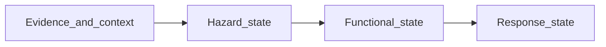

# Functional state and response model

**Canonical incorporation:** Contract-level narrative → [`contracts/v0.1/parcel-state-schema.md`](../../contracts/v0.1/parcel-state-schema.md) and [`architecture/current/architecture-object-map.md`](../../architecture/current/architecture-object-map.md) (parcel state §9); phasing table aligns with [`09-phasing-v0.1-v1.0-v1.5.md`](09-phasing-v0.1-v1.0-v1.5.md).

This note defines how **hazard state**, **functional state**, and **response state** relate to each other and to **`parcel state`** over program phases. It is a **runtime-adjacent architecture brief**. JSON shapes, field names, and normative contracts remain canonical in **`oesis-program-specs`** (for example `contracts/parcel-state-schema.md` and related artifacts).

## Why three layers

Today the project often speaks in one bundle: “parcel state.” That is hard to evolve without either **over-claiming** (implying adaptation that does not exist) or **overloading** one object (mixing environment, operations, and parcel-operator actions).

Splitting into three nested ideas keeps **`v0.1` simple**, makes **`v1.0` more honest** about operational meaning, and lets **`v1.5`** add response and verification **without corrupting** the baseline hazard story.

## Definitions

### Hazard state

What the environment is **believed** to be doing at or near the parcel, with **confidence**, **evidence mode**, and **provenance** (local observation, shared neighbor signal, regional inference, stale, etc.). This stays close to fused environmental estimates (air, heat, water-related signals as applicable).

### Functional state

What hazard-related conditions **mean operationally** for the dwelling and parcel: shelter viability, egress/reentry, asset exposure, route or access degradation at parcel-adjacent scope, utility dependence flags, and related summaries. This is **impact-oriented**: it connects estimates to “what matters for decisions” without yet claiming what was **done** about it.

### Response state

What **actions** are available, **taken**, or **verified**, and whether outcomes **changed** measurable conditions: interventions, logs, before/after windows, verification results, and (later) response history. This is where **adaptation learning** begins; it must not **inflate** hazard confidence by itself.

In `v1.5`, the minimum useful response chain is:

`hazard -> house state -> action -> measured outcome`

That is the bridge from descriptive parcel intelligence to the first honest parcel-specific response model.

## Flow

Upstream **evidence** and **context** (parcel priors, node registry, public feeds) feed **hazard state**. **Functional state** interprets hazard for operations. **Response state** records and verifies actions; its outputs can inform **future** hazard/functional estimates (for example indoor conditions after an intervention) without conflating layers.

## By program phase

Aligns with [`09-phasing-v0.1-v1.0-v1.5.md`](09-phasing-v0.1-v1.0-v1.5.md) and the object map in [`05-revised-architecture-blueprint.md`](05-revised-architecture-blueprint.md).

| Phase | Hazard | Functional | Response |
|-------|--------|------------|----------|
| **`v0.1`** | Core: fused estimate with evidence mode and provenance in the parcel pipeline | May appear as **reasons** or compact flags inside the existing parcel-facing surface; not required as a separate persisted object family | **Out of scope** as a first-class model |
| **`v1.0`** | Stronger trust, history, and neighbor signal; same epistemic discipline | **Explicit** functional translation (stronger than **`v0.1`**), still without a full route/block engine | **Out of scope** except possibly manual notes outside core contract |
| **`v1.5`** | Unchanged in role; must not be silently “upgraded” by response data | Tied to **parcel condition** and operational summaries users need | **Intervention**, **verification**, **house-state**, **compatibility** support objects as in **`09`** |

## Contract posture

- **`v1.5`** additions (house state, interventions, device events, node health) should live in **separate support objects** or extensions **documented against** the core parcel-state contract, rather than overloading core fields in ways that confuse **hazard** confidence with **response** quality.
- **Functional state** should not claim **verified** outcomes; **response state** owns verification and effect-size language subject to evidence quality ceilings.
- **`v1.5`** is not just “better local sensing.” Its minimum purpose is to connect outdoor hazard, house operating state, intervention, and measured outcome well enough for before/after reasoning.

## Non-goals (here)

- Full **automation** or **bounded control** execution semantics
- **Public parcel-resolution** maps or **civic** infrastructure dashboards
- Replacing **official** hazard products; this model **complements** them at parcel-relevant resolution

## Related reading

- [`07-information-layer-and-functional-recovery.md`](07-information-layer-and-functional-recovery.md) — evidence-to-impact and functional recovery framing
- [`00-version-labels-and-lanes.md`](00-version-labels-and-lanes.md) — naming for runtime lanes vs program phases
- [`architecture/v1.5/house-state-and-verification-model.md`](../../architecture/v1.5/house-state-and-verification-model.md) — minimum bridge surfaces and exit criteria
