# v0.1 OSI layer reference diagrams

## Purpose

Use the **OSI model** as a consistent lens on **where** each v0.1 reference path sits in a communication stack. Figures pair **hardware** (sensors, boards, cables, PCs, radios) with **OSI layers** so reviewers see both the physical kit and the protocol stack. Layers **5–6** are included when they clarify TLS, HTTP, or encoding.

**Plain-text and ASCII versions (no Mermaid):** `v0.1-osi-diagrams-text.md`.

These figures pair with:

- `v0.1-scope-matrix.md` — what the slice claims
- `v0.1-gap-register.md` — deferred stacks (Wi-Fi ingest, live public feeds)
- `v0.1-pilot-minimum-subset.md` — internal vs external pilot boundaries
- `implementation-status-matrix.md` — surface maturity

---

## 1. Bench-air serial path (hardware trace → operator host)

USB CDC serial from ESP32-S3 to the operator machine: no IP, no TCP. OESIS payload is **application-layer** JSON carried as UTF-8 lines. **Sensing is not an OSI layer**; I2C from sensors to the MCU is on-board electrical signaling. OSI applies to the **USB serial byte stream** between the dev kit and the host.

### Hardware block (bench-air v0.1 kit)

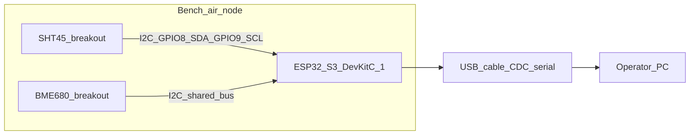

### OSI stack (USB serial leg, host parses JSON at L7)

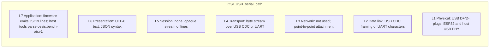

---

## 2. Offline reference pipeline and acceptance (no network)

`make oesis-validate`, `make oesis-check`, `make oesis-accept`: examples on disk; normalization and inference **in-process**. **No on-wire protocol**: OSI L7 is software and file I/O on one machine. Real nodes are **off-path**; fixtures stand in for captured packets.

### Hardware (single host only)

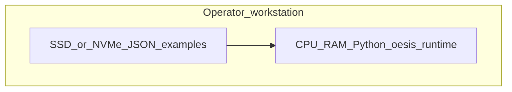

### OSI (logical)

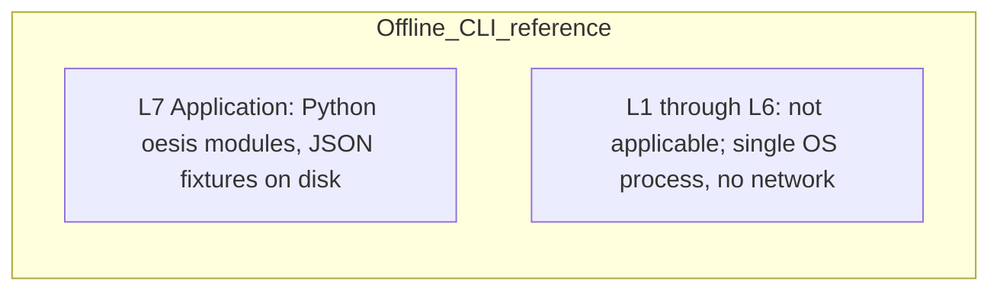

---

## 3. Local HTTP reference (`make oesis-http-check`)

Three services on **loopback**: ingest, inference, parcel-platform. All traffic stays on **one physical machine**; no bench node required for this check (fixtures drive requests).

### Hardware (loopback on one PC)

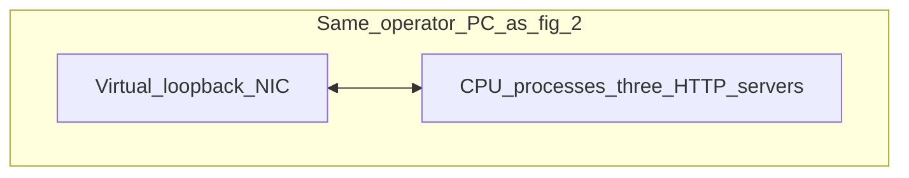

### OSI stack

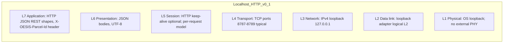

---

## 4. Deferred path: node Wi-Fi to ingest (gap register G3)

Not required for frozen v0.1. **Hardware** adds the ESP32 **Wi-Fi radio**, an access point or home router, and a machine running the ingest service.

### Hardware (target deployment)

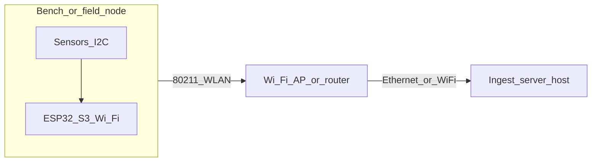

### OSI stack (WLAN and onward)

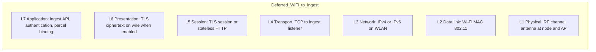

---

## 5. Deferred path: live public weather and smoke context (gap register G4)

Operator-configured **HTTPS** to internet providers. **Hardware** is the operator or server **NIC**, CPE (modem/router), and ISP physical plant.

### Hardware (WAN path)

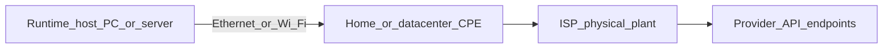

### OSI stack

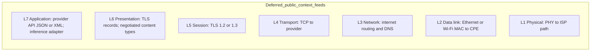

---

## 6. Governance and shared-map reference APIs (matrix: partial surfaces)

On-wire shape matches **figure 3** on loopback today. **Hardware** is the same single workstation; optional **browser on the same host** hits admin routes. Remote admin would add fig 5-style hardware.

### Hardware (reference posture)

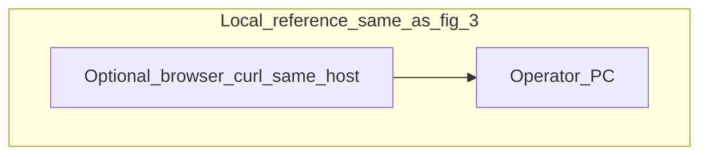

### OSI (logical)

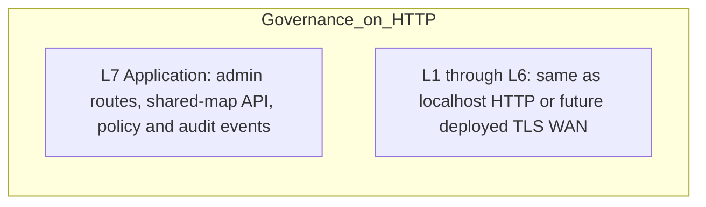

---

## 7. Pilot Tier A vs Tier B (trust boundary)

**Hardware scope** grows from **bench + one PC** to **deployed radios, CPE, and possibly separate servers**.

### Hardware by tier

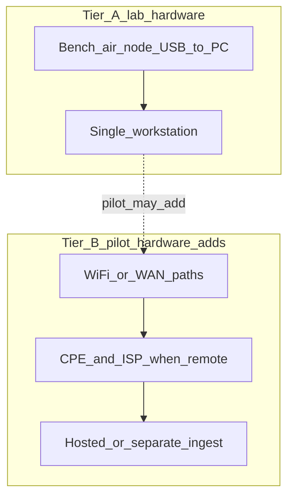

### Relationship (requirements, not a wire protocol)

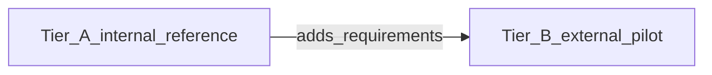

---

## How this maps to the implementation status matrix

| Matrix block | Primary OSI figures |
| --- | --- |
| Software and APIs | 2, 3, 6 when HTTP admin or shared-map is used |
| Hardware and field path | 1; figure 4 when Wi-Fi ingest is real |
| Governance, rights, shared-map | 6; figure 5 if live external aggregates feed shared-map |
| Release, legal, public surfaces | 7 plus the stack that hosts the public site (outside v0.1 runtime) |

## Related

- `v0.1-osi-diagrams-text.md` — same seven figures as tables and ASCII stacks (with hardware sections)
- `architecture/current/reference-stack.md` — logical pipeline (non-OSI flowchart)
- `v0.1-gap-register.md` — G3 and G4 illustrated in figures 4 and 5
- `hardware/bench-air-node/build-guide.md` — BOM and wiring for figure 1
