# v0.1 OSI layer reference diagrams

## Purpose

Use the **OSI model** as a consistent lens on **where** each v0.1 reference path sits in a communication stack. Figures pair **hardware** (sensors, boards, cables, PCs, radios) with **OSI layers** so reviewers see both the physical kit and the protocol stack. Layers **5–6** are included when they clarify TLS, HTTP, or encoding.

**Plain-text and ASCII versions (no Mermaid):** `v0.1-osi-diagrams-text.md`.

These figures pair with:

- `v0.1-scope-matrix.md` — what the slice claims
- `v0.1-gap-register.md` — deferred stacks (Wi-Fi ingest, live public feeds)
- `v0.1-pilot-minimum-subset.md` — internal vs external pilot boundaries
- `implementation-status-matrix.md` — surface maturity

---

## 1. Bench-air serial path (hardware trace → operator host)

USB CDC serial from ESP32-S3 to the operator machine: no IP, no TCP. OESIS payload is **application-layer** JSON carried as UTF-8 lines. **Sensing is not an OSI layer**; I2C from sensors to the MCU is on-board electrical signaling. OSI applies to the **USB serial byte stream** between the dev kit and the host.

### Hardware block (bench-air v0.1 kit)

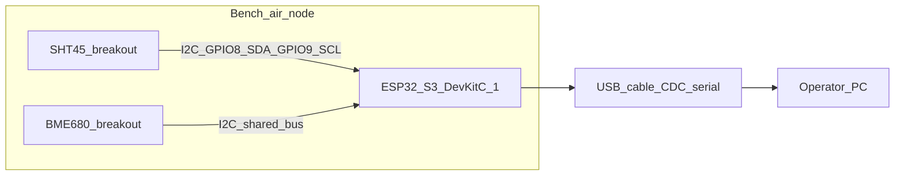

**Deployment posture** (per [`oesis-builds/specs/bench-air-node/v0-1.md`](../../../oesis-builds/specs/bench-air-node/v0-1.md) §F block and [`../../architecture/system/deployment-maturity-ladder.md`](../../architecture/system/deployment-maturity-ladder.md) indoor-class row):

- Deployment class: `indoor`
- Power: `USB` (reverse-polarity protection from regulator)
- IP rating: none / IP20 acceptable
- Protective fixtures: none
- Burn-in: 48 h required for BME680 per `calibration-program.md` §B

### OSI stack (USB serial leg, host parses JSON at L7)

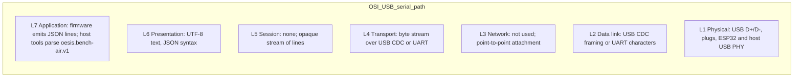

---

## 2. Offline reference pipeline and acceptance (no network)

`make oesis-validate`, `make oesis-check`, `make oesis-accept`: examples on disk; normalization and inference **in-process**. **No on-wire protocol**: OSI L7 is software and file I/O on one machine. Real nodes are **off-path**; fixtures stand in for captured packets.

### Hardware (single host only)

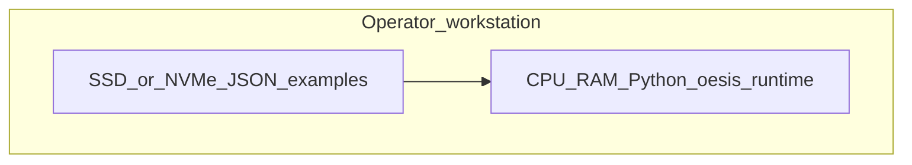

### OSI (logical)

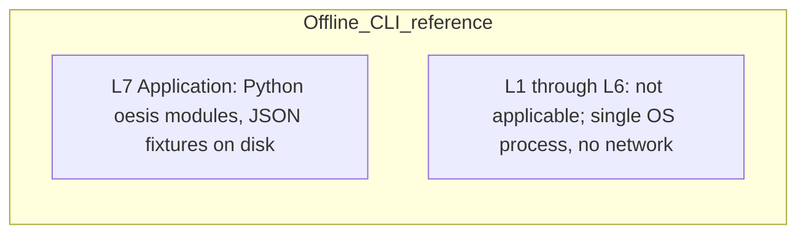

---

## 3. Local HTTP reference (`make oesis-http-check`)

Three services on **loopback**: ingest, inference, parcel-platform. All traffic stays on **one physical machine**; no bench node required for this check (fixtures drive requests).

### Hardware (loopback on one PC)

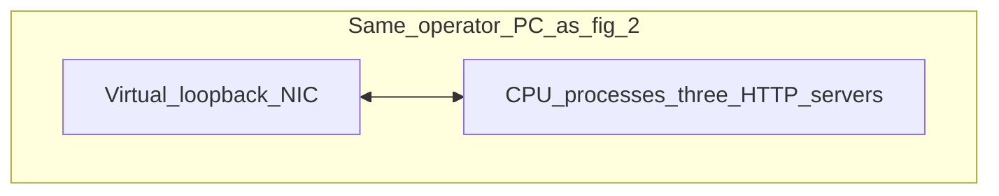

### OSI stack

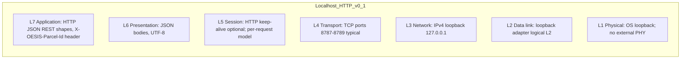

---

## 4. Deferred path: node Wi-Fi to ingest (gap register G3)

Not required for frozen v0.1. **Hardware** adds the ESP32 **Wi-Fi radio**, an access point or home router, and a machine running the ingest service.

### Hardware (target deployment)

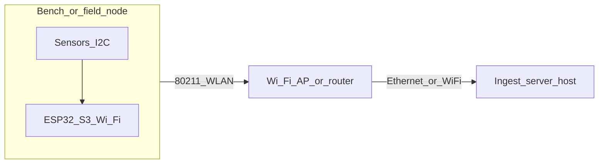

**Deployment posture note.** Figure 4 is protocol-generic — the same 802.11 stack covers nodes deployed in indoor, sheltered, and outdoor-protected classes. Per-deployment-class posture differs at the hardware level (see [`deployment-maturity-ladder.md`](../../architecture/system/deployment-maturity-ladder.md) "Transport tier by deployment class"):

- **Indoor** (e.g., `indoor-response-node`): USB power / IP20 / no protective fixture.
- **Sheltered** (e.g., `mast-lite`): 12V-DC or USB-from-indoor through cable gland / IP44 / **radiation shield required as protective fixture** per [`calibration-program.md`](../../architecture/system/calibration-program.md) §C item 7 (see figure 11).
- **Outdoor-exposed** (e.g., `weather-pm-mast`): mains with outdoor-rated PSU / IP65 / radiation shield + PM airflow module.

Outdoor-exposed nodes beyond Wi-Fi reach fall back to LoRa (figure 8) or cellular (figure 9).

### OSI stack (WLAN and onward)

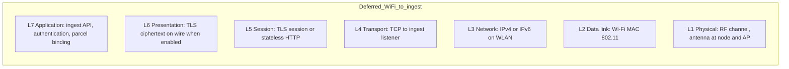

---

## 5. Deferred path: live public weather and smoke context (gap register G4)

Operator-configured **HTTPS** to internet providers. **Hardware** is the operator or server **NIC**, CPE (modem/router), and ISP physical plant.

### Hardware (WAN path)

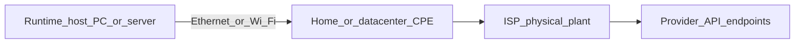

**Deployment posture note.** Public-context feeds are a **runtime-host** concern, not a node concern. The runtime host inherits its power / enclosure posture from the operator's workstation or server environment — not governed by the deployment-maturity-ladder's node classes. Same stack is reused by Tier 2 cloud-API adapters (Ecobee, Nest, Sensibo) at capability-stage `v1.5`, which connect to provider APIs from the runtime host rather than from a physical sensor node (see [`adapter-trust-program.md`](../../architecture/system/adapter-trust-program.md)).

### OSI stack

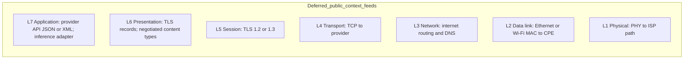

---

## 6. Governance and shared-map reference APIs (matrix: partial surfaces)

On-wire shape matches **figure 3** on loopback today. **Hardware** is the same single workstation; optional **browser on the same host** hits admin routes. Remote admin would add fig 5-style hardware.

### Hardware (reference posture)

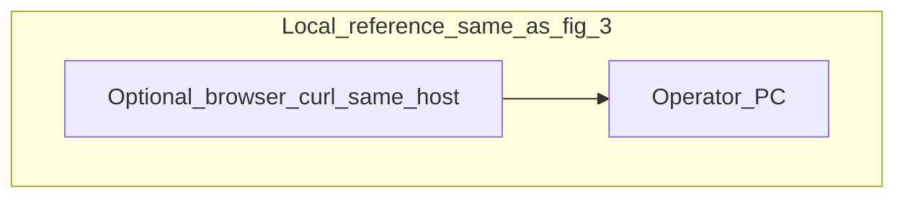

### OSI (logical)

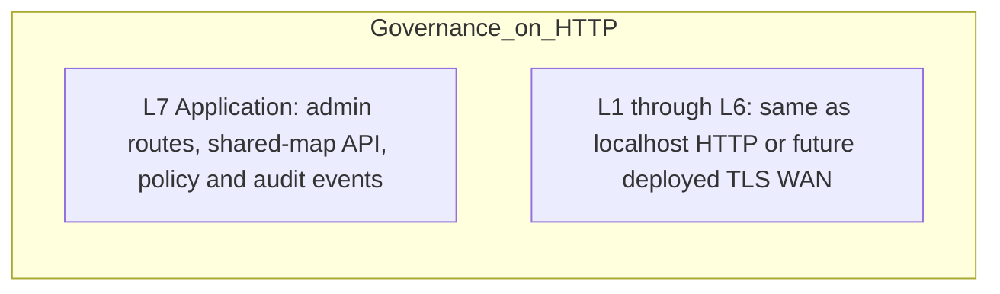

---

## 7. Pilot Tier A vs Tier B (trust boundary)

**Hardware scope** grows from **bench + one PC** to **deployed radios, CPE, and possibly separate servers**.

### Hardware by tier

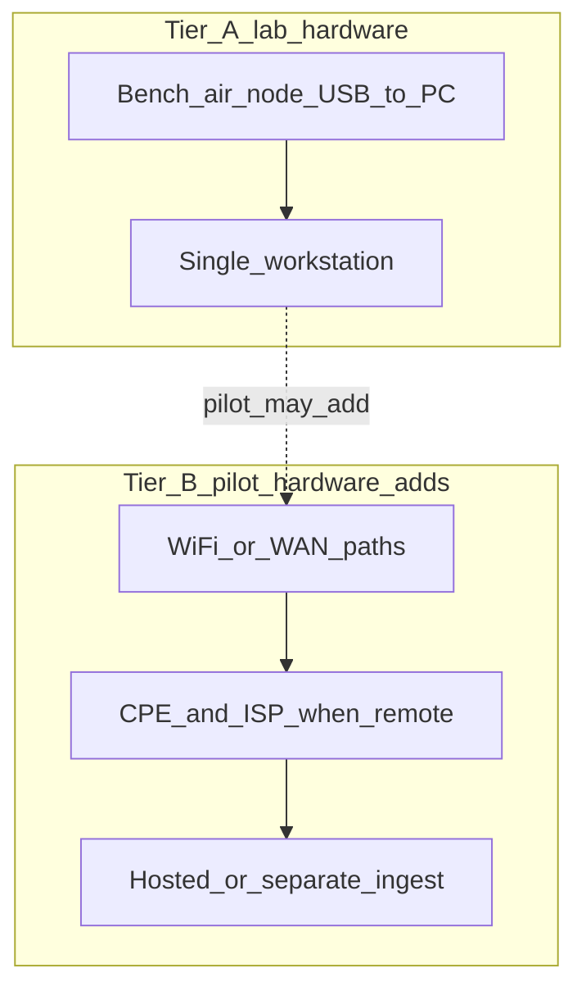

### Relationship (requirements, not a wire protocol)

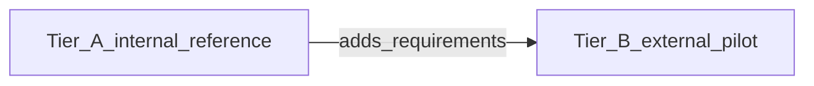

---

## 8. Deferred path: LoRa transport for outdoor nodes (v0.3+ flood-node, far-outdoor nodes)

Not required for v0.1 or v0.2. Enters scope at **program-phase `v0.3`** (flood-node) and any later outdoor-class node whose install point is beyond reliable Wi-Fi. Distinct radio stack from figure 4 — sub-GHz ISM band, long range, low throughput; requires a gateway to bridge to the ingest server.

### Hardware (LoRaWAN topology)

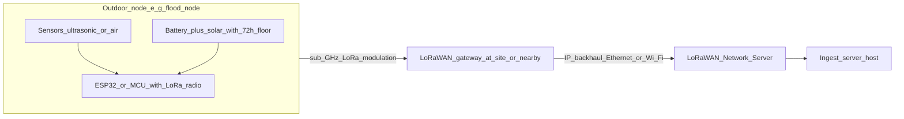

**Deployment posture** (per [`oesis-builds/specs/flood-node/v0-1.md`](../../../oesis-builds/specs/flood-node/v0-1.md) §F block and [`deployment-maturity-ladder.md`](../../architecture/system/deployment-maturity-ladder.md) outdoor-class row):

- Deployment class: `outdoor`
- Power: `battery + solar` with documented 72 h runtime floor (or hardened mains where available)
- IP rating: `IP65` — flood-node installations see standing water
- Protective fixtures: rigid mount at documented low-point + zero-reference staff gauge per `calibration-program.md` §C item 7. Pre-verification readings inadmissible.
- Burn-in: not required (ultrasonic sensors do not need conditioning)

### OSI stack (LoRaWAN + IP backhaul)

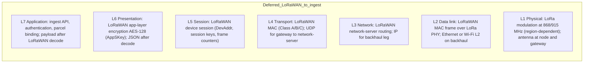

Power-path note: LoRa deployments depend on the node-side battery+solar posture declared in the node's §F block (`power.source: battery_solar` for flood-node v0-1 skeleton) and the documented 72 h runtime floor per [`deployment-maturity-ladder.md`](../../architecture/system/deployment-maturity-ladder.md) outdoor-class row.

---

## 9. Deferred path: Cellular transport for outdoor nodes beyond Wi-Fi reach

Not required for v0.1 / v0.2 / v0.3. Enters scope when an outdoor-class node (typically `weather-pm-mast` or a flood-node at a remote low-point) has no reachable Wi-Fi **and** no reachable LoRa gateway. Per [`deployment-maturity-ladder.md`](../../architecture/system/deployment-maturity-ladder.md) outdoor-class transport tier, cellular is permitted as a fallback for parcels beyond Wi-Fi reach.

### Hardware (cellular topology)

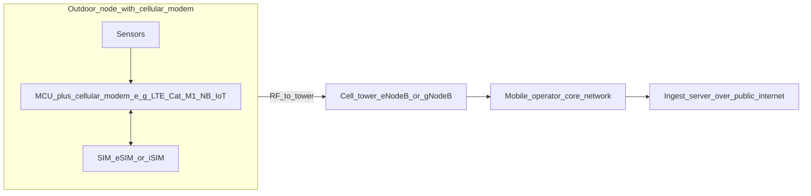

**Deployment posture** (per [`oesis-builds/specs/weather-pm-mast/v0-1.md`](../../../oesis-builds/specs/weather-pm-mast/v0-1.md) §F block pattern and [`deployment-maturity-ladder.md`](../../architecture/system/deployment-maturity-ladder.md) outdoor-class row):

- Deployment class: `outdoor` (typically weather-pm-mast or flood-node beyond Wi-Fi reach)
- Power: mains with outdoor-rated PSU (preferred for weather-pm-mast due to active PM-sensor flow path) or battery + solar (for flood-node)
- IP rating: `IP65`
- Protective fixtures: radiation shield + PM airflow module for weather-pm-mast (see figure 11 for shield); rigid mount + zero-reference for flood-node
- Burn-in: 48 h for BME680 + PM-sensor conditioning per `calibration-program.md` §B

### OSI stack (cellular)

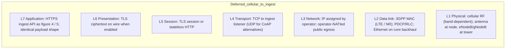

Operational notes: cellular introduces operator billing, data-plan sizing, and SIM-provisioning lifecycle concerns that Wi-Fi (figure 4) and LoRa (figure 8) do not. These are product/operational concerns, not OSI concerns, but they gate when this path is viable for a pilot. Power-path: similar to LoRa — outdoor-class power tier required per §F.

---

## 10. Deferred path: Direct-measurement adapter (circuit-monitor, v1.5)

Not required for v0.1 / v0.2 / v0.3 / v0.5 / v1.0. Enters scope at **capability-stage `v1.5`** bridge when `circuit-monitor` (Tier 3 direct-measurement adapter per [`adapter-trust-program.md`](../../architecture/system/adapter-trust-program.md)) ships. Unlike Wi-Fi (figure 4) or LoRa (figure 8), this path has **two chained transport legs**: a sensor-side leg from PZEM-004T/016 to the MCU, and an ingest-side leg from the MCU to the ingest server. OSI applies to both legs at different points.

### Hardware (chained transport)

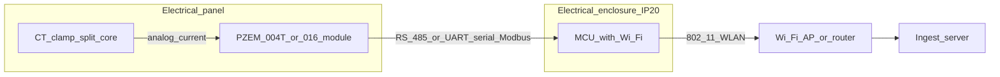

**Deployment posture** (per [`oesis-builds/specs/adapters/circuit-monitor/v0-1.md`](../../../oesis-builds/specs/adapters/circuit-monitor/v0-1.md) §F block — **adapter** (adapter-trust-program §F) with physical_posture declared):

- Tier: `tier_3_direct` per adapter-trust-program
- Physical deployment class: `indoor` (mains-adjacent; inside or near electrical panel)
- Power: low-power from the measured circuit (the module takes power from the circuit it measures)
- IP rating: electrical-enclosure IP20
- Protective fixture: electrical-code-compliant CT clamp installation — hard prerequisite, licensed electrician required in many jurisdictions
- Burn-in: not required (Modbus module is factory-calibrated)

### OSI stack (two legs)

**Sensor-side leg (PZEM → MCU):**

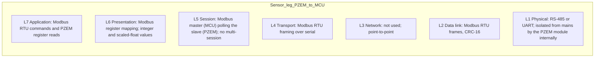

**Ingest-side leg (MCU → ingest server):**

Identical to figure 4 (Wi-Fi to ingest). The MCU re-emits PZEM-derived fields as an `oesis.circuit-monitor.v1` JSON packet and uses the same Wi-Fi stack.

### Why this figure exists

The sensor-side leg is **distinct** from figures 1–4 because the PZEM module sits on a mains-adjacent circuit with its own isolation requirements, Modbus protocol, and electrical-code compliance story (see the §F `physical_posture.protective_fixtures` block in `oesis-builds/specs/adapters/circuit-monitor/v0-1.md`). Drawing the whole path as "just Wi-Fi to ingest" would miss the Modbus transport and the installation-code-compliance gate. Adapter-trust-program §C admissibility rules apply to the *readings*, not to the Modbus transport — but the Modbus leg must succeed before any reading exists.

Tier-model note: Tier 1 passive inference (e.g., thermal-slope HVAC detection) has **no on-wire path** — it derives from existing sensor data. Tier 2 cloud adapters (Ecobee, Nest) use the HTTPS stack of figure 5. Tier 3 direct-measurement adapters like circuit-monitor are the only tier with a new physical leg, hence this figure.

---

## 11. Radiation shield hardware (protective fixture for sheltered and outdoor temperature readings)

Not an OSI path. The radiation shield is a **physical-layer hardware component** whose presence and verification gate temperature-reading admissibility per [`calibration-program.md`](../../architecture/system/calibration-program.md) §C item 7. Figure 11 captures the shield as a hardware component because prior figures (4, 8, 9) assume it implicitly without drawing it, and its acceptance test is a prerequisite for outdoor-class sensor data.

### Hardware block

```mermaid
flowchart TB
  subgraph shield [Passive_or_fan_aspirated_radiation_shield]
    sht4[SHT45_sensor_with_sintered_filter]
    shellInner[Inner_stacked_cones_or_louvered_vanes]
    shellOuter[White_outer_finish_high_albedo]
    sht4 -.sheltered_by.-> shellInner
    shellInner -.enclosed_by.-> shellOuter
  end
  mount[Mast_or_wall_mount_below_solar_line]
  esp5[MCU_with_transport_per_figure_4_8_or_9]
  shield --> mount
  sht4 -->|I2C_cable| esp5
  sun((Solar_radiation))
  air((Ambient_air_cross_flow))
  sun -.deflected_by.-> shellOuter
  air -.flows_through.-> shellInner
```

### What the shield does and why it is in this doc

- **Reduces solar-loading bias** on temperature readings. Bare SHT45 outdoors under direct sun can read 2–4 °C high. The shield deflects direct and reflected solar radiation while allowing ambient-air cross-flow across the sensor.
- **Without a verified shield, temperature readings from the SHT45 are inadmissible** to the calibration dataset used for hazard-formula coefficient fitting per `calibration-program.md` §C item 7.
- The shield is a **protective fixture** in the §F block of every node spec that deploys SHT45 in sheltered or outdoor class — `mast-lite`, `weather-pm-mast`. Per-node spec declares variant (passive / fan-aspirated) and cites the thermal-loading acceptance test.

### Acceptance test (to author per `oesis-builds/specs/mast-lite/radiation-shield-thermal-loading-test.md`)

Thermal-loading test compares SHT45-inside-shield readings to a shaded characterized reference over a daily solar cycle. Acceptance criterion: residual bias under full-sun exposure is within the spec's Uncertainty Budget. Pre-verification readings from the shielded SHT45 are tagged `protective_fixture_verified_at: null` and excluded from the calibration dataset until the test passes.

### Relationship to OSI figures

The shield has no OSI-layer representation — it is pure L1 hardware, and it is not part of any communication channel. It appears in this doc because:

- Figures 4, 8, and 9 assume sheltered or outdoor placement without drawing the shield.
- The `oesis-builds/specs/mast-lite/v0-1.md` and `specs/weather-pm-mast/v0-1.md` §F blocks declare the shield as a protective fixture, which has admissibility consequences.
- A reader auditing "is everything in the §F block represented in the OSI diagrams?" should not conclude the shield is missing — it is here.

Related docs:

- [`../../architecture/system/calibration-program.md`](../../architecture/system/calibration-program.md) §C item 7 — admissibility rule
- [`../../architecture/system/sensor-placement-and-representativeness-guide.md`](../../architecture/system/sensor-placement-and-representativeness-guide.md) — sensor variant selection (sintered filter required for sheltered and outdoor classes)
- [`../../architecture/system/deployment-maturity-ladder.md`](../../architecture/system/deployment-maturity-ladder.md) "Enclosure IP rating tier" — sheltered and outdoor enclosure requirements
- [`../../architecture/system/parts/mast-lite.md`](../../architecture/system/parts/mast-lite.md) and [`parts/weather-pm-mast.md`](../../architecture/system/parts/weather-pm-mast.md)

---

## How this maps to the implementation status matrix

| Matrix block | Primary OSI figures |
| --- | --- |
| Software and APIs | 2, 3, 6 when HTTP admin or shared-map is used |
| Hardware and field path (v0.1–v0.2) | 1; figure 4 when Wi-Fi ingest is real; figure 11 for any sheltered/outdoor SHT45 |
| Hardware and field path (v0.3+ outdoor) | 4, 8 (LoRa), 9 (cellular) depending on node install point; 11 for shield on temperature-sensing nodes |
| Adapter surfaces (v1.5 bridge) | 10 (direct-measurement, circuit-monitor); 5 for Tier 2 cloud APIs; Tier 1 passive inference has no OSI path |
| Governance, rights, shared-map | 6; figure 5 if live external aggregates feed shared-map |
| Release, legal, public surfaces | 7 plus the stack that hosts the public site (outside v0.1 runtime) |

## Related

- `v0.1-osi-diagrams-text.md` — same ten figures as tables and ASCII stacks (with hardware sections)
- `architecture/current/reference-stack.md` — logical pipeline (non-OSI flowchart)
- `architecture/system/deployment-maturity-ladder.md` "Transport tier by deployment class" — canonical source for when each transport path is permitted per class
- `architecture/system/adapter-trust-program.md` — governing policy for figure 10's circuit-monitor adapter
- `v0.1-gap-register.md` — G3 and G4 illustrated in figures 4 and 5
- `oesis-builds/specs/flood-node/v0-1.md` and `specs/weather-pm-mast/v0-1.md` — §F blocks declaring when LoRa / cellular transports are permitted per node
- `oesis-builds/specs/adapters/circuit-monitor/v0-1.md` — §F block for figure 10
- `hardware/bench-air-node/build-guide.md` — BOM and wiring for figure 1
