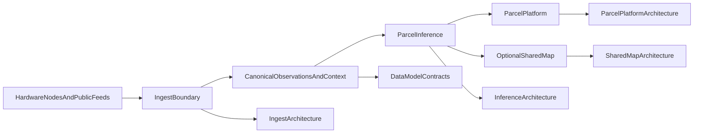

# Reference Stack v0.1

## Purpose

Describe the current runnable technical stack and the documents and code
surfaces that define each stage.

## Status

Current reference stack.

## Stack summary

The current reference stack follows this path:

1. hardware nodes and selected public feeds produce raw evidence
2. ingest validates and normalizes evidence into canonical observations
3. inference combines observations with parcel and public context
4. parcel platform renders the homeowner-facing parcel view
5. shared-map outputs remain optional and policy-gated

## Canonical implementation posture

- sibling repo `../oesis-runtime` is the canonical Python implementation tree for the
  current reference services
- `../../software/*/scripts/*.py` remains the compatibility layer for docs,
  smoke checks, and operator-facing commands
- `../../software/README.md` and `../../software/operator-quickstart.md` remain
  the main execution guides

## Stage map

### Raw evidence producers

- `../../hardware/bench-air-node/README.md`
- `../../hardware/mast-lite/README.md`
- `../../hardware/flood-node/README.md`
- `../../hardware/thermal-pod/README.md`
- `../../docs/system-overview/integrated-parcel-system-spec.md`

### Ingest boundary

- `../../software/ingest-service/architecture.md`
- `../../software/ingest-service/README.md`
- `../../docs/data-model/README.md`

Entry surfaces:

- `make oesis-validate`
- `python3 -m oesis.ingest.validate_examples`
- `python3 -m oesis.ingest.ingest_packet`
- `python3 -m oesis.ingest.serve_ingest_api`

### Canonical observations and context

- `../../docs/data-model/README.md`
- `../../docs/data-model/public-context-schema.md`
- `../../docs/data-model/parcel-context-schema.md`
- `../../docs/data-model/node-registry-schema.md`
- `../../docs/data-model/explanation-payload-schema.md`

### Parcel inference

- `../../software/inference-engine/architecture.md`
- `../../software/inference-engine/README.md`
- `technical-philosophy.md`

Entry surfaces:

- `make oesis-demo`
- `python3 -m oesis.parcel_platform.reference_pipeline`
- `python3 -m oesis.inference.infer_parcel_state`
- `python3 -m oesis.inference.serve_inference_api`

### Parcel platform

- `../../software/parcel-platform/architecture.md`
- `../../software/parcel-platform/README.md`
- `../../software/operator-quickstart.md`

Entry surfaces:

- `make oesis-check`
- `make oesis-http-check`
- `python3 -m oesis.parcel_platform.serve_parcel_api`

### Optional shared-map layer

- `../../software/shared-map/architecture.md`
- `../../software/shared-map/README.md`
- `../../docs/system-overview/shared-map-product-posture.md`

Entry surfaces:

- `python3 -m oesis.shared_map.aggregate_shared_map`
- `python3 -m oesis.shared_map.serve_shared_map_api`
